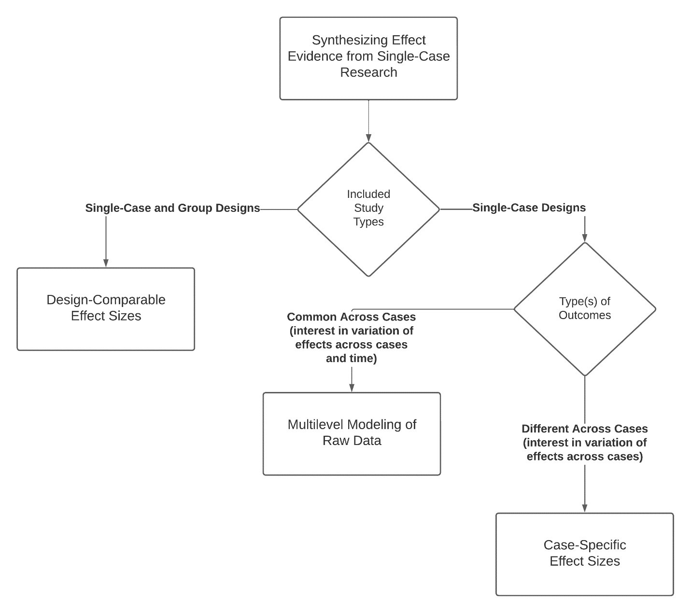

```{r, include = FALSE}
knitr::opts_chunk$set(echo = FALSE, fig.retina = 2)
```

# Approaches for Estimation and Synthesis of Single-Case Studies {#intro}
\chaptermark{Estimation and Synthesis of SCDs}

This chapter provides the background and purpose for the Methods Guide for Effect Estimation and Synthesis of Single-Case Studies.
We provide an overview of the three major approaches for effect size estimation and synthesis of single-case studies: 

(a) design-comparable effect sizes, 
(b) multilevel modeling of raw individual participant interrupted time-series data, and 
(c) case-specific effect sizes. 
We describe the general motivation and rationale for each approach and provide a series of decision rules to guide researchers in their selection. 
Subsequent chapters in this guide provide more detailed illustrations of the three major approaches. 

## Background
Educational decisions made at the state, district, school, and student levels are expected to be informed by empirical evidence [@cook2014council; @whatworksclearinghouse2020What].
These expectations create a compelling need for synthesis, or the integration of research findings from multiple, existing sources of evidence—including findings from single-case designs (SCDs).
The need for methods to synthesis findings from SCDs is all the greater because some educational disciplines have historically relied upon this methodology to collect evidence about interventions, such that the bulk of available evidence about some interventions comes from SCDs.

This methods guide responds to three key developments in educational research related to the documentation of evidence-based practices. 
The first is the expanded use of SCD research methods across disciplines over the last 50 years in both general and special education contexts [@Kratochwill2014Visual].
Although the history of SCD methodology is outside our present scope, SCD design innovations have allowed researchers to advance its use beyond quasi-experimental and behavior analysis origins [see @Kratochwill2014Visual for more detailed information on the history of SCD]. 
Over the past 20 years, researchers’ commitment to using rigorous procedures to identify evidence-based educational practices affirms not only the importance of randomized control trials (RCTs), but also the utility and efficiency of SCDs. 

The second key development in education research is the emergence of effect size measures and synthesis methods for use with SCD and other interrupted time-series data [@shadish2015Role; @Swaminathan2014effect].
Interest in the synthesis of SCDs is long-standing [e.g., @Center1985methodology; @Gingerich1984meta; @White1987some], with methods arising concurrently with the meta-analyses of group design research becoming more statistically rigorous and sophisticated [@hedges1985statistical; @shadish2015metaanalytic].
The interest and intensity of methodological research focused on SCDs has increased over time, resulting in a substantial expansion in the diversity, flexibility, and accessibility of available analytic methods. 
The current state of SCD effect size estimation methods can be categorized into three strands: 
(a) approaches that summarize the effect for each case and then synthesize these case-specific effect sizes [e.g., @pustejovsky2018Using],
(b) methods that use multi-level models to analyze the raw or standardized data from one or multiple SCD studies [@VandenNoortgate2008multilevel], and 
(c) techniques that use design-comparable effect size metrics [@Hedges2012ABk; @Hedges2012MB; @Pustejovsky2014design; @Shadish2013d; @Swaminathan2014effect].
We organize the present methods guide around these three broad methodological strands. 

The third development in education research is the increased use of systematic review and meta-analysis procedures to identify and affirm evidence-based practices in education [@Beretvas2008review; @Shadish2007methods].
In examining the production of systematic reviews and meta-analyses of SCDs from 1985 to 2009, @maggin2011Quantitative found a marked increase in such products between 2000 and 2009. 
Similarly, @jamshidi2018Methodological found increasing production through 2015, as well as improvements in the quality of published reviews. 
However, even contemporary reviews frequently fail to use appropriate methods for combining findings across studies [@jamshidi2018Methodological]. 
Thus, there remains a need for guidance about how to select and apply methods for synthesizing SCD research results.

Effect size measures are a valuable complement to visual analysis for the interpretation of single-case research results and are a key input in two of the available approaches for meta-analytic synthesis of SCDs: case-specific and design-comparable effect size estimation methods.
Researchers have a variety of technically sound effect size metrics to select from when interpreting SCD findings, but relatively few published meta-analyses use design-comparable effect sizes, multilevel modeling, or more advanced case-specific effect sizes [cf. @barton2017TechnologyAided; @jamshidi2018Methodological; @Maggin2017meta-analysis].
One reason for their lack of widespread use by researchers may be the conceptual and procedural complexity associated with advances in effect size measures and meta-analysis techniques.
The complexity of data extraction and calculation of effect sizes for SCDs may also hinder a more rapid uptake of effect size estimation methods. 
In addition, researchers may lack software tools for effect size estimation for single-case studies when using some common statistical packages such as SPSS and SAS [@odom2018Betweencase; @Shadish2013d; @shadish2015Role].

## Purpose of the Methods Guide
The purpose of this methods guide is to improve educational researchers’ practice of estimating effect size measures and synthesizing findings from SCDs. 
We recognize that no single method is ideal for all research goals. 
Furthermore, methods that have the most to offer can be complex and may appear difficult to carry out.
Through the use of this methods guide, we aim to 
(a) provide guidance and decision rules to simplify the process of selecting effect size estimation and synthesis methods, and 
(b) illustrate the step-by-step application of appropriate methods using readily available tools, such as web-based software to calculate case-specific effect sizes or design-comparable effect sizes for SCD studies.

## Study Quality
Conducting a research synthesis—composed of group design studies, SCDs, or both—involves several stages: formulating the research aims, specifying inclusion criteria, conducting a systematic search, and screening for eligible studies [@cooper2010Research; @pustejovsky2017Research].
Additionally, before carrying out effect size calculations or meta-analysis, it is critical to consider the methodological quality and potential biases of studies one includes in the synthesis. 
Several distinct sets of standards are available for SCD studies to assist researchers with assessing methodological quality [e.g., @kratochwill2013SingleCase; @kratochwill2021Singlecase; @reichow2018Development; @tate2016SingleCase; @zimmerman2018Singlecase].
After examining the methodological quality of studies eligible for inclusion in a review, researchers can use one of two strategies to guide their estimation and synthesis of effect sizes. 
One strategy incorporates consideration of study quality as an inclusion criterion. 
Researchers can screen studies and exclude low-quality studies so that the synthesis is based on a subset of studies with quality deemed adequate or high enough that outcome(s) can be attributed to the intervention.
For example, the @WWC2022 indicates that for researchers to include an SCD study in a meta-analysis, the study must meet minimum design criteria (e.g., a multiple baseline study has at least three temporally spaced opportunities for the effect to be demonstrated, along with phases of at least three observations) and must provide minimum evidence of experimental control over extraneous factors (e.g., baselines do not document a therapeutic trend). 
Other screening approaches that rely on visual analysis have also been suggested [@kratochwill2021Singlecase; @maggin2021Commentary].
Alternatively, researchers can use broader inclusion criteria, but then carefully code for aspects of study quality, so that they can examine study quality codes as potential moderators in a meta-analysis. 
With this approach, researchers can estimate effect sizes for studies of varying degrees of quality and empirically explore whether the variation in effect size across studies is dependent on aspects of study quality. 

We assume that researchers who use this methods guide will have already selected a method to assess study quality and an approach for incorporating those assessments into their synthesis.
Thus, we do not focus on SCD study quality assessment methods, but rather provide guidelines that researchers can apply to a collection of studies meeting their inclusion criteria, which potentially include study quality.
In this guide we focus on the final stages of a research synthesis—those involving questions of how to select a method for estimating effects, how to compute effect size estimates (or otherwise prepare data for synthesis), and how to synthesize findings in the form of effect size estimates or individual-level data. 

## Selecting an Approach for Effect Estimation and Synthesis
To select an approach for estimating and synthesizing effects from SCDs, researchers should first reflect on the research aims that motivate their synthesis. 
In some contexts, researchers’ primary aims may be summarizing evidence to arrive at statements about the average efficacy of a class of interventions. 
In other circumstances, researchers might be interested in understanding variation in effects and the extent to which such variation is associated with participants’ characteristics, specific intervention features, or other contextual factors.
When summarization is a priority, researchers may find it more useful to use design-comparable effect sizes that describe average effects. 
If individual-level variation is the focus, then approaches using case-specific effect sizes or multilevel modeling may be more advantageous. 

Another overarching consideration for selecting a synthesis approach pertains to the features of the included studies.
Quantitative synthesis requires choosing an effect size metric that permits comparisons of the magnitude of effects across individual participants and studies. 
Consequently, the extent to which eligible studies use different types of designs or different outcome measures constrains how effects from those studies can be described or compared. 
For instance, if all eligible studies in the review used multiple baseline designs across participants (or another common type of SCD), then several different synthesis approaches are feasible. 
In contrast, if eligible studies include both single-case and group design studies (e.g., small randomized experiments, each with a single pre-test and a single post-test), researchers may seek a synthesis approach that permits comparisons across both design types. 
If all eligible studies used SCDs with very similar methods for assessing the dependent variable, then synthesis based on multilevel modeling of raw data is possible. 
In contrast, if eligible studies used non-equivalent assessments, then researchers may need to use a synthesis approach based on case-specific effect sizes that are suitable for comparison across studies involving different assessments. 
These two broad considerations—the aims of the synthesis and the features of eligible studies—should guide the selection of an approach for synthesis of SCDs. 
We now detail how the three broad synthesis approaches fit within these considerations. 


## Design-Comparable Effect Sizes
In some situations, researchers aim to synthesize the evidence for intervention effectiveness using both single-case and group design studies. 
For example, a meta-analysis by @wood2018Does analyzed 22 single-case and between-group studies to examine the effects of text-to-speech and other read-aloud tools on reading comprehension outcomes for students with reading disabilities. 
The authors used the standardized mean difference to estimate read-aloud intervention effects in the group design studies and a comparable standardized mean difference to estimate effects from the included SCD research, resulting in an overall average weighted effect size of d= 0.35, 95% confidence interval (CI) [0.14, 0.56].
Because the purpose of the study involved the comparison and averaging of effects across single-case and group designs, it was critical that @wood2018Does used an effect size metric that is theoretically comparable across the designs. 
Researchers should select from the design-comparable effect size options (e.g., accounting for the absence or presence of baseline trends) when the aim is to compare and synthesize effects across eligible SCD and group design studies [@Hedges2012ABk; @Hedges2012MB; @Pustejovsky2014design; @Shadish2013d; @Swaminathan2014effect; @VandenNoortgate2008multilevel].
However, if researchers aim to synthesize findings from only SCD studies (i.e., not to integrate findings across single-case and group design studies), it may be feasible and preferable to use other options, such as synthesizing effects using case-specific effect sizes or multilevel modeling.


## Case-Specific Effect Sizes
In addition to averaging effects across studies, researchers may also be interested in exploring variation in treatment effects by categorical differences or individual participant characteristics (e.g., Do effects vary across settings? Are effects consistent across ethnic and racial groups?). 
When included studies use different outcome measures (e.g., included studies report outcomes measured on different scales such as a rate per session, occurrence/count, or ratio), it is important for researchers to use an effect size metric and synthesis approach that accounts for such. 
For example, @bowman-perrott2016Promoting examined five potential moderators (emotional and behavioral disorder risk status, reinforcement frequency, target behaviors, intervention format, and grade level) in their synthesis of 21 SCDs to obtain an overall effect of the Good Behavior Game in promoting positive behavior in the classroom. 
Results of their meta-analysis suggested that the intervention was more effective in reducing problem behaviors among students with or at risk for emotional and behavioral disorders.
Another meta-analysis by @Mason_Davis_Ayres_Davis_Mason_2016 first calculated and aggregated the effect sizes across all included studies, and then investigated the moderating effects of participant characteristics, targeted outcomes, and implementation components on the efficacy of video self-modeling, in which a learner with disabilities watches a video of a model engaged in targeted skills or tasks. 
They found that intervention effects were stronger for younger participants with autism spectrum disorders compared to those not identified as autistic or having an autism spectrum disorder.

Because these syntheses focused on investigating variation across individuals in the effect of treatment, it was important that the effect size estimation and synthesis approach produced effect estimates for each individual participant (rather than a study-level summary effect estimate). 
Design-comparable effect size options are not viable for studying within-participant effects or variation in effects between individuals within the study because these effect sizes produce estimates at the study level (i.e., the effect averaged across the cases), not the individual level.
Furthermore, outcome measures differed widely among studies included in the aforementioned reviews, so the researchers needed an individual-level effect size metric that was not scale-dependent (e.g., not based on simple raw score mean differences). 
When included studies use outcome measurements that cannot simply be re-scaled to be equivalent, case-specific effect size estimation and synthesis options may be best suited. 
However, the case-specific effect size options are not viable for meta-analysts wanting a single overall effect size after synthesizing both single-case design and group design studies because case-specific effects are not comparable to group design effects. 


## Multilevel Modeling of Individual Participant Interrupted Time-Series Data
When a set of SCDs use the same or very similar outcome measures with the aim of studying the variation in effects over time within and between individuals, the multilevel modeling approach should be considered.
For example, @datchuk2020Level meta-analyzed 15 single-case studies totaling 79 students to examine the effects of an intervention on the level and trend in correct writing sequences per minute for students with disabilities.
The researchers found that effect sizes were greater when students received intervention for longer durations (i.e., there was a positive effect on the trend) and that this temporal change in effect was more pronounced with younger students.
In contexts like this, we suggest researchers avoid a meta-analytic approach that relies on a single effect size estimate for a study (e.g., design-comparable effect sizes) or even a single effect estimate for a case (e.g., case-specific effect sizes) and consider options for multilevel modeling of individual participant data series instead. 

## Summary of Options for Effect Estimation and Synthesis
The flow chart in Figure \@ref(fig:synthesis-flow-chart) illustrates a set of heuristic decision rules for selecting among the three general approaches to synthesizing results from single-case research. 
If the primary purpose of one’s research is to integrate findings from both single-case and group-design studies, researchers should consider design-comparable effect sizes, contextually noting that effects are likely to be different for group design studies than from SCD studies @Chen_Pustejovsky_2022.
Alternately, if the researchers plan to only include SCD studies, then they can use two other approaches (i.e., multilevel modeling and case-specific effect sizes). 
The choice between the latter two is related to the measurement of the dependent variable. 
Where there is interest in variability in effects across cases and over time, researchers should consider multilevel modeling of the raw data series, so long as the outcome is measured consistently across cases. 
However, if the aim is to examine how effects vary across the cases but the outcome measurements are non-equivalent and cannot be easily equated, then researchers should consider the options for estimating and synthesizing case-specific effect sizes.

```{r synthesis-flow-chart, fig.cap = "Approaches to Synthesizing Results from Single-Case Research"}

```

## Limitations in Selecting an Approach for Effect Estimation and Synthesis
We emphasize that Figure \@ref(fig:synthesis-flow-chart) presents a heuristic, simplified procedure for selecting among the three general approaches to effect size estimation and synthesis, which cannot and does not cover every possible research context.
We anticipate and acknowledge that there will be situations where researchers’ aims and contexts differ from those we have described and thus do not align perfectly with one of our primary approaches to estimating and synthesizing single-case effect sizes.
For example, researchers who are synthesizing findings from a set of SCDs may wish to compare their results to a previously published meta-analysis of group design studies, but not to investigate individual-level variation in treatment effects.
They might therefore elect to use design-comparable effect sizes even though they are not formally integrating results from group design studies within their review. 

A further possibility is that researchers might elect to use multiple approaches to synthesis to address different aims or research questions. 
For example, consider a project in which researchers have identified both single-case and group design studies. 
They might want to integrate findings across design types while also exploring the variation in effects among individuals.
In this scenario, researchers could estimate design-comparable effect sizes for their first aim and case-specific effect sizes from the subset of SCDs for their second aim. 

We also acknowledge that situations may arise that fall between those we described for case-specific effect sizes and those for multilevel modeling of the raw data series. 
For example, researchers may want to examine how effects vary over time and across cases, using studies with different outcomes. 
For this purpose, the researchers will need to identify and apply extensions of the primary approaches we present in this guide. 
For example, the researchers could either standardize the raw data before estimating a multilevel model, or they could synthesize case-specific effect sizes using multiple standardized effects for each case (e.g., an effect that indexes the immediate shift in level, and another effect that indexes a change in slope). 
In this guide, we aim to address what we perceive to be the most common scenarios, rather than conduct an exhaustive review of all possibilities. 

Finally, we anticipate that the heuristic guidance we provide here will need to be refined over time as further methodological innovations become available. 
We anticipate that research presently underway will provide even more meta-analytic options, with implications for how to select an approach for synthesis. At some point it may be possible to compute case-specific effect sizes that are also design-comparable, or it may be possible to standardize the data for multilevel models in a way that leads to parameter estimates from the model that correspond to design-comparable effect estimates.
When such methods become available, some distinctions made here will become artificial. 
However, even as methodology continues to advance, researchers need guidance that acknowledges the complexity of research purposes and contexts and is dynamic in its accommodation of such variation, while also being concrete and straightforward enough for widespread implementation. 
To support the uptake of advanced methods for meta-analytic synthesis by educational researchers, the remainder of this guide follows the proposed heuristics for selecting among the three major approaches to effect size estimation and synthesis. 


## Structure of the Methods Guide
We divide this guide into three major sections: 
(a) design-comparable effect size estimation and synthesis, 
(b) multilevel modeling, and 
(c) case-specific effect size estimation and synthesis to estimate and synthesize effects. 
Each section is independent; they are not in a particular chronological order, nor do they build upon each other. 
Rather, we expect those using this guide to follow the decision rules in Figure \@ref(fig:synthesis-flow-chart) to determine which approach is most appropriate for them, and then reference the corresponding relevant section. 

We divide each section into chapters. 
Each initial chapter introduces the specific approach to synthesizing results from SCD research, its assumptions, and determination for use.
We then provide additional decision rules for selecting among the specific techniques and options available within a given broad approach. 
This is followed by an illustration where we:

1. Describe the purposes for estimating and synthesizing effects, and the available data.

2. Demonstrate how to use the decision rules in Figure \@ref(fig:synthesis-flow-chart), along with the additional decision rules specific to the initial section chapter, to arrive at the option being illustrated.

3. Present the illustrated data to show how it needs to be structured for the analysis.

4. Provide a step-by-step illustration of how to estimate and synthesize effects using readily available analysis tools.
