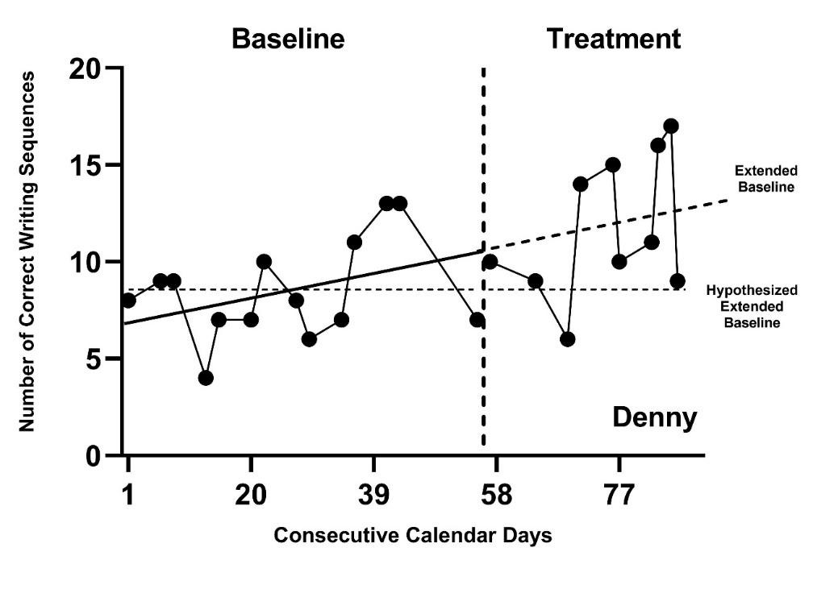
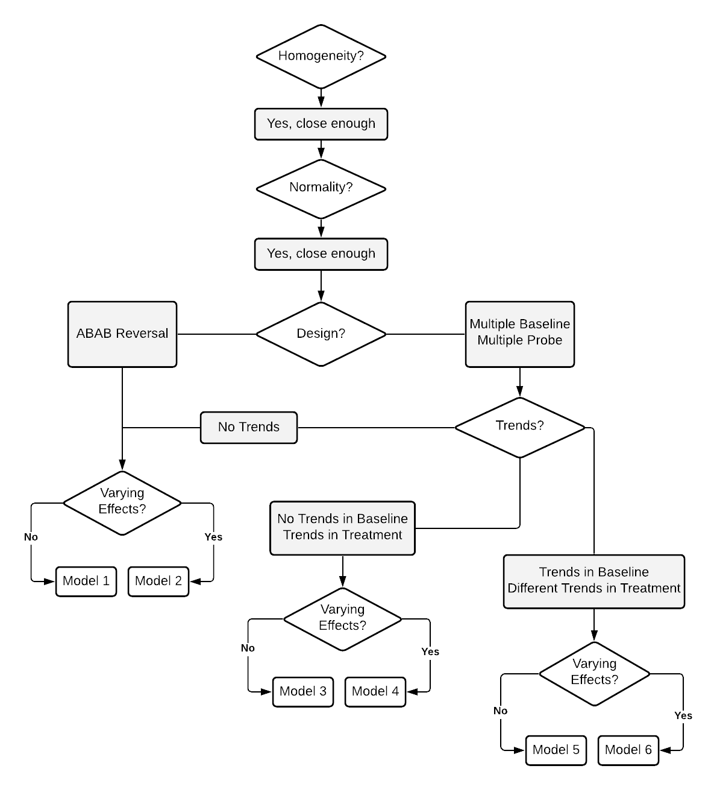

```{r, include = FALSE}
knitr::opts_chunk$set(echo = FALSE, fig.retina = 2)
```

# Introduction to Design-Comparable Effect Sizes {#D-CES}

This chapter provides background on design-comparable effect sizes, describes when to use them, and explains the key assumptions behind their use.
We highlight both the assumptions for using design-comparable effect sizes in meta-analytic synthesis and the assumptions for estimation of these effect sizes from primary study data. 
We then describe available options for estimating design-comparable effect sizes. 
These options allow for different assumptions regarding trends in baseline or treatment phases and different assumptions about the variation in the treatment effect across cases. 
This chapter concludes with a set of decision rules for selecting among the options for design-comparable effect sizes.

## Background

Design-comparable effect sizes are effect size indices for single case studies that are on the same metric as effect size indices used in group comparison studies [@Hedges2012ABk; @Hedges2012MB; @Pustejovsky2014design; @Shadish2013d; @Swaminathan2014effect; @VandenNoortgate2008multilevel]. These design-comparable effect sizes are valuable in a variety of synthesis contexts, particularly those that involve both single-case design (SCD) and group comparison studies. However, these methods also have several limitations. 

First, design-comparable effect sizes rely on an estimate of the variance between participants, requiring at least three distinct participants for estimation. 
This constrains their use to SCDs involving multiple participants (e.g., multiple baseline design across participants) or close replications of SCDs, each of which has a single participant (e.g., ABAB design replicated across several students). 
Further, existing research on design-comparable effect size methods is only available for multiple baseline, multiple probe, or replicated treatment reversal designs. 
Researchers have yet to develop extensions for alternating treatment designs and other types of SCDs. However, ongoing research is likely to increase the designs for which design-comparable effect sizes can be estimated.

A second conceptual limitation is that design-comparable effect sizes produce a single summary effect size per outcome---which represents an _average_ effect across participants---just as between-group design study effect sizes are summaries of average effects across participants. 
As a result, the design-comparable effect size might conceal heterogeneity of effects across participants in an SCD. Meta-analytic researchers are then limited to moderator analyses focused on study-level characteristics; it is not feasible to examine potential moderators that vary across cases in a study or across time points within a case. 

A third limitation is that design-comparable effect sizes are based on a hierarchical model that involves specific assumptions about the distribution of outcomes measured in the study. 
Developing a reasonable model requires care and attention to the plausibility of its assumptions. 
It is not a trivial or automatic process (as effect size calculations for between-group experimental designs are sometimes treated). Moreover, for some types of outcomes, the distributional assumptions of the model may be inappropriate, which further limits the applicability of the design-comparable effect size.

To address these methodological limitations, we use this chapter to provide researchers with guidance on the selection and use of design-comparable effect size estimates. We describe six of the most common modeling options and provide guidance on how to select among these options when calculating design-comparable effect size for use in a research synthesis. 

## When to Use Design-Comparable Effect Sizes

When choosing an effect size for single-case design data, researchers should begin by considering the broader purpose for computing effect sizes. In some cases, researchers may want to synthesize results across different types of studies, as in a comprehensive synthesis of all studies conducted on a topic. For example, researchers conducting a meta-analysis might include all studies examining the effects of social skills interventions on the social and academic outcomes of elementary-aged students with disabilities. In some areas of education research, it is likely that the literature identified for synthesis includes both group and single-case experimental studies. To average the effect across studies with different designs, researchers must pick an effect size index that has a comparable interpretation for each of the included designs [@Hedges2012ABk; @Hedges2012MB; @Pustejovsky2014design; @shadish2015Role]. For exactly this purpose, methodologists developed the design-comparable effect size for SCDs, providing an effect size on a common metric by answering the question, “_What would the standardized mean difference effect size be if one could somehow perform a between-group randomized experiment based on the same population of participants, intervention protocol, and outcome measures_?” 

## General Definition of Design-Comparable Effect Sizes

To understand the logic of the design-comparable effect size, it is helpful to consider how effect sizes are defined in group design studies. In a between-groups randomized experiment comparing a treatment condition (Tx) to a control condition (C) for a specified population, researchers commonly summarize results using the standardized mean difference effect size index. In Equation \@ref(eq:SMD-group), we define this effect size parameter as
\begin{equation}
(\#eq:SMD-group)
\delta = \frac{\mu_{Tx} - \mu_C}{\sigma_C},
\end{equation}
where $\mu_{Tx}$ is the average outcome if the entire population received the treatment condition, $\mu_C$ is the average outcome if the entire population received the control condition, and $\sigma_C$ is the standard deviation of the outcome if the entire population received the control condition. 
The effect size may be estimated by substituting sample means and sample standard deviations in place of the corresponding population quantities [@Borenstein2009effect], or by pooling sample standard deviations across the intervention and control conditions under the assumption that the population variance is equal. Alternately, the mean difference in the numerator of the effect size can be estimated based on a statistical model, such as an analysis of covariance that adjusts for between-group differences in baseline characteristics [@taylor2022Promoting]. Researchers often apply the Hedges $g$ small-sample correction, which reduces the bias of the effect size estimator that arises from estimating $\sigma_C$ based on a limited number of observations [@Hedges1981distribution]. 

Using data from a multiple baseline, multiple probe, or replicated treatment reversal design, the design-comparable effect size for SCDs aims to estimate the same quantity as the standardized mean difference from a between-groups experiment. This task poses challenges because the data from such SCDs involve repeated measurements taken over time. To precisely define the design-comparable effect size, researchers must therefore be specific about the timing of both intervention implementation and outcome assessment. Hypothetically, if a between-groups experiment uses the same study procedures as the SCD, researchers would still need to determine and specify _when to begin intervention and when to collect outcome data_. Furthering this example, suppose that the SCD takes place over times $t=1,...,T$. In our hypothetical between-groups experiment, intervention starts at time $A$ for $1 \leq A < T$ and collection of outcome data for all participants occurs at time $B$ for $A < B$. 
The standardized mean difference from such an experiment would contrast the average outcome at time $B$ if the entire population had started intervention at time $A$ [i.e., $\mu_B(A)$] to the average outcome at time $B$ if the entire population had remained in baseline through time $B$ and then started intervention later at time $T$ [i.e., $\mu_B(T)$]. The standardized mean difference would then correspond to
\begin{equation}
(\#eq:SMD-SCD)
\delta_{AB} = \frac{\mu_B(A) - \mu_B(T)}{\sigma_B(T)},
\end{equation}
where $\mu_B(A)$ is the average outcome at follow-up time $B$ if the entire population were to receive the intervention at time $A$. Then, $\mu_B(T)$ is the average outcome at follow-up time $B$ if the entire population were to receive the intervention at time $T$. Finally, $\sigma_B(T)$ is the standard deviation of the outcome at follow-up time $B$ if the entire population were to receive the intervention at time $T$. 
Note that $\mu_B(T)$ corresponds to the average outcome under the control condition ($\mu_C$, above), because participants would not yet have received intervention as of time $B$. Similarly $\sigma_B(T)$ is the analogue of $\sigma_C$, the standard deviation of the outcome under the control condition because participants would not yet have received the intervention as of time $B$.

@Pustejovsky2014design described a strategy for estimating $\delta_{AB}$ using data from an SCD study. Broadly, the strategy involves specifying a multilevel model for the data, estimating the component quantities $\mu_B(A)$, $\mu_B(T)$, and $\sigma_B(T)$ based on the specified model, and applying a small-sample correction analogous to Hedges $g$. However, because of the need to estimate the standard deviation of the outcome across the participant population [$\sigma_B(T)$], this strategy only works if the SCD study includes data from _multiple_ participants. The approach involves a multilevel model for the data because SCDs involve repeated measurements collected for each of several participants. The first level of the model describes the pattern of repeated measurements over time nested within a given participant and the second level of the model describes how the first-level parameters vary across participants. As a result, the model involves deconstructing $\sigma_B(T)$ into two components: within-participant variation and between-participant variation. This process is not typically possible in a between-groups randomized experiment unless researchers collect repeated outcome measures for each participant.

## What We Assume When We Synthesize Design-Comparable Effect Sizes

The motivation for using the design-comparable effect size δ from SCD studies is strongest when researchers intend to synthesize SCD and group design studies in the same meta-analysis. If assumptions needed for synthesis are not reasonably met, it may be more appropriate to analyze the SCD and group design studies separately. Then, researchers may want to consider alternative effect size metrics for the SCD studies. For this reason, this chapter presents the broader synthesis assumptions prior to the specific assumptions needed for estimating design-comparable effect sizes.

The random effects model is the predominant statistical model for synthesizing effect sizes across studies. With this statistical model, we do not assume that the population effect size estimated in one study is identical to the population effect size estimated from another study. Rather, we assume that the effect size estimated for Study $j$ may differ from the effect size estimated for Study $k$ (e.g., $\sigma_j \ne \sigma_k$). There are several general frameworks for explaining why the effect size may vary from one study to the next. One such framework posits that differences can arise from variation across studies in the units, treatments, observing operations, and settings [UTOS\; @Becker_1996]. The inclusion and exclusion criteria for the meta-analysis can be set up to constrain (but not completely eliminate) the variation from study to study on these dimensions. Use of a random effects model for the summary meta-analysis and the exploration of moderators of the treatment effects is warranted because some degree of variation in effects is anticipated. 

There are several different ways to understand the assumptions underlying the random effects model. One way is to imagine that the included studies in a synthesis represent a random sample from a super-population of possible studies on the topic of interest. In a Bayesian framework, the model can also be motivated by the assumption of exchangeability, meaning that the effect size of studies included in a synthesis are on a common metric that permits judgements of similarity and that their relative magnitude cannot be systematically predicted a priori [@higgins2009reevaluation]. For brevity, we refer to both suppositions (i.e., the super-population and Bayesian motivations) as the exchangeability assumption. Crucially, the exchangeability assumption depends on the effect size metric used for synthesis; for a given set of studies, the assumption may be reasonable for one effect size metric but unreasonable for another.
 
Thus far, we have defined the standardized mean difference metric ($\delta$) for design-comparable effect sizes for SCDs. Therefore, we now consider the exchangeability of $\delta s$. When intending to synthesize a set of studies where there is considerable variation among the study outcomes, sampled units, or treatments (i.e., they differ greatly from one another on one or more of these UTOS characteristics), then the $\delta s$ from these studies are likely not exchangeable. In contrast, when there is similarity in the UTOS, exchangeability is more reasonable. As an example, for the standardized mean difference metric, exchangeability is more plausible when one study's population of participants closely mirrors the participant population characteristics from another study (i.e., similar, if not same, inclusion criteria). Further, when the populations are similar and studies use the exact same operational measure of the dependent variable, we can assume that the distribution of outcomes in the control condition has similar variance. Alternatively, if the two studies drew from populations with very different characteristics so that the disbursement of the study results (distribution of the dependent variable) varied widely, an intervention that produces identical effects on the scale of the dependent variable would have quite different effect sizes on the scale of the standardized mean difference. When populations are distinctly different, the exchangeability assumption is less tenable. Thus, we encourage researchers to examine the studies they plan to include in their synthesis for the potential lack of exchangeability. 

Researchers can explore this aspect of the exchangeability assumption by examining the sampling methods and measurement procedures of the included studies. When subsets of studies use the same operational measure of the dependent variable, the between-participant (case) variance in those studies can be compared. To illustrate the exploration of between-case variability, consider the sampling procedures used in the following two studies extracted from @datchuk2020Level that examined the effect of interventions on writing performance as measured by correct word sequences (CWS). In one study, the sample consisted of three 7-year-old White males identified by their teachers as struggling with writing [@parker2012Application]. In the other study [@stotz2008Effects], the sample comprised three 10-year-old students who exhibited poor writing skills. The first student was a Black male identified with an emotional disturbance, the second student was a White male identified with a specific learning disability, and the third student was a White female identified with a specific learning disability. Presented with this information, we then seek to answer the following questions: (a) Are these samples similar enough to satisfy the exchangeability assumption with the standardized mean difference metric? (b) Might the second sample with variation in differences in participant characteristics (age, race, gender, and educational disability category), be so much more variable in writing performance that it is not reasonable to use the standardized mean difference metric to judge similarity of effects across both studies?

In the first study [@parker2012Application], the mean number of CWS during baseline for the three participants were 8.29, 15.0, and 10.8. In the second study [@stotz2008Effects], participants’ mean CWS baseline levels were 14.6, 29.1, and 22.1. In Study 1, the between-case variation, as indexed by the standard deviation (SD) of the three baseline means, is 3.4, whereas the between-case SD is 7.3 in Study 2. Now we must consider whether this difference is large enough to distort the design-comparable effect size. 

To address our questions, we first consider the raw score effect size for each study by specifying a multilevel model that assumes no trends in baseline or treatment phases, and variation in the effect across cases. In Study 1, the shift in the expected number of CWS when moving from baseline to intervention, or raw score effect size, is 10.7. In Study 2, the CWS raw score effect size is 9.6, about 1.1 times smaller than the raw score effect size for Study 1. Next, we consider the design-comparable effect size computed using the same model used for the raw score effect size. The design-comparable effect size is 0.962 for Study 1 and 0.827 for Study 2; the effect size for Study 1 is approximately 1.2 times greater than Study 2, like the ratio of the observed raw score effect sizes.

We anticipate that future research will provide guidance regarding how much difference in sampling (and resulting between-case variability) researchers can accommodate without creating notable problems for the synthesis of design-comparable effect sizes. Similarly, researchers will continue to investigate, and hopefully establish consensus about, the degree to which differences among outcomes and treatments between studies are tolerable to have confidence in their effect size results. Until then, we suggest that meta-analysts be aware of the underlying exchangeability assumption (that the effect sizes expressed on a given metric are exchangeable across studies) and be forthright and transparent about their findings when reporting results of their synthesis.  

If the differences in the units, treatments, observing operations, and settings between the SCD studies and the group studies are much larger than the differences among either the SCD or group studies, it may be preferable to meta-analyze the SCD and group studies separately. Conversely, if the differences are negligible from one set of studies to the next, the exchangeability assumption is more tenable, and attention can be turned to the assumptions necessary to estimate the design-comparable effect size. 

### What We Assume When We Estimate Design-Comparable Effect Size

Design-comparable effect sizes for SCD studies rely on multilevel models. Estimation is based on several key assumptions, including distributional assumptions about the errors. The models assume that observations for each case are normally distributed around the case-specific trend line, and the variation of observations around the trend line is homogeneous from one phase to the next and from one case to the next. In addition, there are assumptions about the underlying structural model, including whether there are trends in phases. Below, we explain these assumptions in greater detail and provide exemplars of each.

### Normality

Use of design-comparable effect sizes assumes that the experimental observations are normally distributed around the case-specific trend lines. The data may be consistent with this assumption of normality, but not always. For example, @ota2002Task utilized a multiple baseline design across three participants to examine the effects of a math software intervention with a game component on the off-task behaviors of students with attention-deficit hyperactivity disorder (ADHD). To examine the normality assumption, we extracted the study data using Webplot Digitizer [@rohatgi2015Webplotdigitizer] and present it in Figure \@ref(fig:Ota-DuPaul-2002). When examining the baseline phases, observations appear to be distributed somewhat normally around the baseline means, with a pooled skewness value near zero ($sk = 0.15$) and a pooled kurtosis value near zero ($ku = -0.77$). However, we observe non-normality in the treatment phases because the outcome is a percentage that has remained near the floor of 0% for much of the treatment phase ($sk = 1.86$; $ku = 4.99$). 

```{r Ota-DuPaul-2002, out.width = "50%", fig.cap = "Multiple Baseline Design Across Three Participants (Ota \\& DuPaul, 2002)"}
# Figure 2.1

```

With count-based variables, we often anticipate some departures from the traditional normality assumption. These departures tend to be more pronounced when a count variable has a phase mean close to zero. Departures from the traditional normality assumption are more pronounced when a percentage variable has a phase mean close to either end of the $0\%-100\%$ range. These situations are common in published SCDs because the quality of an SCD study is often judged on the stability and level of observations in baseline and treatment phases. For example, if researchers design an intervention to increase a non-reversible behavior (e.g., academic skill), it would be ideal to only recruit participants without the target skill in their repertoire so that observations in the baseline phase reflect such-they would have baseline observations at or near 0. Conversely, an SCD recommendation for behavior-reduction interventions is to seek low rates or non-occurrence of the target behavior in the treatment phase, communicating that the intervention effectively led to the amelioration or extinction of a problem behavior. However, distributions may more closely align with the normality assumption when treatment phase counts are higher than 0, or the percentage variable has a mean closer to $50\%$. Available evidence indicates that design-comparable effect sizes can tolerate a moderate degree of non-normality for relatively simple model specifications [@Chen_Chen_Yang_Chiang_Hsieh_Cheng_Ding_Wu_Peng_2023]. However, additional research is needed to determine how much non-normality can be present before there are substantial consequences for the design-comparable effect size. 

### Homogeneity of Variance

In addition to assuming normality, the illustrations of design-comparable effect size estimation provided in this guide all assume that the within-case variation is homogeneous across phases and cases within a study. Although assumptions of homogeneity across cases and phases may be reasonable, there are situations when researchers should not assume homogeneity of variance. 
Consider again the @ota2002Task study, with the multiple baseline design graphs in Figure \@ref(fig:Ota-DuPaul-2002). Results of our visual analysis suggest that the variance differs between the baseline and treatment phases, with less variation in the treatment phase as the percentage of off-task behaviors decreased and approached 0 (i.e., extinction). With count-based variables (e.g., raw counts or counts converted to percentages), variability often depends on the variable mean. Thus, treatments that shift the mean tend to change the variance. If studies have unstructured baselines, substantial variability is common. If there is tight experimental control in the intervention phase (e.g., researchers predict and control for interventionist/peer attention, strong treatment fidelity), we might expect some reduction in variance. With studies like these, where the variance differs between the baseline and treatment phases, we recommend estimating a more complex multilevel model that yields separate variance estimates for the two phases rather than assuming homogeneity across phases. Such models are feasible to estimate using the tools presented in subsequent chapters, but are beyond the scope of the guide. Until future research provides more concrete guidance about the best ways to proceed when encountering between-case heterogeneity, meta-analysts must remain aware of their assumptions and transparent about analytic decisions when reporting methods and results. 

Upon discovering substantial violations to the normality or homogeneity assumptions, we encourage researchers to consider whether violations to the exchangeability assumption needed for synthesis are also present. For example, imagine that meta-analysts interested in synthesizing the effects of oral narrative interventions select a multiple baseline design study that has all cases reporting baseline observations consistently at or near 0. It is likely that both the normality and homogeneity assumptions are violated for this study. It is also likely that the outcome used in the hypothetical study differs greatly from the outcomes used in the included group design studies. This leads to questions about the exchangeability of the effect sizes. In such circumstances, we advise against trying to force the computation of a design-comparable effect size and the synthesis of SCD and group design studies together. A more appropriate synthesis option may be to meta-analyze the SCD and group design studies separately, allowing for the use of a more appropriate effect size metric for the SCD studies separate from that used for the group design studies. However, we expect that normality and homogeneity of variance assumption violations will often be more modest (or non-existent) than in the above example, so that researchers can continue to entertain the use of the design-comparable effect size. 

### Appropriate Structural Model

The estimation of design-comparable effect sizes requires assumptions about the structural model for the data series collected in the SCD. Ideally, these assumptions are based on content expertise, knowledge of the intervention domain, and understanding of the dependent variable(s) under review. The assumptions also rely on visual analysis and calculation of descriptive statistics from the studies. Regarding baseline trend, given our knowledge and understanding of the behavior(s), context(s), and participants included in the studies, we can assume one of three things: no trend in baseline, a linear trend in baseline, or some form of nonlinear trend. Similarly, we can use the same knowledge to make assumptions about data trends in the treatment phase: no trend, linear trend, or nonlinear trend. Furthermore, we can make assumptions about the parameters defining the baseline trajectory (e.g., level and slope) and the change in trajectory with treatment (e.g., the change in level and change in slope)---they either differ across cases within the study, or we can assume that some of these parameters are the same across cases. Purposeful consideration of our included SCDs is likely to lead to more accurate effect size estimation. If we do not select a structural model consistent with our data, we can expect biased design-comparable effect size estimates. 

```{r Rodgers-2020, out.width = "50%", fig.cap = "Multiple Baseline Across Participants (Rodgers et al., 2020)"}

```

As an example, we present the study of a writing intervention for post-secondary adults with intellectual and developmental disabilities that targeted the improvement of sentence construction [@rodgers2021Effects]. Figure \@ref(fig:Rodgers-2020) is a graphical depiction of the study design and outcome data. Visual analysis of the baseline phases suggests potential baseline trends in accurate writing sequences. Therefore, it would be appropriate to specify a model that assumes a trend in baseline. 
For participant Denny, our visual analysis of observed correct writing sequences suggests an increasing baseline trend, represented by the solid line in Figure \@ref(fig:Rodgers-2020-Denny) (estimated using ordinary least squares regression). In contrast, if we selected a baseline model assuming no trend, Denny’s projected baseline of no trend is considerably different than the projected baseline assuming a linear trend. (In Figure \@ref(fig:Rodgers-2020-Denny), note the difference between the dotted lines representing the baseline trends projected through the treatment phase). The effect estimate would be larger if we did not model the baseline trend in Figure \@ref(fig:Rodgers-2020-Denny) because the observed treatment values are further above the projection based on no trend than the projection based on trend. Thus, assumptions about trends have consequences for the effect size estimates. 

```{r Rodgers-2020-Denny, out.width = "75%", fig.cap = "Hypothesized and Projected Baselines for Denny (Rodgers et al., 2020)"}

```

To select an appropriate structural model, we recommend that meta-analysts start by carefully considering the discipline or intervention under study for the research synthesis, including but not limited to the outcome of interest, the participants included in the studies, and what prior research says about what can be expected regarding trends in absence of intervention and data trends in the treatment phase. For example, a review of research on the use of positive behavioral interventions and supports (PBIS) over time show some efficacy in the reduction of both in-school and out-of-school student suspensions for Black students and students with disabilities [see @Gage_Beahm_Kaplan_MacSuga-Gage_Lee_2020 for a review]. Using this as a basis for understanding the nature of the interventions, contexts, and populations, we can reasonably assume future PBIS research would report similar responses to the interventions if the research contexts are similar. However, rather than make such a broad assumption without verifying it, we recommend that meta-analysts visually analyze all data for studies included in the synthesis and consider the degree to which the data from the studies are reasonably consistent with prior expectations. If data from the studies are consistent with trend expectations (e.g., a learning curve associated with the development of a new skill), these assumptions can be used to select among the design-comparable effect size modeling options. Misalignment between a priori assumptions and actual observations across the studies' included data is likely to compromise the degree of confidence that we place in estimating effect sizes. If substantial inconsistencies exist between researchers' expectations for and actual observations of study data, results from any single modeling option become more suspect. In these situations, we encourage researchers to estimate the effects for each of the competing sets of trend assumptions to provide information on the sensitivity of the findings to the modeling decisions. 

## Modeling Options for Design-comparable Effect Size Estimation

After meta-analysts consider the tenability of the exchangeability assumption, we suggest consideration of normality and homogeneity of variance assumptions. If violations to these distributional assumptions are severe, researchers should reconsider whether the SCD and group design study outcomes are similar enough to assume exchangeability and warrant synthesis using the standardized mean difference effect size metric. If outcomes are substantially different across design types, it may be more reasonable to meta-analyze the SCD and group design studies separately and to use a different effect size metric for the SCD studies. When outcomes appear more similar and violations are not too severe, we suggest meta-analysts proceed with the design-comparable effect sizes and note findings. In their decision to proceed with design-comparable effect sizes, researchers should describe the range of characteristics of the SCD as well as the predominant SCD used in the area of synthesis. For example, do most SCD studies in the research area tend to use reversal designs (e.g., ABAB designs) or do studies predominantly use designs of multiple baseline and/or multiple probe across participants? When synthesizing reversal designs with design-comparable effect sizes, researchers are currently limited to models that assume stability (i.e., no trend). For multiple baseline or multiple probe designs, a variety of trend assumptions are feasible such as linear or quadratic.

When the synthesis includes predominantly multiple baseline and/or multiple probe designs, researchers should state their expectations about trends given their understanding of the participants, context, and outcome under study. We also recommend they visually inspect the graphs of the data from the primary studies, analyzing them for consistency with the trend expectations. Based on these considerations, it is helpful to determine which of the following sets of trend assumptions are most reasonable for the set of studies to be synthesized: (a) no trends in baseline or treatment phases, (b) no trends in baseline, but trends in treatment phases, or (c) trends in baseline and differential trends in treatment. After clarifying the trend assumptions, researchers next need to clarify assumptions about variability in treatment effect across cases (e.g., Is the treatment effect expected to be the same for each case or are between-participant differences anticipated in the response to intervention?). Again, we rely heavily on logic models for the area of research and visual analyses of primary study data to determine if these data are reasonably consistent with the expectations.

Figure \@ref(fig:DC-ES-flow-chart) arranges these considerations into a series of decision rules that researchers can use to select from one of six common models for design-comparable effect sizes. Although there are other possibilities for specifying a design-comparable effect size estimation model, these six models cover a wide range of scenarios that can be estimated with the _scdhlm_ software application [@pustejovsky2021scdhlm]. In addition, we included models that have received the most attention in the methodological literature, as well as those that have been applied in meta-analyses of single-case data.

```{r DC-ES-flow-chart, out.width = "75%", fig.cap = "Flow Chart for the Selection of Design-comparable Effect Sizes"}
# Figure 2.4

```