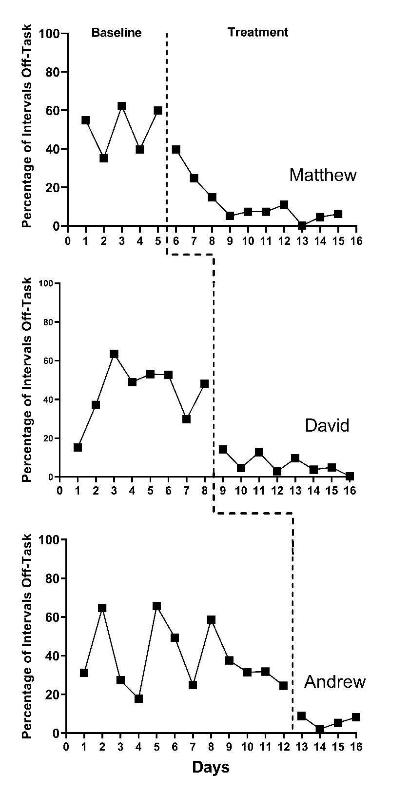
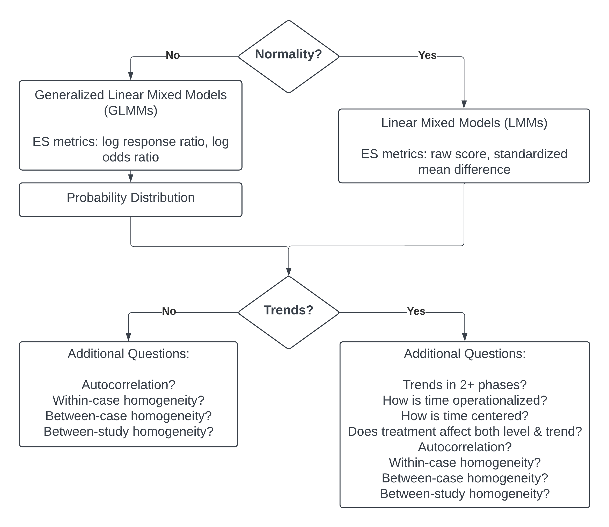

```{r, include = FALSE}
knitr::opts_chunk$set(echo = FALSE, fig.retina = 2)
```

# Introduction to Multilevel Modeling of Raw Participant Data {#MLM-raw-data}

_This chapter provides background on multilevel modeling of the raw data from studies included in a synthesis of SCDs.
We describe when this approach is useful, then discuss various types of study outcomes (e.g., continuous, count, and percentage-based), corresponding assumptions (e.g., within-phase trends, normality), and modeling options for synthesizing findings using multilevel models of raw, individual participant data. 
We conclude this chapter by providing a set of decision rules for meta-analysts to use when selecting among the currently available multilevel modeling options for synthesis of SCDs._

## Background

The use of multilevel models to analyze and synthesize effects from single-case studies is based on the recognition that the raw data often have a hierarchical data structure. 
Initially, two-level models were developed for data from single-case design (SCD) studies with multiple participants, such as multiple baseline designs, where observations are nested within cases [@Ferron_Bell_Hess_Rendina-Gobioff_Hibbard_2009; @Shadish_Kyse_Rindskopf_2013; @van2003combining].
To conduct syntheses across multiple studies, researchers have expanded upon these methods to allow for three-level models where individual observations are nested within cases and cases are nested in studies [@Moeyaert_Ferron_Beretvas_VandenNoortgate_2014; @Moeyaert_Ugille_Ferron_Beretvas_VandenNoortgate_2014; @Owens_Ferron_2012; @VandenNoortgate2008multilevel].

The multilevel modeling approach is valuable when the outcome and time variables are operationalized in a common way across the cases and studies and when the researchers are interested in how treatment effects vary across cases or change over time. 
However, because this approach entails analyzing data from multiple studies using a single multilevel model, it is limited to contexts where a common model is consistent with the logic model for the area of research and the included data. 
In this chapter, we describe when researchers should elect to use multilevel modeling of the raw data and the assumptions involved in using this approach for effect estimation and synthesis.
We then provide a set of the most common modeling options, along with a decision-making guide for selecting among the various multilevel modeling options (e.g., when there are/not baseline trends). 


## When to Use Multilevel Models of the Raw Data
When researchers are synthesizing the literature in an area, the purpose or aims of the synthesis should guide their methodological choices. 
In some situations, researchers may want to explore the degree to which the effect changes over time. 
Yet, information about variation in intervention effect over time is lost when a single value is used to summarize the effect for a case (as with case-specific effect sizes) or for a full study (as with design-comparable effect sizes). 
Using a multilevel model of the raw data allows researchers to retain and examine this information.
Researchers should also consider multilevel models if the study’s aim is to document the time it takes for an intervention to have an effect or whether the effects decay over time.
However, as we detail in the next section, the multilevel modeling approach assumes a common model for all cases in the included studies. 
Thus, multilevel modeling of the raw data is only viable when time is scaled the same way across studies and the outcomes are operationalized either 
(a) in the same way for each study or 
(b) in way that is similar enough to allow the outcome of any study to be equated, scaled, or standardized so that it matches the outcome for the other studies (e.g., converting all latency outcomes to minutes). 
See @Moeyaert_Ugille_Ferron_Beretvas_VandenNoortgate_2013 for more details on standardizing and the efficacy of doing so. 

When the outcome operationalizations are so disparate that the outcomes follow different probability distributions in different studies, it may be unreasonable to standardize the raw data and thus infeasible to use multilevel modeling. 
For example, consider two different study outcomes: “A” is the elapsed time from the beginning of a routine until the first disruptive behavior (latency), and “B” is the number of occurrences of the disruptive behavior during the routine (count). 
Outcome A might follow a normal distribution and Outcome B might follow a Poisson distribution. 
In a situation like this, the statistical models for each outcome are different, and we would not advise the use of a multilevel modeling approach. 
For this guide, we will focus on situations where the outcome is the same across cases and studies. 


## What We Assume with Multilevel Models of the Raw Data
There are several assumptions underlying the multilevel modeling approach to the synthesis of single-case data.
The overarching assumption is that a specific multilevel model describes the process by which the raw data were generated. 
If we have observations nested in cases, and those cases are nested within studies, we assume a specific three-level model. 
The first level represents a model for within-case observations. 
At this level, we make assumptions about the presence or absence of trends within each phase and about the deviations of individual observations from the trend lines (e.g., normally or Poisson distributed). 
Different ways of modeling the distributions allow for different choices in the effect size metric (e.g., standardized mean difference versus log response ratio).
The second level of the model accounts for variation in the trend lines and effect sizes between cases within a study (e.g., some cases may have a lower baseline average level of responding, or a larger shift in responding with intervention). 
Within the level-2 model, there are also distributional assumptions made, such as assuming the baseline levels for cases are normally distributed around some across-case average baseline level. 
Finally, the third level of the model accounts for variation between studies in the average baseline trend lines and effect sizes. 
Again, the level-3 model is specified with the typical assumption that the parameters of these average study trajectories are normally distributed around the parameters of the overall across-study average trajectory. 
In the following sections, we more fully define and elaborate on the underlying assumptions for multilevel modeling of raw single-case data. 

### Within-Case Model Assumptions
The within-case model accounts for the variation in the outcome measurements over time within a case. 
We must model the distribution of the observations around the trend lines, specify the trend line for each phase, and choose the effect size metric on which to quantify changes due to intervention (e.g., changes in level and/or trend between baseline and intervention phases).
When specifying the distribution of observations around the trend line, we consider several characteristics: distribution shape (e.g., normal versus some non-normal distribution), whether deviations from the trend line are independently distributed or serially dependent, and whether the variance is homogeneous or heterogeneous across the study (e.g., when the baseline phase variance is larger than that of the treatment phase). 
When specifying the trend lines, we consider the presence of trends and whether they are linear or follow some non-linear form.

When making decisions about modeling the shape of the distribution of observations around the trend line, normality is the simplest and most common assumption [e.g., @Declercq2019; @Moeyaert_Ferron_Beretvas_VandenNoortgate_2014; @van2003combining], and leads to estimation via linear mixed models (LMMs). 
In some contexts, assuming a normal distribution aligns well with the single-case data.
However, there are circumstances where it may not be appropriate to make such an assumption.
For example, when an SCD study outcome is a count variable with a low mean for one of the phases (e.g., frequency of a target behavior having a treatment phase mean at or near zero), a non-normal distribution like a Poisson, quasi-Poisson^[Strictly speaking, the quasi-Poisson is not a true probability distribution but rather only an approximation. However, it functions in effectively the same way as probability distributions such as the Poisson or negative binomial when developing a statistical model for count outcomes.], or negative binomial may be more appropriate [e.g., @Declercq2019; @Li_Luo_Baek_Thompson_Lam_2023; @Shadish_Kyse_Rindskopf_2013].

In other circumstances, the study outcome may be a percentage (e.g., the percentage of academically engaged time) with a phase mean that is close to the minimum (0%) or maximum (100%). 
When a study phase mean for a percentage variable is near the minimum or maximum value possible, the resulting non-normal distribution might be better approximated with a binomial, quasi-binomial^[Similar to the quasi-Poisson, the quasi-binomial is not a true probability distribution but rather only an approximation.], or beta-binomial distribution [@Li_Luo_Baek_Thompson_Lam_2023; @Shadish_Kyse_Rindskopf_2013]. 
Models involving non-normal probability distributions are known as generalized linear mixed models (GLMMs).

With GLMMs for non-normal distributions, it is common to use other effect size metrics that describe change in percentage or multiplicative terms. 
Outcomes measured as counts and proportions have bounded ranges: counts must be non-negative and proportions must be between zero and one. 
For such outcomes, additive changes may not generalize well because of floor or ceiling effects. 
For instance, a case with an average baseline latency of 20 seconds cannot logically experience a 25 second decrease in latency. 
In contrast, percentage or multiplicative changes are less constrained when outcome scales are bounded. 
Following the previous example, a case with an average baseline latency of 20 seconds can experience a 10% decrease or a 99% decrease in latency or could experience an increase of 2.2 times the baseline level. 
In GLMMs for count outcomes, it is common to specify the model in terms of the natural logarithm of the expected outcome (using a log link function), so intervention effects are quantified as log response ratios. 
In GLMMs for proportion outcomes, it is common to specify the model in terms of the log of the odds of the expected outcome (using a logistic link function), so that intervention effects are quantified as log odds ratios. 

As an example, consider a multiple baseline study by @ota2002Task that examined the impact of a mathematics software intervention on the percentage of intervals where students were off task. 
Figure \@ref(fig:otadupaul) presents the @ota2002Task study data. 
During baseline phases, observations appear somewhat normally distributed around the baseline means, with a pooled skewness value near 0 (*sk* = 0.15) and a pooled kurtosis value near 0 (*ku* = -0.77). 
However, non-normality is present in the treatment phases because the outcome occurs near the floor (0%) for much of the phase (*sk* = 1.86; *ku* = 4.99). 

```{r otadupaul, fig.cap = "Multiple Baseline Design Across Three Participants (Ota & DuPaul, 2002)"}

```

There is some research suggesting that the simpler multilevel models based on the normality assumption (i.e., LMMs) can produce unbiased average effect estimates and accurate inferences, even when the data are not strictly normal [@Declercq2019; @Joo_Ferron_2019].
However, at some point the departures can become so severe that methods accounting for non-normality (i.e., GLMMs) appear preferable. 
We expect that future research will better define the point at which researchers should move to these more complex models with non-normal probability distributions. 
We also anticipate that future research will further define the sample sizes (i.e., series lengths, number of cases, number of studies) needed for estimation of the more complex GLMMs.

The decision about an appropriate distributional model for the outcomes is closely related to the metric on which effect sizes are measured within the model. 
Typical LMMs have parameters that describe additive changes in the outcome. 
As a result, the parameters that describe intervention effects share the same units as the outcome scale. 
For instance, if the outcome variable is a measure of latency in seconds, then an LMM will describe effect sizes in terms of additive shifts in latency, such as an immediate decrease of 20 seconds or (if the model includes linear trends in the treatment phase) a reduction of 4 seconds per intervention session. 

In addition to making decisions about an appropriate shape for the distribution and an appropriate effect size metric, meta-analysts must decide whether the deviations from the trend line are independently distributed or serially dependent. 
If researchers assume serial dependency, they next decide how to model the serial dependence.
The most commonly assumed model for serial dependence in SCD studies is a first-order autoregressive model. 
There is a long history of debate about the prevalence of serial dependence in single-case data [see @matyas1997Serial; @Shadish_Sullivan_2011].
Research suggests that the impact of modeling and not modeling serial dependence depends on whether the statistical model is a single-level model (i.e., a regression for a single-case), a two-level model (e.g., a multilevel model for a single multiple baseline study having four cases), or a three-level model (e.g., a multilevel model of raw data extracted from 10 multiple baseline studies). 
For single-level models where serial dependence is present, a failure to model it does not bias the regression coefficient providing the point estimate of the treatment effect.
However, not modeling serial dependence in a regression model can bias the standard error (SE), leading to substantial problems when making inferences about the treatment effect [@Ferron_2002; @Greenwood_Matyas_1990].
Two-level models not accounting for serial dependence have less severe inferential problems than single-level models, but some problems still persist [@Ferron_Bell_Hess_Rendina-Gobioff_Hibbard_2009].
However, for three-level models, the choice about modeling potential serial dependence appears to have minimal, if any, impact on the treatment effect estimates or inferences [@Joo_et_al_2019; @Petit-Bois_2014].
Furthermore, for two- and three-level models, inferential techniques such as robust variance estimation can be applied to provide some protection against mis-specified assumptions regarding error dependence. 
Because we are focusing on the application of multilevel models for synthesizing across studies (three-level models) in this methods guide, we will use the simpler models that assume independence in our illustrations. 

Next, when specifying the model for the distribution of observations around the trend line, the researchers must consider the degree to which the variability in those observations across phases is consistent (homogeneous) or different (heterogeneous). 
In GLMMs of count data, the variance is assumed to depend on the outcome level.
However, for models assuming a normal distribution, it is typically assumed that the variance does not depend on the outcome level.
In Figure \@ref(fig:otadupaul), one might question not only the normality assumption (as previously noted), but also the difference in variance between the two phases (i.e., less variance in the treatment phases than the baseline phases). 
When using models that assume a normal distribution of the outcomes, researchers can specify either that the variance is equal across phases or that the variance differs between the phases. 
The simpler homogeneous variance assumption may be a reasonable choice. 
Simulation research has demonstrated that when the Kenward Roger method was used for inference, the simpler model provided unbiased treatment effect estimates and accurate confidence intervals even when the treatment phase variance was up to four times that of the baseline variance [@Joo_et_al_2019].
We anticipate that future research will help to provide more concrete guidance as to when changes in variance are substantial enough to warrant use of more complex models that assume heterogeneity.

Finally, the within-case model specifies the form of the growth trajectory for each phase.
The simplest trajectory is one without trend, but researchers can specify linear or non-linear trends within the multilevel modeling framework [e.g., @Hembry_Bunuan_Beretvas_Ferron_VandenNoortgate_2015; @Rindskopf_2014; @Swan_Pustejovsky_2018].
However, because the resulting effect estimates can vary substantially based on the modeling of trends, we encourage researchers to think carefully about the participants, outcomes, and contexts of the studies they are synthesizing. 
We also encourage researchers to visually analyze the data from each included SCD study. If visual inspection of the data reveals patterns generally consistent with expectations (e.g., the logic model and visual analysis both suggest baseline and treatment phase trends), then the researcher should specify the multilevel model to be consistent with the logic model and the raw data. 
Alternatively, when there is ambiguity about the appropriate model for the growth trajectory for the baseline and/or treatment phase, we suggest researchers estimate and contrast alternative plausible models to document the sensitivity of the effect estimate and inferences relative to the specification of the growth trajectory. 

### Case Similarity Assumptions
At level-2 of the multilevel model, we make assumptions about case similarity within a study.
Generally, if we assume that the outcome for one case follows a normal distribution, we assume that the outcome for all cases within the study follows a normal distribution.
Similarly, if we assume that the level-1 errors for one case are independent and homogenous, we assume that the errors for all cases are independent and homogeneous; and if we assume that trends are absent within a case, we assume a within-case model without trends is appropriate for all cases. 

In addition to assuming that the within-case model is appropriate for generalization across all cases, researchers must make assumptions related to the within-case model parameters.
Researchers must decide which parameters in the within-case model are the same for all cases and which parameters vary randomly across cases. 
Typically, the within-case variance parameters are assumed to be the same for each case (e.g., the session-to-session outcome variation for one case equals the session-to-session variation in the outcome for any other case). 
In contrast, we typically assume that the regression coefficients (e.g., the change in level and slope parameters that index the treatment effect) vary from case to case and that these regression coefficients are normally distributed across the cases. 
Indeed, if the aims of the synthesis include investigating heterogeneity of treatment effects across participants, then using a model in which the regression coefficients vary across cases may be critical for addressing research questions of interest. 
Finally, for the regression coefficients that vary, we must consider whether they also covary. 
For example, if cases with lower baseline levels tend to show smaller treatment effects, there would be covariation between the coefficients. It is possible to specify multilevel models that assume covariation and models that do not. 

We encourage researchers to consider the plausibility of the case similarity assumptions prior to jumping into a multilevel modeling application. 
At this time, methodological research is limited regarding the degree to which the case similarity assumptions can be violated, and thus it is not clear when more complex models and estimation approaches are preferable. 
@baek_Ferron_2020 provide a method for relaxing the assumption that the within-case variance is constant across cases within a study. 
They also show that differences in the within-case variance can often be tolerated by models that assume homogeneity. 
For the illustrations in this methods guide, we assume that within-case variances are equal across cases, and that the regression coefficients that vary follow normal distributions. 
We anticipate that future research will continue to develop alternatives and guidance for contexts where these assumptions are not tenable. 


### Study Similarity Assumptions
At the third level of the multilevel model, we make assumptions about the similarity of the studies regarding the parameters at both of the first and second levels of the model.
In terms of the model for observations nested within cases, we need to make assumptions about the similarity of distributions and variances.
Typically, multilevel models and GLMMs assume that all outcomes from all studies follow a single distributional family (e.g., normal, negative binomial, beta-binomial). 
Furthermore, for linear mixed models, we typically assume that the session-to-session variation in the outcome is constant not only across the cases within each study, but also across all cases in all included studies. 
Analogously, for GLMMs involving distributions with dispersion parameters (such as the quasi-Poisson or negative binomial), we typically assume that the dispersion is constant across all cases in all included studies. 

Regarding the regression coefficients of the case-specific model, if we assume the baseline level varies randomly across cases within one study, we assume that the baseline levels vary randomly across cases in all studies.
Similarly, if we assume that the treatment effect varies randomly across cases in one study, we assume that the treatment effect varies randomly across cases in all studies, and if covariation is assumed among the random effects in one study, covariation is assumed for all studies. 

In addition to assuming that the general between-case model is appropriate for generalization across all studies, researchers must make assumptions related to the between-case model parameters (i.e., which parameters are the same for all studies and which parameters vary randomly across studies).
Typically, the between-case variance parameters are assumed to be the same for each study. Consequently, there is an assumption of homogeneity across studies in the variation (and covariation) between cases.
In contrast, we typically assume that the regression coefficients (e.g., the across case average change in level and slope parameters) vary from study to study and that these coefficients are normally distributed across the studies. 

As with the previous sets of assumptions, we encourage researchers to consider the plausibility of the study similarity assumptions prior to applying a multilevel model. 
For example, if the participant sampling methods for one study are markedly different from the sampling methods of another study (e.g., homogeneous versus heterogeneous purposive sampling), the assumption of equal between-case variance has likely been violated. 
Similarly, if studies use heterogeneous approaches to measuring outcomes, such as widely varying observation session lengths, the assumption of common within-case variance may be implausible. 
Hopefully, future research will provide guidance about the degree to which multilevel models can tolerate some violation of these assumptions. 

## Comparison to Other Synthesis Approaches
Compared to the other broad approaches to synthesis of single-case studies, the assumptions involved in the raw data synthesis approach have some commonalities and some unique features.
Both the raw data synthesis approach and design-comparable effect size syntheses are based on multilevel modeling, as the latter entails specifying a separate multilevel model for the data from each study to estimate a study-level summary effect size on a scale-free metric.
The resulting design-comparable effect size can then be compared to the effect size from a between-group design.
Thus, both approaches require making assumptions about case similarity within a study.
Further, we have recommended using a common model specification when estimating design-comparable effect sizes, similar to how the raw data synthesis approach requires specifying a model that captures the form of time trends across all included studies.
However, synthesis of design-comparable effect sizes does not involve study similarity assumptions (such as homogeneity of outcome variance) to the same extent as the raw data synthesis approach.
Of course, along with additional assumptions, the raw data synthesis model also provides richer descriptions of the distribution of and variation in effects—not only variation across studies, but also variation across cases within studies and variation over time. 

In contrast to the design-comparable effect size approach and the raw data synthesis approach, syntheses of case-specific effect size indices do not entail as extensive a set of assumptions about case similarity.
Rather, the case-specific effect size approach avoids making case similarity assumptions about regression coefficients or session-to-session outcome variation, and instead focuses on estimating a summary effect size index for each case. 
Because no case similarity assumptions are made, it is more difficult to accommodate complex data features such as time trends and autocorrelation than it is with multilevel modeling.
Thus, synthesis using case-specific effect size indices loses some flexibility but gains a degree of simplicity by avoiding the need to make so many assumptions. 

## Multilevel Modeling Options for Synthesizing Single-Case Research
We summarize in this section the decisions to be made when choosing a specific multilevel model for synthesizing single-case research. 
For the studies included in the synthesis, we suggest that meta-analysts first attend to the operationalization of the outcome variable(s). 
For multilevel modeling of the raw data across studies, recall that outcomes must be operationalized in the same way, or in a manner similar enough so that all included study outcomes can be transformed or standardized so they consistently use the same unit of measurement.
In considering the outcome, it is also important to determine if assuming a normal distribution is reasonable. 
If assuming normality is reasonable, the meta-analyst can turn to LMMs for estimation.
However, if it is not reasonable to assume normality (as with some count-based variables), then the meta-analyst should consider GLMMs. 
Additionally, when using GLMM for non-normal data, they must consider the most appropriate probability distribution for modeling the outcome (e.g., Poison, quasi-Poisson, or negative binomial). 

Regardless of whether the meta-analyst is assuming normality and working with a LMM or assuming some non-normal distribution and working with a GLMM, the next major decision to make is whether to model trends. 
We suggest researchers base their decision on: 
(a) the logic model underlying the research to be synthesized, considering what is known about the participants, outcome, intervention, and setting; and 
(b) visual analysis of the data from each of the studies being synthesized. 

Regardless of whether trends are included, there are several further considerations they must make to fully define the variances and covariances that will be estimated.
For example, they will need to specify the deviations of observations from the trend line as either autocorrelated or independent. 
They will also need to specify whether the variance in the deviations from the trend line remains constant or changes over the course of the study.
Finally, beyond the within-case assumptions of variability, the meta-analyst must determine if it is reasonable to assume homogeneity of within-case variance across all cases in all included studies, and whether between-case variance terms are homogeneous across studies. 

If the meta-analyst specifies the model to include trends, their list of considerations is slightly longer.
Not only do they consider the assumptions about the variances and covariances, as done with a model assuming no trends, but the meta-analyst must now address questions about the trends and measurement of time. 
More specifically, they must make decisions about whether there are trends in either or both baseline and treatment phases, whether the intervention affects the trend, and whether the trends are linear or nonlinear. 
Additionally, they must make assumptions about the time variable. 
For example, in one study context it may be assumed that slopes are attributed to maturation over time and the time variable is measured in calendar days. 
Conversely, in another study context, the researchers may attribute the within-case treatment phase slope to time exposed to the intervention, and the time variable may be measured on a scale defined as “sessions.” 
Because meta-analysts must use the same multilevel model when conducting a synthesis of all included studies, they need to be consistent in how they approach the definition of the time variable.
Finally, meta-analysts must determine when the effect should be indexed in the treatment phase, leading to decisions about how to center the time variable in the multilevel model.
When centering or rescaling a time variable, meta-analysts effectively move the zero on the time scale so that it corresponds to the time at which they want to estimate the treatment effect.
For example, a researcher who wants to estimate the immediate intervention effect will center time so that zero corresponds to the first treatment phase observation, whereas a researcher who wants to estimate the effect five sessions into intervention would center time so that zero corresponds to the fifth treatment phase observation.

In Figure \@ref(fig:mlmapproach), we arrange these considerations into a series of decision rules that researchers can use to select between LMMs and GLMMs, and models with and without trends. 
Recent methodological research has started to develop more concrete guidance on the most appropriate modeling and estimation choices in contexts where non-normality is assumed and GLMMs are more appropriate [@Li_Luo_Baek_Thompson_Lam_2023].
However, for the purposes of this guide, we illustrate the application of multilevel models for study contexts where it is reasonable to assume normality and thus LMMs are appropriate.
We first consider the application of LMMs when expecting no trends (Chapter 7), and then address the more complex situation when anticipating trends (Chapter 8). 

```{r mlmapproach, fig.cap = "Flow Chart for the Selection of Multilevel Modeling Approach"}

```

