```{r, include = FALSE}
knitr::opts_chunk$set(echo = FALSE, fig.retina = 2)

library(dplyr)
library(knitr)
library(kableExtra)
```

# Illustration of Multilevel Modeling When No Trends Are Assumed {#MLM-Trend}

_This chapter demonstrates the application of multilevel models that include time trends in the baseline and/or treatment phases. For illustrative purposes, we use data from four single-case studies examining interventions for improving student writing. We provide step-by-step instructions to demonstrate organization of the data, necessary coding of variables, appropriate multilevel model selection, and model specification and estimation using the MultiSCED app._ 

In this chapter, we illustrate the application of multilevel modeling in contexts where one expects single-case design (SCD) study data to include time trends. Just as in the previous chapter, the approach presented in this chapter assumes that all included SCD studies measured the dependent variable in the same way, or in ways that can be standardized so that the outcomes and measures of time are operationalized using a common scale. Unique to this chapter, we demonstrate the specification and analysis process for a model in which the dependent variable is expected to systematically increase or decrease during a phase, and the intervention is expected to impact the outcome's level and rate of change over time. As a running example, we imagine a scenario where our goal is to synthesize evidence from SCDs studies that examine intervention effects on writing outcomes—specifically on students’ rate of correct word sequences written per minute.

Writing interventions are often necessary when students’ writing skill lags behind their peers. Due to natural school-based instructional activities, we anticipate that some students may show slight improvement during baseline. However, only when the struggling writers begin intervention do we expect an immediate increase in the production of correct word sequences, and an increase in their rate of improvement over time. To illustrate the steps for applying multilevel models in contexts where trends are expected, we use a set of four multiple probe and multiple baseline SCDs previously included in a larger review of intervention effects on student writing outcomes [@datchuk2020Level]. In a real, full-scale meta-analysis project, we would synthesize all studies meeting the inclusion criteria. However, our illustrations include only four studies from the larger review to succinctly illustrate the details of the modeling process that includes visually analyzing the data of each primary study for consistency with our expectations and with the assumptions of the selected multilevel model. 

In two multiple probe studies, @walker2005using and @walker2007improving, researchers examined the impact of a rule-based direct instruction intervention on the expressive writing of high schoolers with learning disabilities. In our third study, @stotz2008Effects investigated the effects of a self-graphing intervention using a multiple baseline design across three fourth graders with high-incidence disabilities. In the fourth study, @lewandowski2011effects examined the effects of a planning and drafting intervention on writing using a multiple baseline design across six elementary students with attention difficulties. While this final study included two participants with only two baseline observations, we include it here for the purposes of our illustration. However, for other purposes, researchers might choose to exclude the @lewandowski2011effects study because its design does not meet the _What Works Clearinghouse Standards_ [-@WWC2022] for multiple baseline designs.

In this chapter illustration, our goal is to model the outcome data from all cases in all studies to estimate the average effect of writing interventions on the rate of writing correct word sequences. This objective is feasible because each of the studies measures the number of correct word sequences written by students. To analyze these outcomes on a common scale, we convert all data to correct word sequences per minute. 

Because our model includes trends, we must make two important decisions about the most appropriate method for operationally defining a common time variable. First, to determine the unit of time measurement, we consider how the outcome we are trying to measure changes over time. For instance, changes could occur linearly across calendar days, across school days, or across intervention sessions (which might occur more or less frequently than once per school day). If we anticipate changes occurring during baseline due to maturation, the calendar day unit of measurement might be appropriate. If we anticipate baseline change to occur related to regular teaching and learning activities in the classroom, it may be best to measure the outcome using the unit of school days. Alternatively, if we expect changes to occur with each additional intervention session, then perhaps session number is the ideal choice for the units of time. 

Next, when primary studies use different units to measure time, meta-analysts must convert raw data to use a consistent unit for time in the analysis. In three of our four included studies, the authors reported "sessions" as the only unit of time (the exception was @stotz2008Effects, who measured the outcome across consecutive school days). Although less ideal than a more precise time specification (e.g., days), our operationalization of time to model trends is limited the use of "sessions" because no other information was available within the @lewandowski2011effects or Walker [-@walker2005using; -@walker2007improving] manuscripts. While we acknowledge the potential biases in estimating effects with a less precise definition of time, we find it reasonable to use “sessions” as the unit of time because we expect writing to improve with practice, and writing practice is largely expected to occur within the observation sessions. We recommend meta-analysts in a similar situation provide rationales for their selection of a common time variable so these limitations can be taken into consideration when reviewing the effect estimation results. 

After operationalizing our outcome measure and time variables, we proceed with the selection of a multilevel modeling approach in effect estimation because we are interested in how intervention impacts both the level and slope of students' writing over time (see the decision rules in Figure 1.1). Thus, we divide this chapter illustration into two stages: (a) selecting a multilevel model for the studies and (b) estimating the multilevel model using the MultiSCED app, a web-based application for conducting multilevel models of SCD studies [@Declercq2020].

## Selecting a Multilevel Model for the Single-Case Studies

Using the decision rules in Figure \@ref(fig:mlmapproach), we first select among the general multilevel modeling approaches. We must decide whether we should treat the outcome as a continuous variable that is normally distributed around the trend lines. The common study outcome is a rate of correct writing sequences per minute, which is based on a count. Thus, it would be reasonable to consider a generalized linear mixed model (GLMM) that does not assume normality. However, GLMMs are more complex than linear mixed models (LMMs) and there is limited evidence of GLMM utility for synthesizing SCDs. For the purposes of this methods guide, we will examine our expectations about the outcome for the contexts studied. In addition, we will visually analyze the graphed outcome data over time per case to gauge the potential severity of any violation to the normality assumption. If not too severe, we will proceed with LMMs because there is evidence of their ability to produce unbiased estimates of treatment effects quantified as average mean differences or mean changes in linear slope on the scale of the outcome, along with appropriate inferences, even in contexts where outcomes are not normally distributed [@Declercq2019; @Joo_Ferron_2019]. In the future, we anticipate that further methodological research will better clarify the relative merits of GLMMs versus LMMs and provide clearer guidance for researchers to select among the options.

In this illustration, the outcome is students' rate of correct word sequences written per minute. Given our prior knowledge and experience with this dependent variable, we anticipate that outcome levels will be lower than desirable in baseline, but not at the floor. That is, we do not expect participants' baselines to solely contain observations with values of zero. Following intervention, we predict the rates of correctly written word sequences to be further from zero and to more closely approximate a normal distribution.

We present the included study graphs in Figure \@ref(fig:Walker-2005) [@walker2005using], Figure \@ref(fig:Walker-2007) [@walker2007improving], Figure \@ref(fig:Stotz-2008) [@stotz2008Effects], and Figure \@ref(fig:Lewandowski-2011) [@lewandowski2011effects]. For each of these studies, we visually inspect the graphs to rule out obvious non-normality (i.e., constant values within a phase, or trend lines so close to the floor or ceiling that variation on one side of the trend line is notably different than on the other side). Visual analysis of the graphed data in Figures \@ref(fig:Walker-2005)-\@ref(fig:Lewandowski-2011) suggest variation around the trend lines that are not obviously non-normal. To better understand the potential degree of a normality assumption violation, we pooled the deviations from the ordinary least squares estimates of within-phase trend lines for each case included in the studies and estimated the skew and kurtosis of the distribution of the deviations. Resulting summary indices suggest moderate departures from normality in baseline ($sk = 1.56$; $ku = 7.43$), and a closer-to-normal distribution in the treatment phase ($sk = 0.11$; $ku = 4.79$). Because the distributions are not severely non-normal and research suggests that LMMs for SCD data can handle some non-normality in the outcomes [@Declercq2019; @Joo_Ferron_2019], we proceed with use of an LMM, which also allows us to illustrate the MultiSCED app.

```{r Walker-2005, out.width = "60%", fig.cap = "Effect of Intervention on Correct Word Sequences (Walker et al., 2005)"}
# Figure 8.1
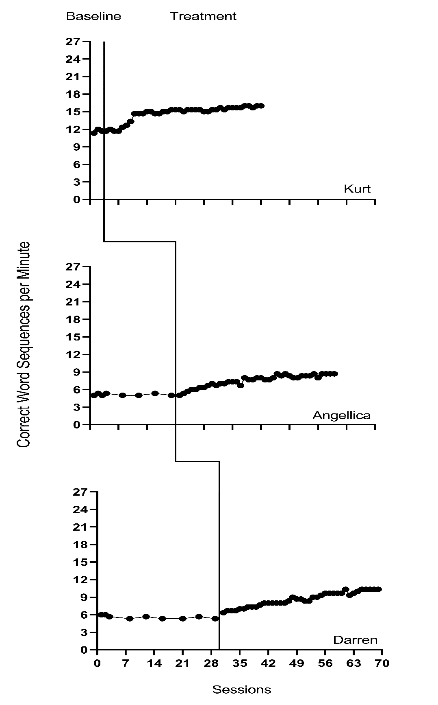
```

```{r Walker-2007, out.width = "60%", fig.cap = "Effect of Intervention on Correct Word Sequences (Walker et al., 2007)"}
# Figure 8.2
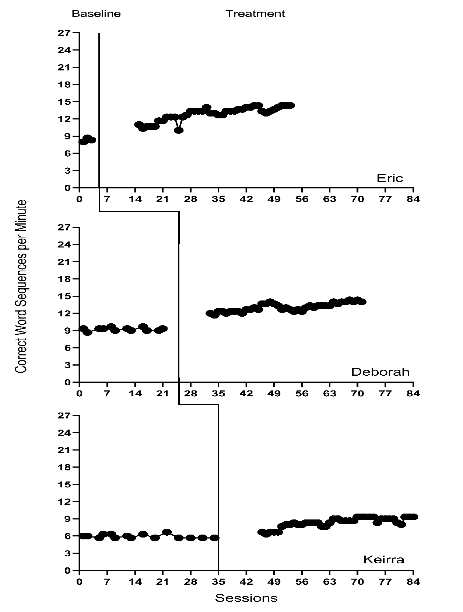
```

```{r Stotz-2008, out.width = "60%", fig.cap = "Effect of Intervention on Correct Word Sequences (Stotz et al., 2008)"}
# Figure 8.3
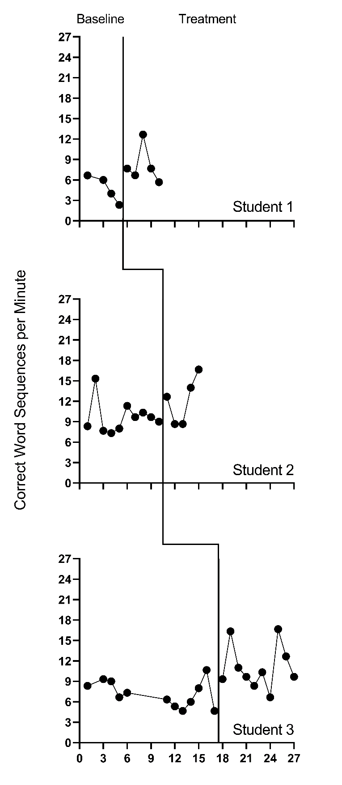
```

```{r Lewandowski-2011, out.width = "60%", fig.cap = "Effect of Intervention on Correct Word Sequences (Lewandowski, 2011)"}
# Figure 8.4
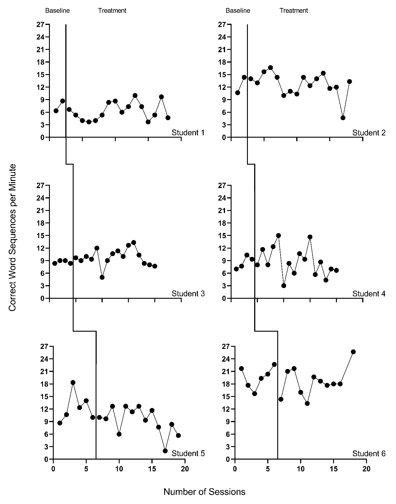
```

Next, we must decide whether to include trends in our model. The outcome in each study is the rate of writing correct word sequences. Using prior knowledge of this academic outcome and the context of the studies, it is plausible that some participants show a slight degree of improvement in the writing outcome during the baseline phase because students engage in writing activities in a variety of academic contexts. However, we do not anticipate a general positive linear trend to be present across all cases in all studies. Unlike our expectations for baseline data, we are more confident in our assumption that the interventions will result not only in an immediate and noticeable increase in students’ correctly written word sequences, but also in a change in the rate of growth. Therefore, we plan to model trends in the treatment phases. 

Visual inspections of the graphs in Figures \@ref(fig:Walker-2005)-\@ref(fig:Lewandowski-2011) are partially consistent with our expectations for baseline and treatment phase trends. Overall, we do not see a consistent pattern in trends for participants' baseline writing rates. Turning to the treatment phases, visual inspection of participants' graphs across studies reveals a general positive linear trend in the data as expected. For most cases, the treatment phase trends appear steeper than any trends present in the baseline phase, but the pattern of positive trends across the cases is not consistent. There is also variability in intervention duration (i.e., treatment phase length). However, based on our understanding of the study outcome (i.e., writing) and context (i.e., school setting), and consistent trends during intervention across most cases (especially in Figures \@ref(fig:Walker-2005) and \@ref(fig:Walker-2007)), it appears reasonable to use a multilevel model with trends (at least in the treatment phases).

We turn next to an examination of the within-case variance using visual analysis of study graphs. Figures \@ref(fig:Walker-2005)-\@ref(fig:Lewandowski-2011) show similar variation across baseline and treatment phases and a follow-up statistical analysis of the deviations from trend lines shows that the standard deviation (SD) of these deviations was 1.35 in baseline and 1.53 in intervention. Although the within-case variability is similar across phases, it appears to differ across studies, with more variability in the latter two studies that examined younger children. Adding confidence to this conclusion, descriptive statistics for the Walker et al. [-@walker2005using, -@walker2007improving] studies indicate deviations from the trend lines of 0.46 and 0.50 SDs respectively, whereas the SDs from the trend lines for the studies by @stotz2008Effects and @lewandowski2011effects are 2.32 and 2.46 respectively. This obvious violation of the homogeneity assumption appears to be at least partially responsible for the high kurtosis values seen in our examination of normality. Examining normality within each study, the maximum kurtosis value is only 1.5 (for @walker2005using). While it is feasible to estimate separate covariance matrices for the studies with older and younger participants [@baek2016using; @baek_Ferron_2020], these more complex heterogeneous variance models are not accessible via the MultiSCED app. In addition, the average treatment effect size estimates (changes in level and slope) and related inferences are relatively robust to this sort of violation of the homogeneity assumption [@baek_Ferron_2020], so proceeding with the simpler homogeneous variance models seems reasonable.

In summary, our visual analyses of the primary study data resulted in several conflicts between our expectations, the study results, and the assumptions associated with a multilevel model with trends. First, the inconsistencies raise questions about whether we need to include baseline trends in our model specification. Second, there are multiple violations to the assumptions of the basic LMM for SCD studies, like evidence of non-normality (particularly in the baseline phases) and heterogeneity of variance across cases. The model we use in this chapter is surely simpler than the process that actually generated the data under analysis. With a relatively small number of studies, one may want to further simplify their model specification by removing baseline trends. However, for purposes of illustrating multilevel modeling of trends using the MultiSCED app, we proceed with the more elaborate model specification. We also note that the multilevel model estimates of the across-case average treatment effects (i.e., change in level, change in trend), as well as the inferences associated with those effects (e.g., confidence intervals, significance tests), are relatively robust to violations of the normality and homogeneity assumptions.

## Details of the Multilevel Model with Trends

The multilevel data structure has repeated observations that are nested within cases and cases that are nested within studies, and thus there is a model for the variation of observations within a case (level-1), a model for the variation between cases within a study (level-2), and a model for variation between studies (level-3). The formal specification of the within-case (level-1) model with trends in both the baseline phase and the treatment phase is:
\begin{equation}
(\#eq:MLM-L1-Trend)
Y_{ijk} = \beta_{0jk} + \beta_{1jk}Tx_{ijk} + \beta_{2jk}Time_{ijk} + \beta_{3jk}Tx_{ijk} \times Time_{ijk} + e_{ijk},
\end{equation}
where $Y_{ijk}$ is the outcome variable $Y$ at measurement occasion $i$ for case $j$ of study $k$. Tx_{ijk} is dummy coded with a value of 0 for baseline phase observations and a value of 1 for treatment phase observations. $Time_{ijk}$ is the value of the time variable on occasion $i$ for case $j$ of study $k$. The error term, $e_{ijk}$, is time-, case-, and study-specific, and assumed independently and normally distributed with variance $\sigma_e^2$. Outside of the MultiSCED app, it is feasible for researchers to estimate a different (co)variance structure for $e_{ijk}$, such as first-order autoregressive or heterogeneous across phases or cases [@Joo_et_al_2019; @Petit-Bois_2014; @baek2016using].

Second, we must decide how to center the $Time_{ijk}$ variable (i.e., at what point in time is the value of $Time_{ijk}$ equal to zero). Our choice of the focal time to index the effect has consequences for how we interpret the regression coefficients of the model. The most common choice is to code $Time_{ijk}$ such that zero (0) corresponds to the first treatment phase observation for case $j$ for study $k$. Because this centering choice is appropriate for this example, and because the MultiSCED app will do this centering of time for us, we do not need to enter the centered time variable into our dataset. If we wanted to enter this centered time variable during our data organization phase, we would code the treatment phase observations sequentially starting from 0 (i.e., 1 for the second treatment phase observation, 2 for the third, and so on). For baseline phase observations, coding begins by working back from 0. In other words, we would code the last baseline phase observation as -1, the second-to-last baseline observation as -2, and so on.

Then, after deciding to center $Time_{ijk}$ such that 0 corresponds to the first treatment observation, we can interpret $\beta_{0jk}$ as the expected baseline value for case $j$ of study $k$ if the baseline is extended to the first treatment observation. $\beta_{1jk}$ is then interpreted as the immediate effect of the intervention (i.e., the difference between the treatment phase trend line and the extended baseline trend line at time zero). Figure \@ref(fig:Walker-Darren) visually depicts these regression coefficients. The baseline slope is $\beta_{2jk}$, and the change in slope between baseline and treatment phases is $\beta_{3jk}$. 

```{r Walker-Darren, out.width = "60%", fig.cap = "Illustration of Treatment Effect for Darren (Walker et al., 2005)"}
# Figure 8.5
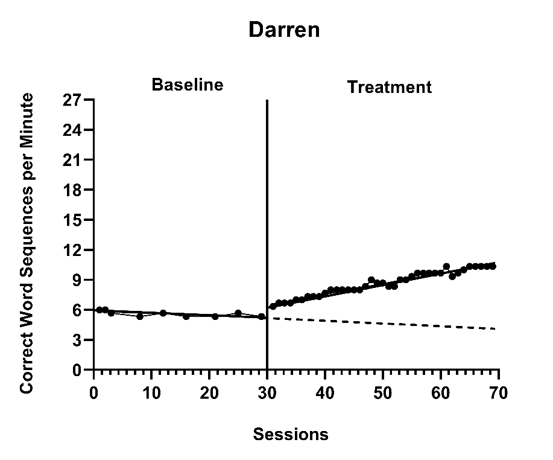
```

The between-case (level-2) model is:
\begin{equation}
(\#eq:MLM-L2-beta0)
\beta_{0jk} = \gamma_{00k} + u_{0jk}
\end{equation}
\begin{equation}
(\#eq:MLM-L2-beta1)
\beta_{1jk} = \gamma_{10k} + u_{1jk}
\end{equation}
\begin{equation}
(\#eq:MLM-L2-beta2)
\beta_{2jk} = \gamma_{20k} + u_{2jk}
\end{equation}
\begin{equation}
(\#eq:MLM-L2-beta3)
\beta_{3jk} = \gamma_{30k} + u_{3jk}
\end{equation}
where $\gamma_{00k}$ is the expected across-case average baseline value at the time of the first treatment observation of study $k$, $\gamma_{10k}$ is the across-case average immediate treatment effect of study $k$, $\gamma_{20k}$ is the across-case average baseline slope, and $\gamma_{30k}$ is the across-case average change in slope between baseline and treatment phases. The case-specific errors ($u_{0jk}$, $u_{1jk}$, $u_{2jk}$, and $u_{3jk}$) correspond to the regression coefficient deviations of individual case $j$ of study $k$ from the across-case average values for study $k$. These case-specific errors are assumed multivariate normal with covariance 
$\Sigma_u = \begin{bmatrix}
\sigma_{u_0}^2 & & & \\ 
\sigma_{u_1u_0} & \sigma_{u_1}^2 & & \\
\sigma_{u_2u_0} & \sigma_{u_2u_1} & \sigma_{u_2}^2 & \\
\sigma_{u_3u_0} & \sigma_{u_3u_1} & \sigma_{u_3u_2} & \sigma_{u_3}^2\\
\end{bmatrix}$.
In some applications, an unstructured matrix will be difficult to estimate with the limited number of cases available. Common alternatives include estimating a diagonal covariance structure or removing errors from Equations \@ref(eq:MLM-L2-beta2) and \@ref(eq:MLM-L2-beta3) so that some of the slopes do not vary randomly across cases.

The between-study (level-3) model is:
\begin{equation}
(\#eq:MLM-L3-beta0)
\gamma_{00k} = \theta_{000} + v_{00k}
\end{equation}
\begin{equation}
(\#eq:MLM-L3-beta1)
\gamma_{10k} = \theta_{100} + v_{10k}
\end{equation}
\begin{equation}
(\#eq:MLM-L3-beta2)
\gamma_{20k} = \theta_{200} + v_{20k}
\end{equation}
\begin{equation}
(\#eq:MLM-L3-beta3)
\gamma_{30k} = \theta_{300} + v_{30k}
\end{equation}
where $\theta_{000}$ is the across-study average expected baseline value at the time of the first treatment observation, $\theta_{100}$ is the across-study average immediate treatment effect, $\theta_{200}$ is the-across study average baseline slope, and $\theta_{300}$ is the across-study average change in slope between baseline and treatment phases. The study-specific errors ($v_{00k}$, $v_{10k}$, $v_{20k}$, and $v_{30k}$) correspond to the deviations of the across-case average coefficient values of study $k$ from the overall values averaged across all studies. These study-specific errors are assumed multivariate normal with covariance
$\Sigma_v = \begin{bmatrix}
\sigma_{v_0}^2 & & & \\ 
\sigma_{v_1v_0} & \sigma_{v_1}^2 & & \\
\sigma_{v_2v_0} & \sigma_{v_2v_1} & \sigma_{v_2}^2 & \\
\sigma_{v_3v_0} & \sigma_{v_3v_1} & \sigma_{v_3v_2} & \sigma_{v_3}^2\\
\end{bmatrix}$. In many applications, an unstructured matrix will be difficult to estimate with the limited number of studies available. In our example, the data include only four independent studies, which would not be considered adequate for estimating an unstructured covariance matrix. Common alternatives include estimating a diagonal covariance structure or removing errors from some of Equations \@ref(eq:MLM-L3-beta2) and \@ref(eq:MLM-L3-beta3) (and potentially \@ref(eq:MLM-L3-beta1)) so these regression coefficients do not vary randomly across the studies.

For the purposes of the methods guide, we illustrate in detail the estimation of the multilevel model for the writing outcome of correct word sequences per minute using the MultiSCED app [@Declercq2020]. This app limits users to LMMs and the covariance structures described in this section. To allow for the exploration of how model specification details influence estimates and inferences, we contrast the full model results (from Equations \@ref(eq:MLM-L1-Trend) to \@ref(eq:MLM-L3-beta3)) with models having simpler covariance structures (e.g., models without as many coefficients varying randomly across studies). See Chapter 7 Appendix for examples of SAS and R code used to estimate models with diagonal covariance structures.

## Estimating the Multilevel Model for the Included Writing Intervention Studies

Using the web-based MultiSCED calculator for the multilevel modeling of single-case data, we can estimate the across-case average treatment effect and variance components describing the degree of heterogeneity in treatment effects. The MultiSCED app is available at http://34.251.13.245/MultiSCED/. To use this app, researchers must save their dataset as a text file (.txt) or a comma-delimited file (.csv). We recommend that researchers first enter their data in Excel, and then save the Excel dataset as a tab-delimited text file.

Figure \@ref(fig:Excel-Lewandowski) shows a screenshot of a portion of the original Excel spreadsheet containing the data extracted from the set of four writing intervention studies, with correct word sequence writing outcomes converted as needed to compare rates on a common per-minute scale. This spreadsheet contains six columns of data corresponding to the following six variables: (a) study identifier (i.e., Study), (b) case identifier (i.e., ID), (c) point in time for which the outcome was recorded (i.e., Time), (d) frequency outcome (number of correct word sequences written; i.e., CWS), (e) rate outcome (rate of correct word sequences written per minute, CWSpM), and (f) phase identifier (i.e., intervention). Note that the time variable is numbered sequentially from first observation to last observation and has not yet been centered relative to the start of the treatment phase.

To use the MultiSCED app, the session and outcome variables must be numerical values. However, the variables for study, case, and phase identifiers may be entered as alphanumeric (word labels) or numeric values. Because the app requires it, we organized the data using a long format with one row per time point per case per study, where we input the value of the outcome at each time point for a specific case below the cell containing the value at the previous time point. For each study (e.g., Lewandowski in Figure \@ref(fig:Excel-Lewandowski)), we first arranged cases by baseline length. In order of shortest to longest baseline length, we entered all observations for one case at a time, in order of time. After we entered all data for the case with the shortest baseline, we entered data for the case with the second-shortest baseline, and so on. After entering the data for all cases within a particular study, we repeated the process with the remaining studies; we entered the data from each successive study below the data from the previous study.

```{r Excel-Lewandowski, out.width = "60%", fig.cap = "Screenshot of Extracted Study Data Within the Original Excel Spreadsheet"}
# Figure 8.6
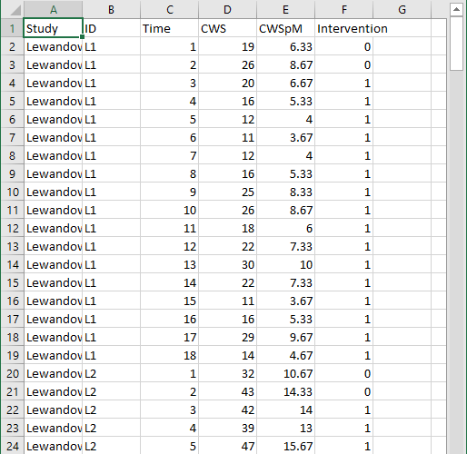
```

After organizing the data within the Excel spreadsheet, we then save the Excel spreadsheet as a tab delimited text file (.txt). We present a screenshot of a portion of the resulting text file in Figure \@ref(fig:Txt-Lewandowski). To prepare the data set for the MultiSCED app, one can follow the steps below.

For Windows: 

1. From the _File_ menu, select _Save As_.
2. Select _Browse_ to select a folder where the spreadsheet will be saved.
3. To save the spreadsheet, enter a file name in the corresponding field.
4. Then use the _Save as_ Type menu to select the option to save the file type as Text (Tab delimited) (*.txt).
5. Finally, click _Save_. 

If there are multiple worksheets within the original Excel spreadsheet file, a pop-up message will appear to request permission to save only the active sheet. If this occurs, select OK to save the data file. We strongly encourage researchers to open the newly created tab delimited text file to ensure that the data appear as expected. 

For MacOS:

1. From the _File_ menu, select _Save As_.
2. Enter a file name in the _Save As_ field.
3. Select a location from the dropdown menu, _Where_, to save your spreadsheet.
4. Then use the _File Format_ menu to select the option to save your file type as Tab delimited Text (.txt).
5. Finally, click _Save_.

It is important to note here that an error message will appear if attempting to save a spreadsheet with multiple worksheets. A pop-up will inform you that the workbook cannot be saved in the selected file format. If encountering this error, researchers should open a newly created file with one worksheet for the data needed in their analysis. 

```{r Txt-Lewandowski, out.width = "60%", fig.cap = "Screenshot of Saved Tab Delimited Text File"}
# Figure 8.7
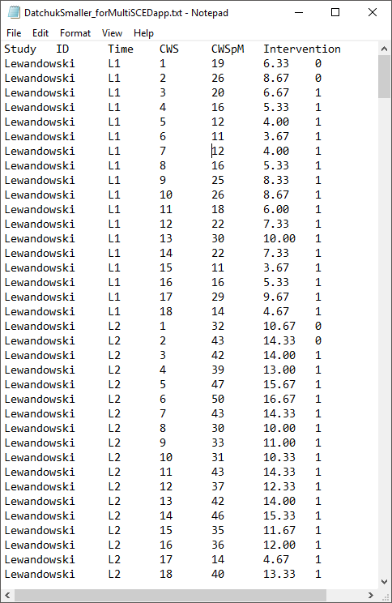
```

After converting and saving the dataset as a tab delimited text file, we are prepared to use the MultiSCED app (http://34.251.13.245/MultiSCED/). Figure 8.8 is a screenshot of the Home page for the MultiSCED app. At the top of the page, one will see that the _Home_ link on the blue menu bar has a darker background than the other website page links. To access the app, we must move from the _Home_ page to the _Input_ page by clicking on the Input link in the website navigation menu bar. 

```{r MultiSCED-navigation-homepage, out.width = "60%", fig.cap = "Screenshot of the Website Navigation Menu and Home Page of the MultiSCED App"}
# Figure 8.8
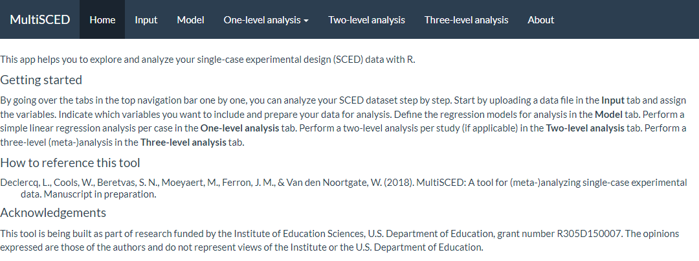
```

A screenshot of the _Input_ page is shown in Figure \@ref(fig:MultiSCED-input-dataFile). After navigating to the _Input_ page, we find a sidebar menu with three additional links: _Data file_, _Variables_, and _Data summary_. We first select the sidebar option to choose the _Data file_ section. When it is highlighted in dark blue (as in Figure \@ref(fig:MultiSCED-input-dataFile)), we can upload our dataset (.txt or .csv) by clicking the _Browse_ button, selecting the folder where the data file is saved, and clicking _Open_. When we did this, two additional menus appeared in the _Upload_ box beneath the _Browse_ button: _Separator character_ and _Decimal character_. The default option for the _Separator character_ is tab. We keep the default setting because we already saved the dataset as a tab delimited text file. However, if your file is saved as a .csv file, you can select _comma_ under the _Separator character_ dropdown menu. Regarding the _Decimal character_ menu, the option for decimal representation defaults to dot, which is the standard choice in the U.S. However, for researchers located outside of the U.S. that use commas to mark decimals (e.g., EU countries), the setting will need to be changed from the default of dot to the comma option. We note here that researchers can use sample data to practice using the app. To access sample data, researchers should upload any file (which will not be used) and then click on the _Use testdata_ checkbox. Sample data information will be automatically input into the _Variables_ section which follows. After completing these actions, we transition to the _Variables_ section on the left side of the screen.

```{r MultiSCED-input-dataFile, out.width = "60%", fig.cap = "Screenshot of the Input Page of the MultiSCED App"}
# Figure 8.9
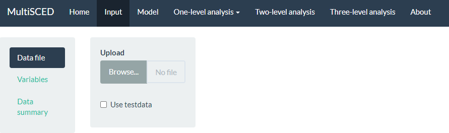
```

As shown in Figure \@ref(fig:MultiSCED-input-variables-Lewandowski) of the MultiSCED app _Input_ page, the _Variables_ section appears as the second option in the left sidebar under _Data file_. When highlighted in dark blue, the _Variables_ page has two primary sections: _Base variables_ and _Moderator variables_. Using the drop-down menus in the _Base variables_ section, we select our outcome variable (i.e., CWSpM) from the _Response_ menu, case identifier from the _Case_ menu, study identifier from the _Study_ menu, and phase identifier from the _Phase_ menu. We also use the _Phase control group_ drop-down menu to define our dummy coded values for baseline observations and specify our time variable from the options in the _Time_ drop-down menu. Because we are modeling trends, we also check the box next to _Center time variable_. The app will center time for each case so that zero corresponds to the first intervention observation allowing the coefficient for _Intervention_ to index the immediate effect of the intervention. Figure \@ref(fig:MultiSCED-input-variables-Lewandowski) shows the _Variables_ tab, along with the appropriate menu selections for this model. 

```{r MultiSCED-input-variables-Lewandowski, out.width = "60%", fig.cap = "Screenshot of the Variables Section Within the Input Page of the MultiSCED App"}
# Figure 8.10
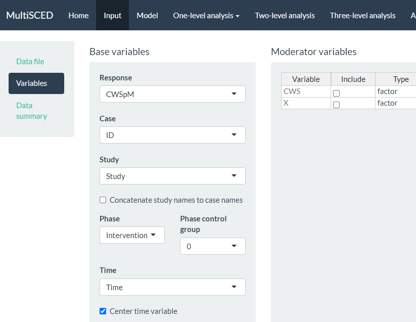
```

After specifying our variables, we navigate to the _Data summary_ section of the app. We show a screenshot for the _Data summary_ tab in Figure \@ref(fig:MultiSCED-input-datasummary-Lewandowski). At the top of the page, the app summarizes the data for each of the three levels in our model: the number of studies included (i.e., 4), the number of cases nested within these four studies (i.e., 15 cases), and the total number of observations nested within the cases that are nested within the studies (i.e., 442). These values all correspond with what we know about our dataset. 

Under the column headers _Studies_ and _Cases_, the app defaults to include all studies and cases in the analysis, as indicated by the check marks (see Figure \@ref(fig:MultiSCED-input-datasummary-Lewandowski)). This is appropriate for our application, because for this methods guide, we intend to illustrate the synthesis of data across all cases and studies using a three-level analysis. As an aside, the MultiSCED app allows for statistical models for a single case or two-level models of the cases nested within a single study. Thus, it provides the option to click _(De)select all_ to allow researchers to only include the data from studies and cases on which they want to focus their analysis. 

```{r MultiSCED-input-datasummary-Lewandowski, out.width = "60%", fig.cap = "Screenshot of the Data summary Section within the Input Page of the MultiSCED App"}
# Figure 8.11
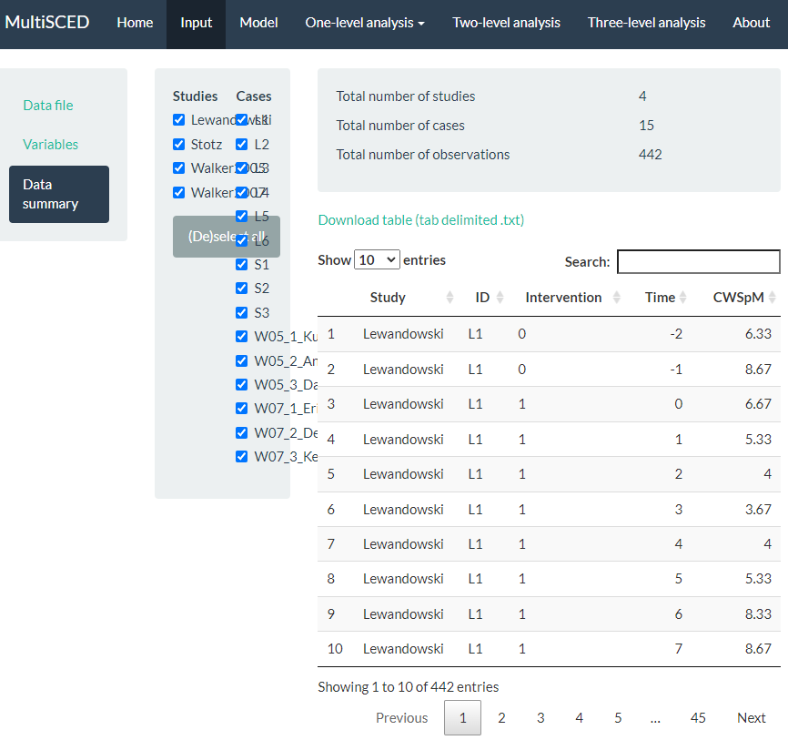
```

After examining the _Data summary_, we need to specify our multilevel model. To do so, we navigate to the _Model_ page (see Figure \@ref(fig:MultiSCED-modelspec-Lewandowski)). There are five sections to the _Model_ page: _Fixed effects_ and _Random effects_ on the left, and _One-level model_, _Two-level model_, and _Three-level model_ on the right side of the screen. In the _Fixed effects_ section, we find a list of four _Base variables_ that we can include in our model. To specify a model without trends, we leave the _Fixed effects_ section untouched, as the app includes _intercept_ and _Intervention_ by default (as noted by the checkmark next to each). Because we want to estimate a baseline slope and a change in slope that occurs with intervention, we manually check the boxes next to _Time_ and _Intervention X Time_. When we check these boxes, the app automatically adds more options [i.e., _(Time)^2^_ and _Intervention X (Time)^2^_]. However, because we anticipated linear trends and ruled out non-linear trends through visual analysis, we do not include (check) either of these additional boxes.

Under the _Random effects_ section, the app leaves all options unchecked. Therefore, we manually select the effects necessary to match our three-level model specifications in Equations \@ref(eq:MLM-L1-Trend) to \@ref(eq:MLM-L3-beta3). Allowing all regression coefficients to vary randomly across cases, we check all boxes under the _Case level_ sub header. Then, we check each of the boxes under the _Study level_ sub header to let the across-case study averages vary randomly for each of the coefficients across studies. As we opt to include these _Case level_ and _Study level_ variables, the app automatically updates our model specification on the page. In Figure \@ref(fig:MultiSCED-modelspec-Lewandowski), we present a screenshot of the resulting _Model_ page, where the three-level model shown (bottom right) matches our model defined by Equations \@ref(eq:MLM-L1-Trend) to \@ref(eq:MLM-L3-beta3). Under the equations, the app provides R syntax for fitting the model.

At this point, we have specified a very complex model and do not anticipate good estimation of the (co)variance matrices, particularly for the study-level errors. Our model includes four study-level random effects, but the data include only four unique studies. Although our process thus far (e.g., including random effects on all four terms, thereby letting all coefficients vary freely) aligns with what has typically been done in prior methodological studies focused on evaluating the appropriateness of three-level models for single-case data, much of this research uses diagonal as opposed to unstructured covariance matrices [e.g., @Joo_et_al_2019; @Moeyaert_Ugille_Ferron_Beretvas_VandenNoortgate_2013; @Moeyaert_Ugille_Ferron_Beretvas_VanDenNoortgate_2016]. If meta-analysts encounter estimation problems that suggest some of the variances may be 0 or correlations are at the boundaries of 1 or -1, they will need to take further action, such as simplifying the variance structure (i.e., removing error terms with little to no variability) and changing the covariance structure specification. 

```{r MultiSCED-modelspec-Lewandowski, out.width = "60%", fig.cap = "Screenshot of the Model Page of the MultiSCED App"}
# Figure 8.12
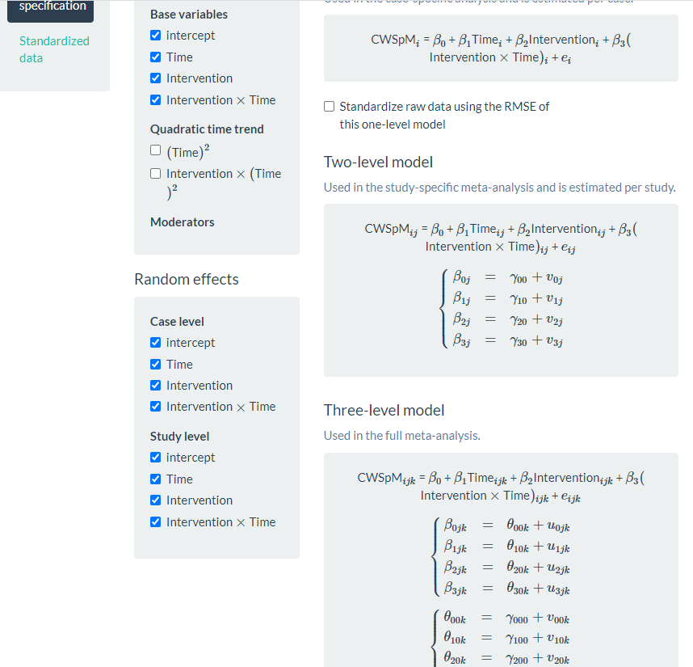
```

After specifying the model, we use the header at the top of the website to navigate to our multilevel model results by clicking the _Three-level analysis_ link. In transitioning to the _Three-level analysis_ page, we may immediately note a blank page (i.e., no results) or view an error message. However, we usually encounter a small progress tracking bar in the far-right bottom of the page that conveys that estimation is in progress. It takes the MultiSCED app a few seconds to complete our model estimation and present the multilevel model results (see Figure \@ref(fig:MultiSCED-3Level-Lewandowski)). 

```{r MultiSCED-3Level-Lewandowski, out.width = "60%", fig.cap = "Screenshot of the Three-level analysis Page of the MultiSCED App"}
# Figure 8.13
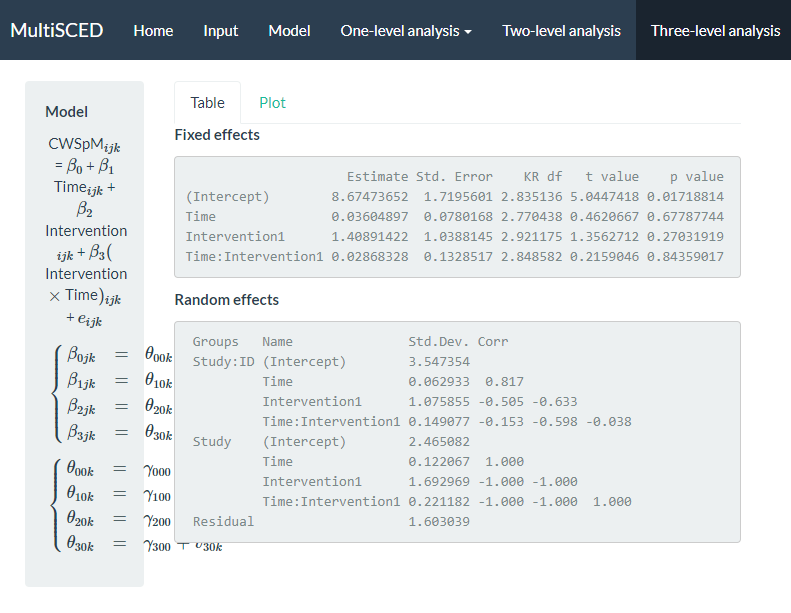
```

The multilevel model estimation results indicate that if baseline continued, the estimated across-case and across-study average correct word sequences written is 8.67 per minute at the time of the first treatment observation. The immediate treatment effect estimate was an increase of 1.41 correct writing sequences (CWS) per minute (i.e., the difference between the across-case and across-study average treatment phase trajectory and projected baseline trajectory at the time of the first treatment observation). The standard error (SE) of the estimate was 1.04, indicating substantial uncertainty in the size of the average immediate treatment effect. However, this was expected given the small number of studies we used to illustrate the MultiSCED app procedures, as more studies would have resulted in a more precise estimate [e.g., see @datchuk2020Level]. The estimated across-case and across-study average baseline slope was 0.036 ($\text{SE} = 0.078$), and estimated change in slope with intervention was 0.029 CWS per minute per intervention session ($\text{SE} = 0.133$). Although the small, positive slope estimate in baseline and the increase in slope with intervention align with our expectations, the sampling error in both estimates is too large to conclude that either of the corresponding population parameters differ from zero.

We next examine the results under the _Random effects_ sub header. The MultiSCED app reports the _Random effects_ variance components as standard deviations (SDs). Unlike fixed effects, which have been shown to be well estimated even with the small sample sizes typical of single-case research, variance components are typically not well estimated. Rather, we expect they were estimated with considerable bias due to the limited number of studies and cases [@Moeyaert_Ugille_Ferron_Beretvas_VandenNoortgate_2013; @Owens_Ferron_2012]. In addition, our examination of the data prior to modeling suggested that we likely oversimplified the model by specifying an independent and homogeneous variance structure, which leads to even more bias in the estimated variance components [@Joo_et_al_2019]. Consequently, although we report these parameter estimates from our model as a conceptual illustration for the purpose of this guide, we do not suggest that users of the app give serious weight to the interpretation of the _Random effects_ variance components unless they have more cases and studies. Per the results reported under the _Random effects_ sub header, the estimated SD of the observations around the case-specific trend lines is 1.60 (i.e., _Residual_). 

Next, examining the between-case variability within studies (i.e., _Study: ID_), we see that the estimated SD of the case-specific intercepts is 3.55, the estimated case-specific immediate treatment effects SD is 1.08, the estimated SD of the case-specific baseline slopes is 0.063, and the estimated SD of the case-specific changes in slope with intervention is 0.15. Also note that the correlations among these random effects are plausible correlation values. In contrast, when we examine the correlation matrix for the study random effects (i.e., _Study_), we see estimated correlations at the boundaries (1 and -1) for all random effects at the study level. This signals that the covariance structure is too complex at the study level for the app to estimate correlations between our included four variables across only four studies. Thus, we will re-estimate the model while simplifying the number of study-level random effects and look to see the impact of specifying a simpler covariance structure on the estimates of the treatment effects.

To simplify the covariance structure for the study-level random effects, we go back to the _Model_ page and deselect some of the _Random effects_ options listed under the _Study level subheading_. As shown in Figure \@ref(fig:MultiSCED-modelspec-simpler-Lewandowski), we uncheck _Time_, _Intervention_, and _Intervention X Time_. Although conceptually any of these coefficients could vary from one study to the next, we only have four studies in our example, which is not sufficient to estimate so many variance components. 

```{r MultiSCED-modelspec-simpler-Lewandowski, out.width = "60%", fig.cap = "Screenshot of the Re-Specified Model with Fewer Study-Level Random Effects (Model Page)"}
# Figure 8.14
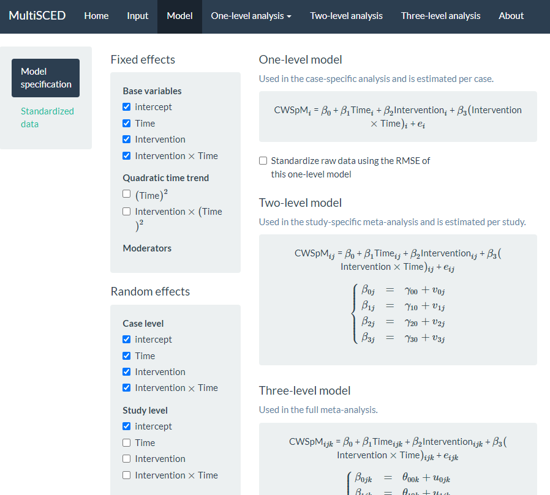
```

We show the results from this simpler re-specified model in Figure \@ref(fig:MultiSCED-3Level-simpler-Lewandowski). With this model, the across-case and across-study average immediate effect is 1.03 ($\text{SE} = 0.64$) and the estimated effect of the intervention on the slope is -0.03 ($\text{SE} = 0.06$). The point estimates for the effects have changed, but the conclusion of a potential non-effect (i.e., the population effect parameters may be zero) remains the same. Although we eliminated the correlations of 1 and -1 in the study-level random effect estimates, the estimated variance for the study-level intercepts is 0, suggesting insufficient between-study variability necessary to obtain a non-zero estimate. 

```{r MultiSCED-3Level-simpler-Lewandowski, out.width = "60%", fig.cap = "Screenshot of the Three-level analysis Page for the Re-Specified Model with Fewer Study Level Random Effects"}
# Figure 8.15
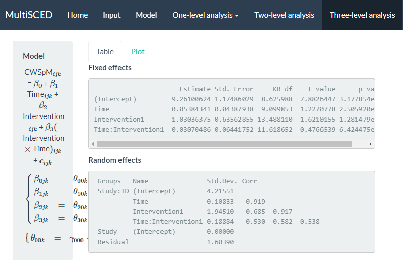
```

After comparing both models, we consider the degree to which we may obtain better treatment effect estimates from one model or another. For example, could we achieve better estimates if using a model that allows all effects to vary randomly across cases and studies, or a model with a covariance structure that is easier to estimate? Similarly, is it better to model heterogeneity in the error variance between cases and phases, and is it best to model autocorrelation among the case-level errors? Researchers have shown that the misspecification of the covariance structure as either too simple or too complex at any of the three levels introduces little to no bias in the average treatment effect estimates, leading to relatively accurate inferences about the average treatment effect [@baek_Ferron_2020; @Joo_Ferron_2019; @Moeyaert_Ugille_Ferron_Beretvas_VandenNoortgate_2013; @Moeyaert_Ugille_Ferron_Beretvas_VanDenNoortgate_2016; @Petit-Bois_2014; @Petit-Bois_Baek_VandenNoortgate_Beretvas_Ferron_2016]. However, this research examines a limited range of conditions. We hope that future research will serve to further clarify the optimal approach for estimating three-level LMMs for SCD study data. In addition, SCD studies will sometimes have outcomes that present more severe violations of the normality and homogeneity assumptions than we encountered here. Useful directions for future research include: (a) determining at what point the violations are severe enough and sample sizes large enough to prefer the use of GLMMs, (b) providing further guidance on the most appropriate ways to specify and estimate GLMMs [@Li_Luo_Baek_Thompson_Lam_2023], and (c) producing easy-to-use software to make GLMMs more readily accessible to SCD researchers. 