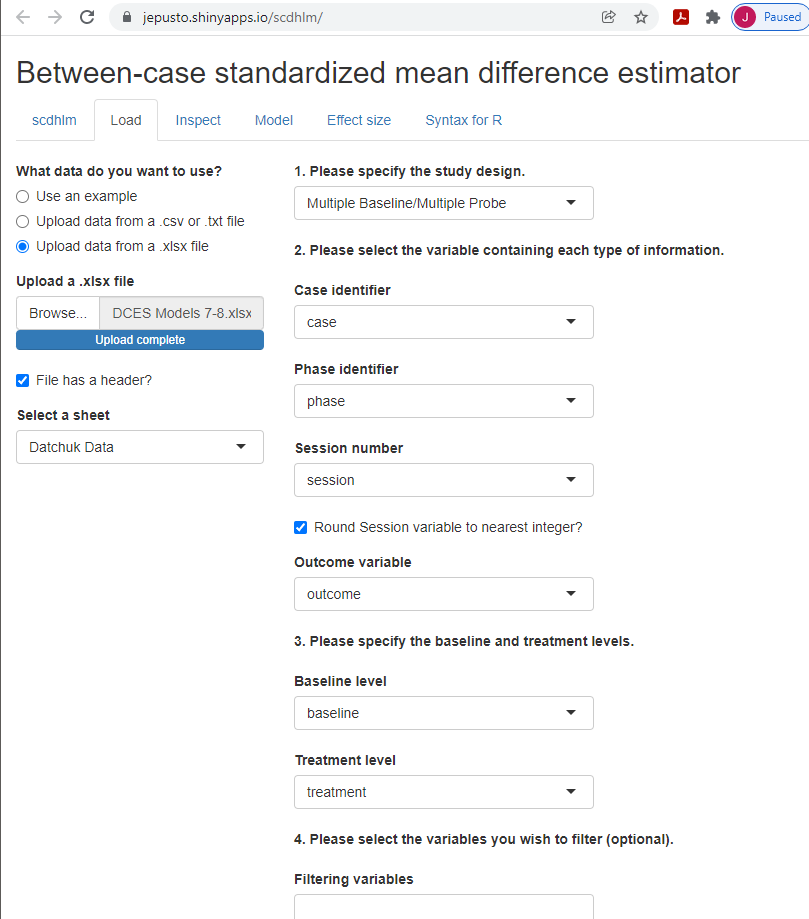
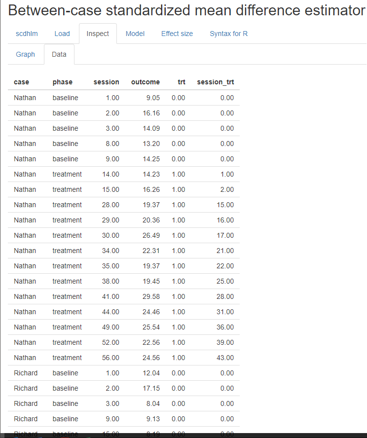
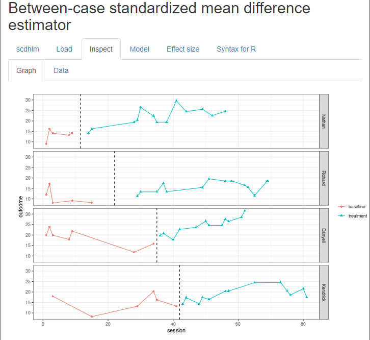
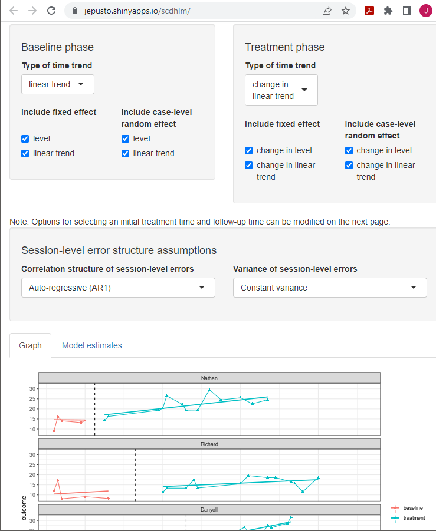
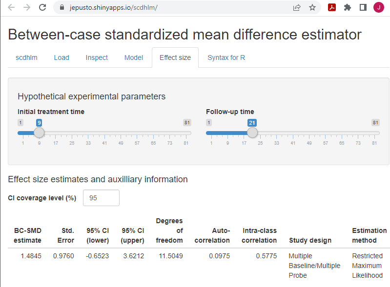
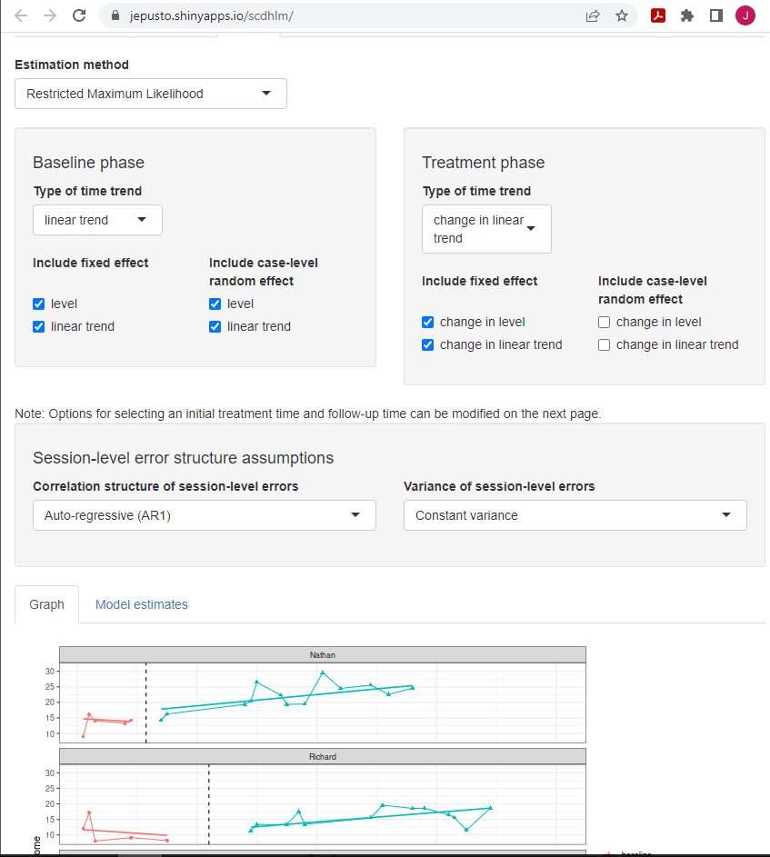
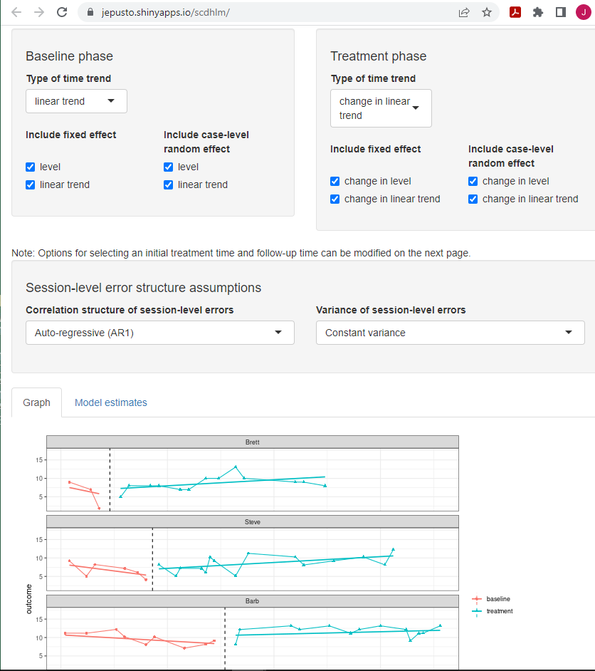
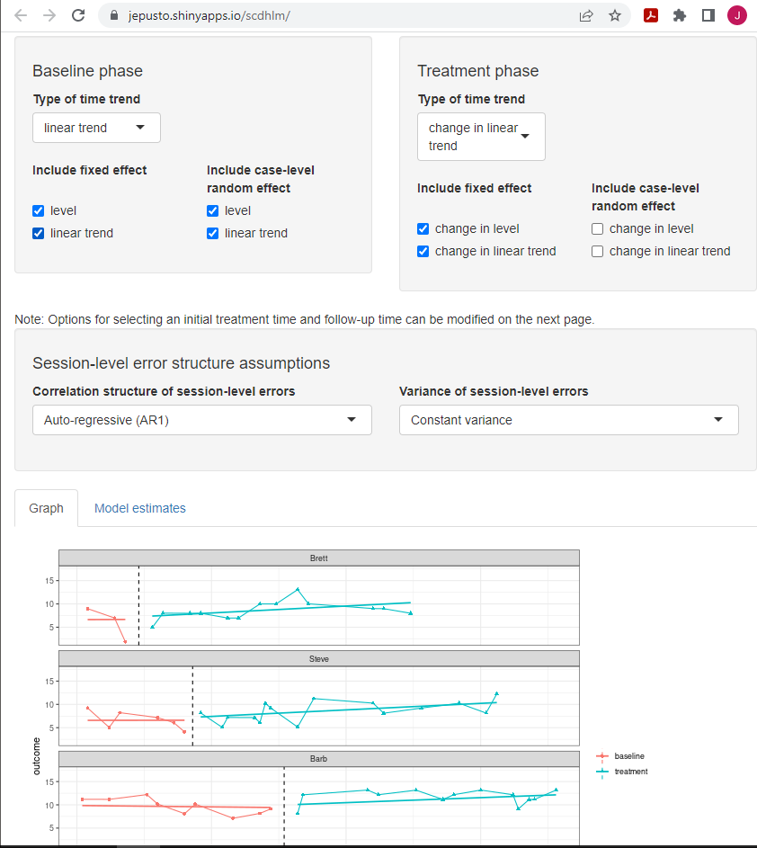

# Illustration of Design-Comparable Effect Sizes When Assuming Trends in Baseline and Different Trends in Treatment {#illustrate-D-CES-Btrends}

Chapter 5 illustrates the computation of design-comparable effect sizes in contexts where one assumes time trends in baseline and that the treatment will lead to changes in both the level and slope of the time trends. We demonstrate the calculations using data from a multiple probe study, a multiple baseline study, and a group study. For the single-case studies, we provide step-by-step instructions for selecting design-comparable effect sizes and estimating them using the _scdhlm_ app. We also discuss estimating the effect size for the group study and synthesizing the effect sizes across the group and single-case studies.

In this chapter, we describe how researchers can compute design-comparable effect sizes and synthesize results using models that assume baseline time trends and a treatment effect that has an immediate impact on the level of the outcome, along with an effect on the trend—assumptions that correspond to Models 5 and 6 from Figure \@ref(fig:DC-ES-flow-chart). For illustrative purposes, we calculate effect sizes and synthesize findings from three studies of interventions designed to improve writing skills for students with learning disabilities, including a multiple probe study, a multiple baseline study, and a group design study. The multiple probe study by @datchuk2016Writing investigated intervention effects on the writing behavior of four adolescents with writing difficulties. The multiple baseline study by @rodgers2021Effects investigated the effects of a writing intervention for four postsecondary students with intellectual and developmental disabilities. Finally, the group study by @hebert2018Writing investigated the effects of a writing intervention for 61 fourth and fifth grade students designated as struggling readers (i.e., at least one grade level behind their peers). 

For this hypothetical synthesis, we choose to use a design-comparable effect size to aggregate effects across these study designs. We organize the procedures into four stages: (1) selecting a design-comparable effect size for the SCD studies, (2) estimating the design-comparable effect size using the _scdhlm_ application, a web-based calculator for design-comparable effect sizes [@pustejovsky2021scdhlm], (3) estimating the effect size for the group study, and (4) synthesizing the effect sizes across the SCD and group studies. Because well-developed effect size estimation methods for group studies are illustrated elsewhere [@borenstein2021introduction; @cooper2019handbook], we concentrate primarily on the first two steps.

## Selecting a Design-Comparable Effect Size for the Single-Case Studies

We use the decision rules in Figure \@ref(fig:DC-ES-flow-chart) to select an appropriate design-comparable effect size for the SCD studies. To do this, we consider the characteristics of the population, the context, and the outcome of interest. We make predictions about the type of trends we expect to see in the baseline and treatment phases, and we reflect on the rationale for our expectations. Based on our prior research and experience with this population, we hypothesize that the outcome variable of student writing quality may have baseline phase trends. For example, some students may show slight positive trends because of practice effects, others may show a deteriorating trend in absence of writing feedback, or students' baseline observations may portray little to no trend at all in absence of intervention. Despite expected variability in the baseline phase, we do expect a noticeable positive shift in the level of responding early in the treatment phase, followed by a gradual increase in writing quality over time. Because we are assuming the presence of trends in both baseline and treatment phases, we tentatively consider Model 5 or Model 6 (see Figure \@ref(fig:DC-ES-flow-chart)) to estimate the included study effect sizes. We make the choice between Model 5 and Model 6 based on our logic model and a priori expectation that the treatment effect will not vary across cases (Model 5) or that the treatment effect could vary across cases (Model 6). Based on the different writing abilities of the participants, as well as their unique learning histories and abilities, we anticipate some across-case variation in effects. Thus, we tentatively choose Model 6 as most consistent with our understanding of this context.

Next, we visually analyze the graphs from the SCD studies to see if our initial assumptions are reasonable considering the data. Figure \@ref(fig:Datchuk-raw-2016) shows the data we extracted from @datchuk2016Writing, and Figure \@ref(fig:Rodgers-raw-2021) shows the data we extracted from @rodgers2021Effects. 
<!-- MC: Although it seems that Rodgers et al. was first published online in 2020. I changed the year to 2021 when it was published in the journal. -->
In viewing the graphs, we examine the extent to which the data are reasonably consistent with the homogeneity and normality assumptions underlying the models for design-comparable effect sizes. Note that in Figures \@ref(fig:Datchuk-raw-2016) and \@ref(fig:Rodgers-raw-2021), we see similar between-case variation and similar variation across phases within a case and can conclude that our homogeneity assumptions are reasonable. In addition, we do not detect the presence of outlying values or clear departures from normality. Consequently, our initial decision to use design-comparable effect sizes appears to be a reasonable choice.

During visual analysis of the primary study graphs, we now need to determine the appropriateness of choosing a model with baseline trends. Consistent with our expectations, the typical baseline pattern across cases in Figures \@ref(fig:Datchuk-raw-2016) and \@ref(fig:Rodgers-raw-2021) does exhibit a trend. For example, Richard and Danyell (Figure 5.1) and all cases in Figure \@ref(fig:Datchuk-raw-2016) (except Denny) appear to have a decline in writing skills performance in baseline, as indicated by a downward trend in the data. However, the baseline trends for Nathan and Kendrick (Figure \@ref(fig:Datchuk-raw-2016)) are less clear or appear to be increasing (e.g., Denny in Figure \@ref(fig:Rodgers-raw-2021)). Because the typical pattern across the two SCD studies is consistent with our trend expectations, we proceed with an assumption of baseline trends.

Next, we conduct a similar visual analysis of the treatment phases. For most of the cases, we see an immediate shift in performance along with a change in the trend. Richard, Danyell, and Kendrick (Figure \@ref(fig:Datchuk-raw-2016)) show an improvement in writing skills that generally increases over time in treatment (i.e., positive trend lines). Brett, Steve, and Denny (Figure \@ref(fig:Rodgers-raw-2021)) show a similar pattern of increasing improvement in writing skills. Because the design-comparable effect size assumes a common model across cases and estimates an average effect across the cases, we find it best to select a model that is consistent with the typical and expected pattern. Thus, it appears reasonable to proceed with a model that assumes a trend in baseline and a different trend in the treatment phases (i.e., Model 5 or Model 6 from Figure \@ref(fig:DC-ES-flow-chart)).

(\#fig:Datchuk-raw-2016)Multiple Probe Data Extracted from Datchuk (2016)

(\#fig:Rodgers-raw-2021)Multiple Baseline Data Extracted from Rodgers et al. (2021)

## Details of the Models for Design-Comparable Effect Sizes

To differentiate between Model 5 and Model 6, we provide a formal specification of each. For both Model 5 and Model 6, we write the within-case (level-1) model as:
\begin{equation}
(\#eq:M5M6-L1)
Y_{ij} = \beta_{0j} + \beta_{1j}Tx_{ij} + \beta_{2j} (Time_{ij}-B)+ \beta_{3j}Tx_{ij}\times((Time_{ij}-k_j)-(B-A)) + e_{ij},
\end{equation}
where $Y_{ij}$ is the score on the outcome variable $Y$ at measurement occasion $i$ for case $j$, $Tx_{ij}$ is dummy coded with a value of 0 for baseline observations and a value of 1 for the treatment observations, $Time_{ij}$ is the time-point for measurement occasion $i$ for case $j$, $B$ is a centering constant that defines the focal follow up time for defining the effect size, $k_j$ is the last time-point before case $j$ begins their treatment phase, and $B-A$ corresponds to the treatment duration (i.e., the number of time points the case has been in intervention at the focal time). $\beta_{1j}$ indexes the raw score treatment effect for case $j$, which is the distance between the treatment phase trend line and the extended baseline phase trend line at the focal follow-up time. In addition, this model includes $\beta_{0j}$, which corresponds to the expected baseline value for case $j$ at the focal follow up time $B$, $\beta_{2j}$ is the slope of the baseline phase, and $\beta_{3j}$ is the change in slope that occurs with intervention (i.e., the difference between the treatment and baseline phase slopes for case $j$). Finally, the error ($e_{ij}$) is time- and case-specific, assumed to be normally distributed, and first-order autoregressive with variance $\sigma_e^2$. 

(\#fig:Datchuk-2016-Danyell)Illustration of Treatment Effect 5 Observations into Treatment for Danyell (Datchuk, 2016)

As shown in Figure \@ref(fig:Datchuk-2016-Danyell), 
<!-- MC: Not sure if Figure 5.3 is what Figure 32 in the word doc refers to. -->
the size of the raw score treatment effect depends on its measurement time (i.e., the raw score effect size depends on the focal time selected). It becomes important for researchers to determine the time at which the effect should be estimated because: (a) the raw score effect size varies over time in the treatment phase, and (b) it is estimated specifically after a specific treatment duration [i.e., when $(Time_{ij}-k_j)-(B-A)=0$]. To choose a focal time, we find it helpful to review the SCD research literature and examine the treatment phase lengths of the extant studies. It is also helpful to consider the duration of the treatment in the group design studies, because such studies typically index the treatment effect immediately after completing the intervention. Generally, We we do not want to avoid extrapolate extrapolating much beyond the length of the actual treatment for most cases. 

For this illustration we choose to estimate the effect 12 observations into treatment because the group design study [@hebert2018Writing] had 12 intervention sessions. Further, the SCD studies in this area---particularly the two we are using in this chapter---tend to have at least 12 treatment observations (with the exception of Denny in Figure \@ref(fig:Rodgers-raw-2021), who has 10 treatment observations).

For Model 5, we write the between-case model as:
\begin{equation}
(\#eq:M5-L2-intercept)
\beta_{0j} = \gamma_{00} + u_{0j}
\end{equation}
\begin{equation}
(\#eq:M5-L2-slope-trt)
\beta_{1j} = \gamma_{10}
\end{equation}
\begin{equation}
(\#eq:M5-L2-slope-time)
\beta_{2j} = \gamma_{20} + u_{2j}
\end{equation}
\begin{equation}
(\#eq:M5-L2-slope-interaction)
\beta_{3j} = \gamma_{30}
\end{equation}
where $\gamma_{00}$ is the across-case average value of the outcome at time zero (0) based on a linear projection of the average baseline trajectory to the focal follow-up time $B$ and $u_{0j}$ is a case-specific error, which accounts for variation between cases in their expected baseline levels at time point $B$. Thus, $\sigma_{u_0}^2$ corresponds to the projected between-case variance at the focal time if the cases remained in baseline. The across-case average baseline slope is $\gamma_{20}$, and the corresponding error term ($u_{2j}$) allows this slope to vary across cases. We assume that the errors in these equations ($u_{0j}$ and $u_{2j}$)) are distributed multivariate normal with covariance $\Sigma_u$. The across-case average raw score treatment effect at the focal time is $\gamma_{10}$ and the across-case average change in slope with intervention is $\gamma_{30}$. We assume these effects to be the same for each case in Model 5, so we do not include error terms in Equations \@ref(eq:M5-L2-slope-trt) and \@ref(eq:M5-L2-slope-interaction). 

We define the design-comparable effect size at the focal time as the raw score treatment effect at the focal time $\gamma_{10}$ divided by a standard deviation (SD) that is comparable to the SD used to standardize mean differences in the group design studies. Compared to the models discussed in previous chapters, the added complexity of Models 5 and 6 makes researchers' choice of time points more consequential. Specifically, when we assume that the baseline slopes vary, we assume that the between-case variability changes with time. Thus, the design-comparable effect size will depend on both the duration of the treatment and the projected baseline between-case variability at the follow-up time. It may also be helpful to acknowledge the assumed heterogeneity across time in the SCD studies and to consider a sensitivity analysis that would examines the extent to which the design-comparable effect size depends on the between-case variance estimation time point. The assumed heterogeneity poses a lesser threat for the synthesis if there is little variation between the design-comparable effect size and the different choices for when to estimate the between-case variance.  lead to relatively little variation in the design-comparable effect size estimate.

With these caveats in mind, and using the model specification given in Equations \@ref(eq:M5M6-L1)-\@ref(eq:M5-L2-slope-interaction), we define the design-comparable effect size as:
\begin{equation}
(\#eq:M5-SMD)
\delta = \frac{\gamma_{10}}{\sqrt{\sigma_{u_0}^2 + \sigma_e^2}},
\end{equation}
where $\sigma_{u_0}^2$ corresponds to the between-case-variance in expected baseline levels at the target time $B$. The numerator of the effect size corresponds to the average effect of receiving treatment for duration $B-A$, where both $A$ and $B$ are constants specified by the meta-analyst. Therefore, one can interpret this effect size as describing the effect in a hypothetical study where all cases start intervention after time $A$ and where outcomes are assessed at the focal follow-up time $B$ [see @Pustejovsky2014design for more details on this interpretation]. 

The specification of Model 6 is like Model 5, but we add error terms ($u_{1j}$ and $u_{3j}$) to the equations to account for between-case variation in the treatment effect and between-case variation in the change in slopes with intervention. More specifically:
\begin{equation}
(\#eq:M6-L1)
Y_{ij} = \beta_{0j} + \beta_{1j}Tx_{ij} + \beta_{2j} (Time_{ij}-B)+ \beta_{3j}Tx_{ij}\times((Time_{ij}-k_j)-(B-A)) + e_{ij}
\end{equation}
\begin{equation}
(\#eq:M6-L2-intercept)
\beta_{0j} = \gamma_{00} + u_{0j}
\end{equation}
\begin{equation}
(\#eq:M6-L2-slope-trt)
\beta_{1j} = \gamma_{10} + u_{1j}
\end{equation}
\begin{equation}
(\#eq:M6-L2-slope-time)
\beta_{2j} = \gamma_{20} + u_{2j}
\end{equation}
\begin{equation}
(\#eq:M6-L2-slope-interaction)
\beta_{3j} = \gamma_{30} + u_{3j}
\end{equation}

The added error terms contribute to variability under the intervention condition. However, because the SD used to standardize the design-comparable effect size is based on the variability in the absence of intervention, the definition of the design-comparable effect size for the Model 6 definition matches that of for Model 5. Like Model 5, the choice of the focal time will impact the design-comparable effect size, not only because it impacts influences the raw score treatment effect $\gamma_{10}$, but also because it impacts influences the between-case variance. 

For the purposes of this chapter, we tentatively select Model 6 based on our a priori considerations and illustrate the estimation of design-comparable effect sizes for these data. We also provide a contrast of Model 6 results compared to Model 5 specifications. This contrast is useful for several reasons, including that it provides an additional way for us to examine the empirical support for the model we have chosen (e.g., visual analyses of the implied trajectories for Model 6 may fit the raw data better than those for Model 5). In addition, by contrasting the results of both models, we can examine the sensitivity of our effect size estimates to the model chosen (e.g., whether we assume the effect size varies across cases may have little to no effect on the design-comparable effect size). Finally, contrasting model results allows us to illustrate a method of selecting between models in circumstances where a priori information is not sufficient to inform the choice between specifications. 

Before illustrating the estimation of the design-comparable effect size for our SCD studies, we emphasize that there are other variations of these models with slopes in both baseline and treatment phases. For example, if we remove the error term from Equation \@ref(eq:M5-L2-slope-time) or Equation \@ref(eq:M6-L2-slope-time), we constrain the model so that all cases have the same baseline slope. Constraining the slopes to be equal across cases makes the between-case variance homogeneous across time, which simplifies the definition of the design-comparable effect size. We could also consider removing the error term from Equation \@ref(eq:M6-L2-slope-interaction), which would constrain the change in slopes to be equal across the cases. Yet another possible variation is to remove the main treatment effect (i.e., remove the term $β_1j$ Tx_ijfrom Equation \@ref(eq:M5M6-L1) or Equation \@ref(eq:M6-L1)). In the latter example, by removing the main effect for treatment, we constrain the model so there is no immediate shift in level with intervention, but only a change in the slope of the trend line. For this chapter, we illustrate models that correspond to either assuming the effect of the treatment is constant across cases (Model 5) or the that the treatment effect can vary across cases in trajectories’ magnitudes of level and slope change (Model 6). 

## Estimating the Design-Comparable Effect Size for the Single-Case Studies

### Example 1: Multiple Probe Study by @@datchuk2016Writing

We can estimate a design-comparable effect size for Models 5 or 6, as well as the other models suggested in Figure \@ref(fig:DC-ES-flow-chart), using a web-based calculator for design-comparable effect sizes [@pustejovsky2021scdhlm], which is available at https://jepusto.shinyapps.io/scdhlm. In using this application, we recommend that researchers have a data file that aligns with the format expected by the application, as shown in Figure \@ref(fig:Datchuk-2016-load) for the SCD study by @datchuk2016Writing. To use this app, the data file must be saved as an Excel file (.xlsx), comma delimited file (.csv), or text file (.txt). In addition, the data must include columns for the _case identifier_, _phase identifier_, _session number_, and _outcome_. We illustrate this arrangement in Figure \@ref(fig:Datchuk-2016-excel) for the @datchuk2016Writing study. For the _phase identifier_, we have used "baseline" to indicate baseline observations and “treatment” to indicate intervention observations. Researchers can also elect to use another labeling scheme if it clearly distinguishes between baseline and intervention conditions (e.g., 0 to indicate baseline observations and 1 to indicate intervention observations). Although the data format for the phase identifier variable is flexible (text or numeric), the _scdhlm_ app requires use of only numerical values for the _session number_ and _outcome_ variables. Additionally, we recommend that users arrange their data by first case (i.e., enter all the rows of data for the first case before any of the rows of data for the second case), followed by _session number_. 

(\#fig:Datchuk-2016-excel)Snapshot of Spreadsheet Containing Extracted Datchuk (2016) Data

After starting the app, we use the _Load_ tab to load the data file, as illustrated in Figure \@ref(fig:Datchuk-2016-load). The data file could be a .txt or .csv file that includes one dataset or could be an .xlsx file that has either one spreadsheet (e.g., a data set for one study), or multiple spreadsheets (one spreadsheet for each of several studies). If using an .xlsx file with multiple spreadsheets, we can select the spreadsheet containing the data for the study of interest from the _Load_ tab. Then, we use the drop-down menus on the right of the screen to indicate the study design (_Treatment Reversal_ or _Multiple Baseline/Multiple Probe across participants_) and define which variables in the data set correspond to the case identifier, _phase identifier_, session, and _outcome_ (see Figure \@ref(fig:Datchuk-2016-load)).

After loading the data, we use the Inspect tab to ensure that the raw data were imported correctly and mapped to their corresponding variable names (Figure \@ref(fig:Datchuk-2016-inspect-data)). In addition, we can use the _Inspect_ tab to view a graph of the data (Figure \@ref(fig:Datchuk-2016-inspect-graph)). At this point, we recommend that researchers compare these data with the graphed data from the original study to ensure the study data uploaded to the app correctly. Later, we can check these graphed data for consistency with the tentatively selected model for the design-comparable effect size. 

(\#fig:Datchuk-2016-load)Between-Case Standardized Mean Difference Estimator (scdhlm, v. 0.6.0) Load Tab for Datchuk (2016)

(\#fig:Datchuk-2016-inspect-data)Between-Case Standardized Mean Difference Estimator (scdhlm, v. 0.6.0) Data Tab within the Inspect Tab for Datchuk (2016)

(\#fig:Datchuk-2016-inspect-graph)Between-Case Standardized Mean Difference Estimator (scdhlm, v. 0.6.0) Graph Display within the Inspect Tab for Datchuk (2016)

After data inspection, we go to the Model tab to specify the model for the design-comparable effect size. Figure \@ref(fig:Datchuk-2016-model6) shows the specification for Model 6 (i.e., the model that assumes trends in baseline, different trends in treatment, and an effect that varies across cases). Starting with specification of the _Baseline phase_, we select _linear trend_ under _Type of time trend_ because we assume the presence of linear time trends in the baseline phases. We then include _level_ and _linear trend_ as fixed effects to enable model estimation for an across-case average linear trend line for the baseline phase. To allow the intercepts of the trend lines to vary from case to case, we select the option to include _level_ as a random effect. We also include _linear trend_ as a random effect to allow the baseline trends to vary across cases. 

After _Baseline phase_ model specification, we attend to the specification of the _Treatment phase_. For _Type of time trend_, we select _change in linear trend_ because we assume trends differ across phases. We then elect to include _change in level_ and _change in linear trend_ as fixed effects to allow the across-case average trend line for the treatment phase to differ from the across-case average baseline phase trend line, in both level and slope. We also check the boxes to include _change in level_ and _change in linear trend_ as random effects to allow the changes in trend lines from baseline to treatment phase to vary across cases. Note the app allows us to make different potential assumptions about the correlation structure of the session-level errors. Shown are the default options of autoregressive and constant variance across phases. These defaults match the model presented in Equations \@ref(eq:M5M6-L1) and \@ref(eq:M6-L1) and were used because they seem appropriate for this data set.

(\#fig:Datchuk-2016-model6)Between-Case Standardized Mean Difference Estimator (scdhlm, v. 0.6.0) Model Tab Showing Model 6 Specification for Datchuk (2016)

For this data set, we see that our a priori identified model provides trajectories that fit the data reasonably well. Thus, we proceed to the _Effect Size_ tab, as shown in Figure \ref(fig:Datchuk-2016-ES). On the _Effect Size_ tab screen, there are two sliders---_Initial treatment time_ and _Follow-up time_. Moving these, we can change the size of the effect size to specify how far into treatment we want to estimate an effect. In our example, we use the default slider value of 9 for the _Initial treatment time_, which corresponds with the time point after which we would introduce treatment in a hypothetical study (were each case to begin the treatment phase at the same time). Next, because we want to estimate the treatment effect 12 observations into the treatment phase, we set the second slider (_Follow-up time_) to 21. This number corresponds to the 12th observation of a treatment phase that started immediately after observation 9. Following these specifications, the design-comparable effect size estimate for this study is 1.48, with a standard error (SE) of 0.98, and $95\%$ confidence interval (CI) [-0.65, 3.62].

(\#fig:Datchuk-2016-ES)Between-Case Standardized Mean Difference Estimator (scdhlm, v. 0.6.0) Effect size Tab Showing Model 6 Estimate for Datchuk (2016)

The additional information reported on the _Effect size_ tab (Figure \@ref(fig:Datchuk-2016-ES)) includes estimates of other quantities from the model and information about the model specification and assumptions used in calculating the design-comparable effect size. The reported degrees of freedom are used in making a small-sample correction to the effect size estimate, analogous to the Hedges' $g$ correction used with group designs [@Hedges1981distribution]. Larger estimated degrees of freedom mean that the denominator of the design-comparable effect size is more precisely estimated, and that the small-sample correction is less consequential. Conversely, small degrees of freedom indicates that the denominator of the effect size is imprecisely estimated, and that the small-sample correction is more consequential. The reported autocorrelation is the estimate of the correlation between errors at the first level of the model for the same case that differ by one time-point (or session), based on a first-order autoregressive model. The reported intra-class correlation is an estimate of the between-case variance of the outcome as a proportion of the total variation in the outcome (including both between-case and within-case variance) as of the selected _Follow-up time_. Larger values of the intra-class correlation indicate that more of the variation in the outcome is between participants. The remaining information in the output (_Study design_, _Estimation method_, _Baseline specification_, _Treatment specification_, _Initial treatment time_, _Follow-up time_) describes the model specification and assumptions used in the effect size calculations. The app includes this information to allow for reproducibility of the calculations.

Having obtained our main design-comparable effect size estimate based on Model 6, we also want to check its sensitivity to our selected time at which we estimate the between-case variability. To do so, we move the sliders on the _Effect Size_ tab so that the _Initial treatment time_ slider is now set to 5, corresponding to the time of the last baseline observation in our hypothetical experiment. We change the _Follow-up time_ to 17, which keeps the duration of the treatment at 12 observations. After making these changes, the design-comparable effect size is an estimated 1.34 with an SE of 0.91 and $95\%$ CI [-.69, 3.37]. The sensitivity of the design-comparable effect size estimate to our choice of when to estimate the between-case variance demonstrates a potential challenge of using design-comparable effect sizes in contexts where it is assumed that the baseline slopes vary across cases. 

If our a priori arguments for selecting Model 6 were tenuous, or if some members of our research team thought we should consider Model 5, we can do so by going back to the _Model_ tab and changing our specification. Specifically, under the specification of the _Treatment phase_, we uncheck the boxes to exclude _change in level_ and _change in linear trend_ as random effects. By removing those two random effects, we constrain the treatment effect to be the same for all cases (i.e., the change in level and change in linear trend is the same for each case). We keep all other modeling options the same as Model 6 (e.g., time sliders). In Figure \@ref(fig:Datchuk-2016-model5), we can see that the simpler, more restrictive Model 5 specification has a slightly less desirable fit for the trend lines than those of Model 6. The estimated design-comparable effect size for Model 5 is 1.41, with an SE of 0.64, and $95\%$ CI [-0.09, 2.92]. Ultimately, if we had remaining SCD studies to be included in our synthesis, we would hold off selecting between Models 5 and 6 until fit was examined for the data from each of the SCD studies. 

(\#fig:Datchuk-2016-model5)Between-Case Standardized Mean Difference Estimator (scdhlm, v. 0.6.0) Model 5 Specification for Datchuk (2016)

### Example 2: Multiple Baseline Study by @rodgers2021Effects

After estimating the design-comparable effect size for the first SCD study by @datchuk2016Writing, we repeat these steps for all remaining single-case studies in our synthesis. For our second SCD study [@rodgers2021Effects], we run through this same sequence of steps:
1. Load the data.
2. Inspect the data in both tabular and graphic form.
3. Specify our selected model for the data (i.e., Model 6 for this illustration).
4. Estimate the design-comparable effect size.

As shown in Figure \@ref(fig:Rodgers-2021-model6), the Model 6 estimated trajectories fit the data reasonably well. After completing step 2, we proceed with use of Model 6 for the @rodgers2021Effects dataset (step 3) and then start the process of estimating the design-comparable effect size (step 4). On the _Effect Size_ tab, we need to make choices about the initial treatment time and follow-up time-points. Locating the shortest baseline (Brett), we leave the _Initial treatment time_ slider at the default value of 9—the last baseline observation for Brett. We set the _Follow-up time_ slider to 21, so that the treatment duration for the hypothetical study is 12 and consistent with the time specification for the previous SCD study [@datchuk2016Writing]. After defining the times, the resulting design-comparable effect size estimate is 0.76 with an SE of 0.74 and $95\%$ CI [-1.36, 2.88]. Finally, to check the sensitivity of our estimate to our specified times for between-case variability, we change the values of the _Initial treatment time_ and _Follow-up time_ sliders to 5 and 17, respectively. The resulting design-comparable effect size changes to 0.90 with an SE of 0.75 and $95\%$ CI [-1.06, 2.87].

(\#fig:Rodgers-2021-model6)Between-Case Standardized Mean Difference Estimator (scdhlm, v. 0.6.0) Model 6 Specification for Rodgers (2021)

If our a priori arguments for selecting Model 6 were tenuous, or if some members of our research team thought we should consider Model 5, we can do so by going back to the _Model_ tab for each of our SCD studies and changing our specification. Specifically, under the specification of the _Treatment phase_, we uncheck the boxes where we had previously included random effects for _change in level_ and _change in linear trend_. By removing those two random effects, we constrain the treatment effect to be the same for all cases (i.e., the change in level and change in linear trend is the same for each case). We keep all other modeling options the same. We show the Model 5 specification for the @rodgers2021Effects study in Figure \@ref(fig:Rodgers-2021-model5). With the more restrictive model, the fit of the trend lines is similar but not quite as good compared to those in the originally specified Model 6. For Model 5, the estimated design-comparable effect size is 0.46, with an SE of 0.40 and $95\%$ CI [-0.39, 1.31]. Across the included SCD studies, if the fit is similar across models or is better for the model selected a priori, then it is preferable for researchers to use the one that best aligns with their logic model. For this illustration, we move forward with the Model 6 estimates because this model is most consistent with our a priori expectations, and the resulting fit is similar to or slightly better than its Model 5 contrast.

(\#fig:Rodgers-2021-model5)Between-Case Standardized Mean Difference Estimator (scdhlm, v. 0.6.0) Model 5 Specification for Rodgers (2021)

## Estimating the Design-Comparable Effect Size for the Group Study

After estimating the design-comparable effect size for each SCD in the synthesis, we estimate the design-comparable effect size for each included group study. Details on estimating standardized mean difference effect sizes from group studies are readily available from a variety of sources, including Chapter 12 of _The Handbook on Research Synthesis and Meta-Analysis_ [@Borenstein2019effect], books [e.g., @borenstein2021introduction] and journal articles [e.g., @Hedges1981distribution; @Hedges2007effect]. We therefore omit the details of the effect size calculations for the group design study in this example.

@hebert2018Writing reported a randomized-control trial examining the impact of a writing intervention for 51 fourth and fifth grade students. The researchers randomly assigned the students to an informational text writing intervention ($n = 32$) or to a control group ($n = 29$), in which students focused on mathematics writing so that the total amount of writing time was controlled. While the @hebert2018Writing study included various outcome data, we focus on the proximal measure of student ability to write informational text using simple description. To measure the effect, we calculate Hedges' $g$, which corrects for small sample size bias, using the adjusted mean difference between groups controlling for the pretest writing assessment and student characteristics. The resulting effect size estimate is 0.62, with an SE of 0.22. 

## Analyzing the Effect Sizes

As a final step, we synthesize the effect sizes across both the SCD and group design studies. Depending on the researchers' goals of the synthesis, a variety of options are available: (a) creating graphical displays that show the effect size and CIs for each study, (b) averaging the effect sizes and then creating a CI for the overall average effect, (c) examining the extent of variation in effect sizes across studies, (d) exploring potential moderators of the effect, and (e) examining the effect sizes for evidence of publication bias. Because the use of design-comparable effect size for the single-case studies produces effect size estimates that are in the same metric as the commonly used standardized mean difference effect sizes from group studies, researchers can accomplish these goals using the methods developed for group studies. Details on these methods are readily available elsewhere [e.g., @borenstein2021introduction; @cooper2019handbook]. We illustrate the pooling of the effect sizes from our studies here using a fixed effect meta-analysis, consistent with the approach used in What Works Clearinghouse intervention reports [@whatworksclearinghouse2020What]. 

Table \@ref(tab:ES-est-chapter5) reports the effect size estimates, SEs, and fixed effect meta-analysis calculations for the example studies. The top panel uses the design-comparable effect size results for SCD studies based on Model 6. As a sensitivity analysis, the bottom panel presents the results based on Model 5. Note that the effect size estimate from the group design study is the same in both panels. In fixed effect meta-analysis, the overall average effect size estimate is a weighted average of the individual studies' effect size estimates, with weights proportional to the inverse of the sampling variance (squared SE) of each effect size estimate. 
Column C of Table \@ref(tab:ES-est-chapter5) reports the inverse variance weight assigned to each of the studies, with the percentage of the total weight listed in parentheses. For the analysis based on Model 6, the effect size estimate from the group design study receives $88\%$ of the total weight, while the effect size estimates from the single-case studies receive $4\%$ and $8\%$ of the total weight, respectively. The total inverse variance weight is 23.5. The overall average effect size estimate is 0.67 with an SE of 0.21[^SEnoteChapter5] and an approximate $95\%$ CI [0.26, 1.08]. The _Q_-test for heterogeneity is not significant, $Q(2) = 0.75$, $p = .69$, indicating that the evidence is consistent with the possibility that all the studies provide estimates of the same true effect size.

[^SEnoteChapter5]: The SE of the overall effect size is the square root of the inverse of the total weight.

<table class=" lightable-classic" style='font-family: "Arial Narrow", "Source Sans Pro", sans-serif; margin-left: auto; margin-right: auto;'>
<caption>(\#tab:ES-est-chapter5)Fixed Effect Meta-Analysis Calculations for 
             Example Writing Intervention Studies</caption>
 <thead>
  <tr>
   <th style="text-align:left;"> Study </th>
   <th style="text-align:center;"> Effect Size Estimate (A) </th>
   <th style="text-align:center;"> Standard Error (B) </th>
   <th style="text-align:center;"> Inverse-variance Weight (%) (C) </th>
  </tr>
 </thead>
<tbody>
  <tr grouplength="4"><td colspan="4" style="border-bottom: 0;"><strong>Model 6</strong></td></tr>
<tr>
   <td style="text-align:left;padding-left: 2em;" indentlevel="1"> Datchuk (2016) </td>
   <td style="text-align:center;"> 1.48 </td>
   <td style="text-align:center;"> 0.98 </td>
   <td style="text-align:center;"> 1.04 (4.4) </td>
  </tr>
  <tr>
   <td style="text-align:left;padding-left: 2em;" indentlevel="1"> Rodgers et al. (2020) </td>
   <td style="text-align:center;"> 0.76 </td>
   <td style="text-align:center;"> 0.74 </td>
   <td style="text-align:center;"> 1.82 (7.8) </td>
  </tr>
  <tr>
   <td style="text-align:left;padding-left: 2em;" indentlevel="1"> Hebert et al. (2018) </td>
   <td style="text-align:center;"> 0.62 </td>
   <td style="text-align:center;"> 0.22 </td>
   <td style="text-align:center;"> 20.66 (87.8) </td>
  </tr>
  <tr>
   <td style="text-align:left;padding-left: 2em;" indentlevel="1"> Fixed effect meta-analysis </td>
   <td style="text-align:center;"> 0.67 </td>
   <td style="text-align:center;"> 0.21 </td>
   <td style="text-align:center;"> 25.53 (100) </td>
  </tr>
  <tr grouplength="4"><td colspan="4" style="border-bottom: 0;"><strong>Model 5</strong></td></tr>
<tr>
   <td style="text-align:left;padding-left: 2em;" indentlevel="1"> Datchuk (2016) </td>
   <td style="text-align:center;"> 1.41 </td>
   <td style="text-align:center;"> 0.46 </td>
   <td style="text-align:center;"> 2.44 (8.3) </td>
  </tr>
  <tr>
   <td style="text-align:left;padding-left: 2em;" indentlevel="1"> Rodgers et al. (2020) </td>
   <td style="text-align:center;"> 0.46 </td>
   <td style="text-align:center;"> 0.40 </td>
   <td style="text-align:center;"> 6.25 (21.3) </td>
  </tr>
  <tr>
   <td style="text-align:left;padding-left: 2em;" indentlevel="1"> Hebert et al. (2018) </td>
   <td style="text-align:center;"> 0.62 </td>
   <td style="text-align:center;"> 0.22 </td>
   <td style="text-align:center;"> 20.66 (70.4) </td>
  </tr>
  <tr>
   <td style="text-align:left;padding-left: 2em;" indentlevel="1"> Fixed effect meta-analysis </td>
   <td style="text-align:center;"> 0.65 </td>
   <td style="text-align:center;"> 0.18 </td>
   <td style="text-align:center;"> 29.35 (100) </td>
  </tr>
</tbody>
</table>

The bottom panel of Table \@ref(tab:ES-est-chapter5) reports the same calculations using the Model 5 design-comparable effect size estimates for the two SCD studies. For both @datchuk2016Writing and @rodgers2021Effects, Model 5 effect sizes appear to be more precisely estimated and therefore receive more weight in the fixed effect meta-analysis ($8\%$ and $21\%$, respectively). The overall average effect size based on Model 5 is quite like the average effect size based on Model 6, but is somewhat more precisely estimated, with an SE of 0.18 and a $95\%$ CI [0.29, 1.01], due to the smaller SEs in the SCD studies. 

In fixed effect meta-analysis, the overall average effect size estimate is a summary of the effect size estimates across the included studies, which are treated as fixed. The SE and CI in fixed effect meta-analysis consider the uncertainty in the process of estimating the effect size estimates in each of the individual studies. However, they do not provide a basis for generalization beyond the included studies because the fixed meta-analysis does not account for uncertainty in the process of identifying studies for inclusion in the meta-analysis [@konstantopoulos2019statistically; @Rice_Higgins_Lumley_2018]. When conducting syntheses of larger bodies of literature—and especially of studies with heterogeneous populations, design features, or dependent effect sizes—researchers will often prefer to use random effects models [@Hedges_Vevea_1998] or their further extensions [@PustejovskyTipton2021; @van2013three].
