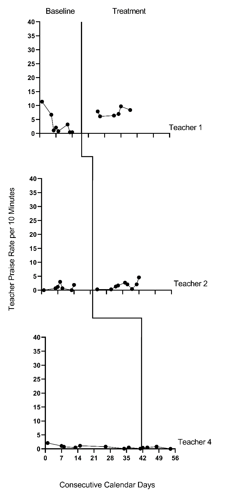
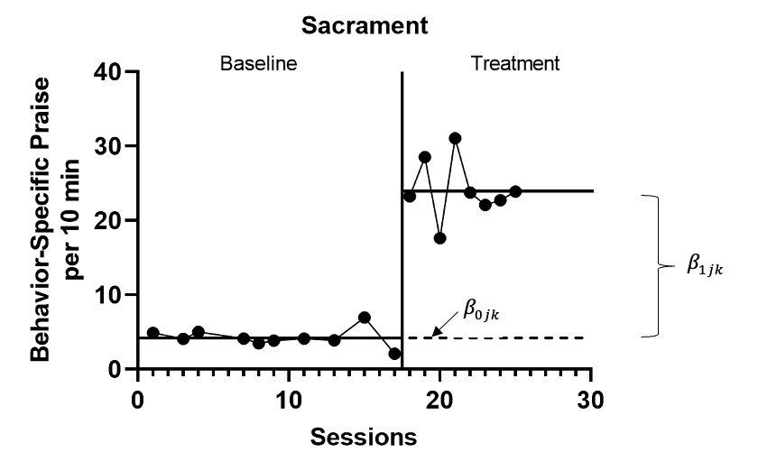
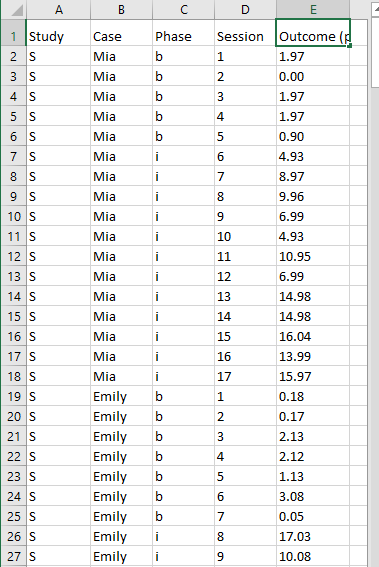
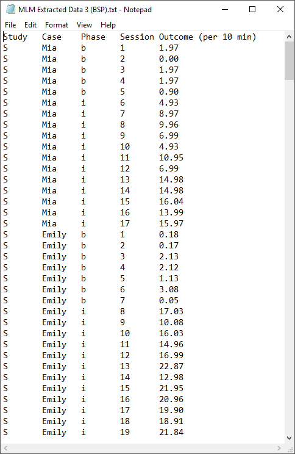
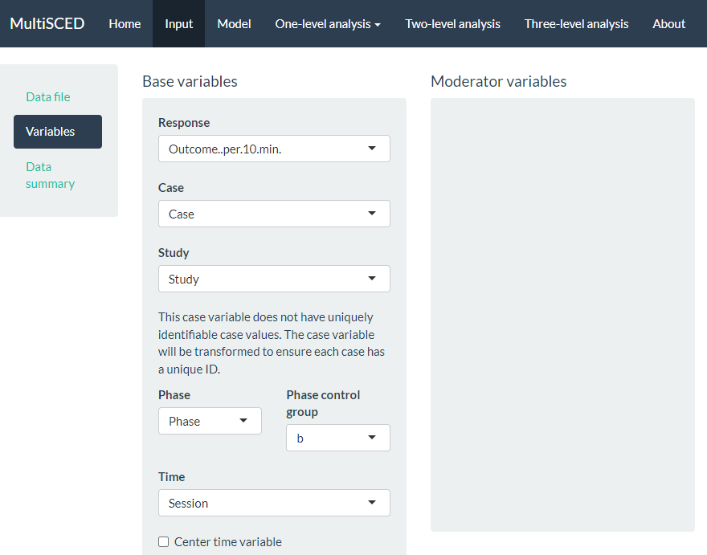
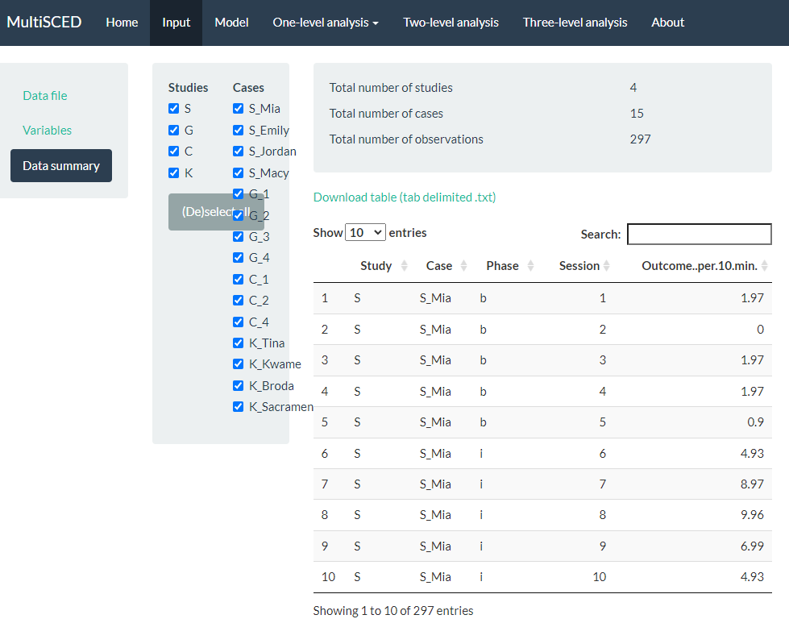
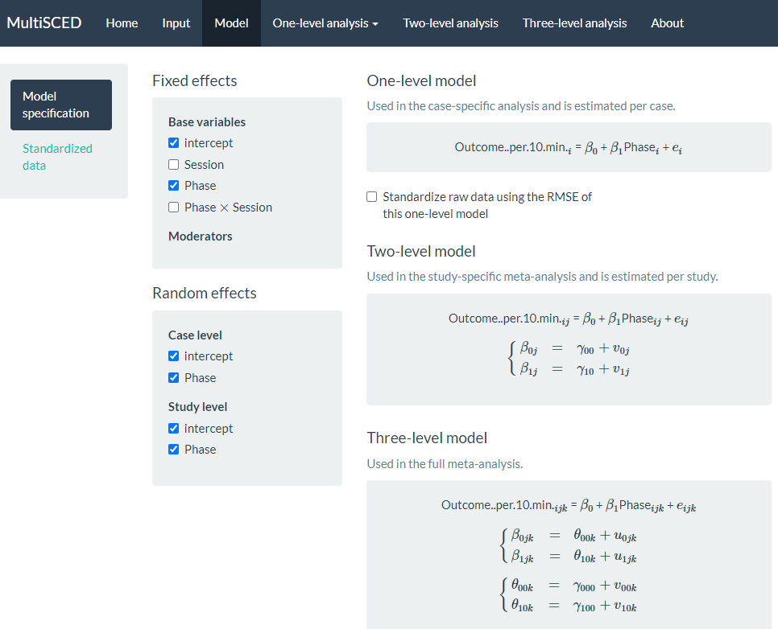
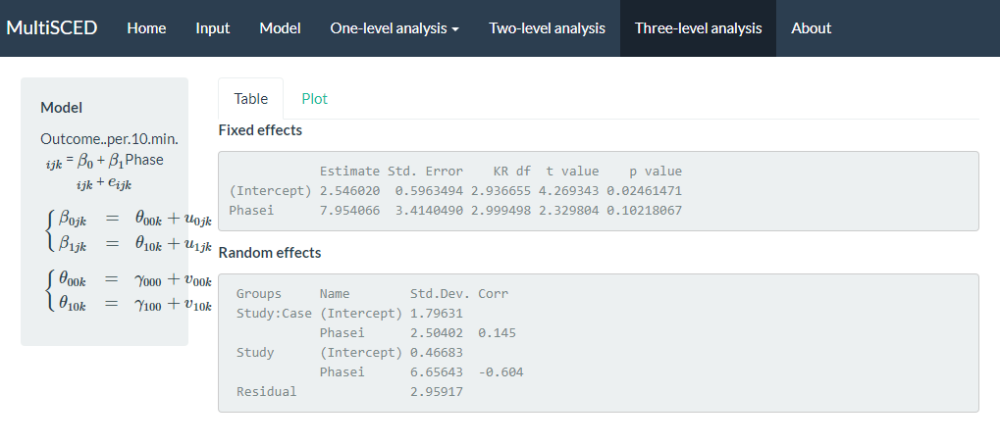

# Illustration of Multilevel Modeling When No Trends Are Assumed {#MLM-NoTrend}

_This chapter illustrates the application of multilevel models in contexts where one does not expect trends in either baseline or treatment phases. We provide instruction for using the MultiSCED app to specify and estimate the multilevel model to synthesize results from a set of single-case studies. We offer step-by-step instructions using data from four multiple baseline design studies examining methods to improve use of behavior-specific praise in classroom contexts._ 

In this chapter, we illustrate the application of multilevel modeling in contexts where one does not expect time trends to occur for a set of single-case design (SCD) studies included in a synthesis. Multilevel models assume that the analysis focuses on the same outcome for each case in each study. In addition to this assumption, the multilevel model explored in this chapter is specified based on the prediction that the dependent variable for each case has a stable level throughout the baseline and treatment phases and that introduction of treatment may result in an immediate shift in the level of the dependent variable.

We present an example scenario where we want to synthesize evidence from several SCD studies that examine intervention effects on the improvement of behavior specific praise (BSP) used by educational staff (e.g., teachers or aides). It is of note that while all studies are implemented by educational staff in English, they took place in different countries (e.g., U.S. and Ghana) and included different intervention ingredients. Due to the paucity of research investigating the effects of BSP implemented by educators (teachers or teacher assistants) in school settings, and the need to succinctly model this process, we limited our illustration to four multiple baseline (MB) design studies, described in further detail below. 
In one study, @Gage2018 examined the impact of one-on-one training coupled with emailed visual performance feedback on four first-year general education classroom teachers’ use of BSP with their students. In a second study, @CollierMeek2017 investigated whether prompts emailed daily to second and fifth grade classroom teachers would promote their use of BSP with students. The third study by @Sallese_Vannest_2022 examined the effects of a multicomponent (self-monitoring, performance feedback, goal setting, modeling, and action planning) teacher-led training program on the improvement of BSP used by four paraprofessionals with elementary students identified with specific learning disabilities or other health impairment. Finally, @knochel2021culturally studied how self-monitoring coupled with performance feedback affected the use of BSP by four classroom staff (who were also caregivers) assigned to work with students with autism spectrum disorder (ages 7-17 years). 

Synthesizing the data from these four studies involves estimating the average treatment effect on the scale of the outcome variable by modeling the outcome data for all cases in all studies. While our goal is feasible because each study examined the same outcome, the studies measured the BSP outcomes on different scales. More specifically, the included studies reported BSP frequencies using different time intervals (e.g., frequency per 10 minutes versus 15 minutes). To make the outcome comparable across the studies, we converted all frequencies to report a rate of BSP per 10 minutes. When the included studies had comparable outcomes, we chose to synthesize the results using the multilevel modeling approach (see the decision rules in Figure \@ref(fig:synthesis-flow-chart)). In this chapter, we break our illustration into two stages: (a) selecting a multilevel model for the studies, and (b) estimating the multilevel model using the MultiSCED app, a web-based calculator for conducting multilevel models of single-case studies [@Declercq2020]. 

## Selecting a Multilevel Model for the Single-Case Studies

Using the decision rules in Figure \@ref(fig:mlmapproach) (see Chapter 6), we first select the general multilevel modeling approach. We must decide whether we can treat the outcome as a continuous variable that is normally distributed around the trend lines. With an outcome rate of BSP per 10 minutes, it would be reasonable to consider a generalized linear mixed model (GLMM) that does not assume normality. However, GLMMs are more complex than linear mixed models (LMMs) that assume normality, and there is limited evidence of GLMM utility for synthesizing SCD data. For this methods guide, we will examine our expectations about the outcome for the contexts studied. In addition, we will visually analyze the graphed raw outcome data for each case over time to gauge the severity of any violation to the normality assumption. If not too severe, we will proceed with using an LMM, which can produce unbiased estimates of treatment effects quantified as mean differences on the outcome scale, along with appropriate effect inferences in a variety of contexts where the outcome is not normally distributed [@Declercq2019; Joo_Ferron_2019]. In the future, we anticipate that methodological research will better clarify the relative merits of GLMMs versus LMMs and provide clearer guidance for researchers to select the best option for their models. 

After selecting our general multilevel modeling approach (i.e., LMM), we then use our prior knowledge and experience with the dependent variable to state our expectations for data patterns within and across phases and cases. Here, we anticipate that levels of BSP will be lower than desirable in baseline. However, we predict that some skills already exist within participants' repertoires, so they will not occur at floor levels (i.e., we do not expect participants’ baselines to consist of consecutive values of zero). Conversely, we predict the frequencies to be further from zero and to more closely approximate a normal distribution after introducing the intervention. 

We present the graphs for all four MB studies in Figure \@ref(fig:Gage-raw-2018) [@Gage2018], Figure \@ref(fig:CollierMeek-raw-2017) [@CollierMeek2017], Figure \@ref(fig:SalleseVannest-raw-2022) [@Sallese_Vannest_2022], and Figure \@ref(fig:Knochel-raw-2021) [@knochel2021culturally]. The graphs for the first three studies (Figures \@ref(fig:Gage-raw-2018) - \@ref(fig:SalleseVannest-raw-2022)) align with our expectations; none of the participants have notable floor effects. Except for two outlying values for Teacher 1 at the beginning of the baseline phase in Figure \@ref(fig:CollierMeek-raw-2017), the outcome distributions across cases appear relatively normal. However, in Figure \@ref(fig:Knochel-raw-2021), the baseline rate of BSP for two participants is zero, and a third participant has many baseline values of zero. Upon further inspection of the @knochel2021culturally study, we hypothesize that the intervention setting of Ghana and adult participants being caregivers (not professional educators) could account for lower levels of BSP in baseline. To better understand the degree to which the normality assumption was violated, we pooled the deviations from the phase means for each case in each study and estimated the skew and kurtosis of the distribution of the deviations. Resulting summary indices suggest moderate departures from normality in baseline ($sk = 1.49$; $ku = 6.35$), and approximately normal distributions during intervention ($sk = 0.31$; $ku = 1.22$). Because the distributions are not severely non-normal and prior evidence suggests that LMMs for SCD data can handle some non-normality in the outcomes [@Declercq2019; @Joo_Ferron_2019], we deem it appropriate to proceed with LMM for the purpose of illustrating multilevel modeling using MultiSCED.

<div class="figure">

<p class="caption">(\#fig:Gage-raw-2018)Effect of Intervention on the Rate of Behavior Specific Praise (Gage et al., 2018)</p>
</div>

<div class="figure">

<p class="caption">(\#fig:CollierMeek-raw-2017)Effect of Intervention on the Rate of Behavior Specific Praise (Collier-Meek et al., 2017)</p>
</div>

<div class="figure">

<p class="caption">(\#fig:SalleseVannest-raw-2022)Effect of Intervention on the Rate of Behavior Specific Praise (Sallese & Vannest, 2022)</p>
</div>

<div class="figure">

<p class="caption">(\#fig:Knochel-raw-2021)Effect of Intervention on the Rate of Behavior Specific Praise (Knochel et al., 2021)</p>
</div>

Next, we must decide whether to include trends in our model. We expect the BSP outcome for each case in each study to be relatively stable during baseline and not likely to systematically trend up or down in the absence of intervention. Visual inspections of the study graphs (see Figures \@ref(fig:Gage-raw-2018)-\@ref(fig:Knochel-raw-2021)) are largely consistent with our expectation. We discussed the baseline of Teacher 1 in Figure \@ref(fig:CollierMeek-raw-2017), and concluded the first two observations were more likely outliers than evidence of a systematic linear trend. Based on our understanding of the BSP outcome and visual inspection of the graphs which show no trend for most cases, it appears reasonable to use a multilevel model without baseline trends. 

Next, we turn to the treatment phases. We expect that the intervention will lead to an immediate shift in the rate of BSP and that participants will maintain this higher level throughout the treatment phase. In Figures \@ref(fig:Gage-raw-2018) and \@ref(fig:CollierMeek-raw-2017), respectively, visual inspection of the treatment phases for @Gage2018 and @CollierMeek2017 reveals relatively stable responding, as anticipated. However, in the @Sallese_Vannest_2022 study (Figure \@ref(fig:SalleseVannest-raw-2022)), upward trends appear for some of the participants as the rate of BSP increases over time in intervention (e.g., Mia). In Figure \@ref(fig:Knochel-raw-2021) [@knochel2021culturally], we see that the rate of BSP for two participants (Kwame and Broda) increases with time spent in intervention (unlike the other participants who have relatively stable rates throughout treatment). Because multilevel modeling requires us to assume a common model (e.g., trends for all or no cases), we proceed with estimating a model that assumes no treatment phase trends. For the three cases that appear to have treatment phase trends, their contribution to the across-case average effect estimate will be based on their across-time average effect, not on their initial effect or final effect. In addition, by not modeling the trends for these few individuals, we anticipate this decision will impact their residuals (deviations of their observations from their trend lines) in a manner that potentially increases the within-case error variance and degree of autocorrelation. However, as previously noted, these models are relatively robust to small or moderate violations of the (co)variance assumptions.

After selecting a model that assumes no trends, we turn next to an examination of the within-case variance using visual analysis of the graphed data and prior knowledge of the BSP outcome. In Figures \@ref(fig:Gage-raw-2018)-\@ref(fig:Knochel-raw-2021), we note increased variation in participants’ treatment phase outcome data, as expected for an outcome variable reported as a rate. Thus, we anticipate increases in the rate of BSP will lead to an increase in the variance of BSP. For example, the change in variance is pronounced for the @knochel2021culturally participants (Figure \@ref(fig:Knochel-raw-2021)). Their baseline levels are relatively low, and treatment phase levels are relatively high. To define the between-phase variance change more precisely, we pool the deviations across cases for each phase. The standard deviation (SD) for the baseline phase deviations is 1.52. The SD of treatment phase deviations is 3.17. While we could estimate a heterogeneous variance model, multilevel models that assume homogeneity can tolerate differences in variance of this magnitude [@Joo_et_al_2019]. 

In summary, our visual analyses of primary study data identified multiple potential violations to the assumptions of the basic LMM for SCD studies, like evidence of baseline phase non-normality, across-phase heterogeneity, and a few cases that present with treatment phase trends. Thus, the LMM we use in this chapter is surely simpler than the process that generated the real data under analysis. However, the multilevel model estimate of the across-case average treatment effect and the associated inferences (e.g., confidence interval, significance tests) are relatively robust to violations of the normality and homogeneity assumptions. In addition, our purpose is to increase accessibility by illustrating the use of the MultiSCED app, and this app is limited to LMMs and homogeneous variance assumptions. Thus, we proceed to illustrate the estimation of the no-trend LMM. 

## Details of the No-Trend Multilevel Model

The multilevel data structure has repeated observations that are nested within cases and cases that are nested within studies, and thus there is a model for the variation of observations within a case (level-1), a model for the variation between cases within a study (level-2), and a model for variation between studies (level-3). The formal specification of the no-trend within-case model (level-1) is: 
\begin{equation}
(\#eq:MLM-L1-noTrend)
Y_{ijk} = \beta_{0jk} + \beta_{1jk}Tx_{ijk} + e_{ijk},
\end{equation}
where $Y_ijk$ is the outcome for variable $Y$ at measurement occasion $i$ for case $j$ of study $k$ and $Tx_{ijk}$ is dummy coded with a value of 0 for baseline phase observations and a value of 1 for treatment phase observations. The mean baseline level for case $j$ of study $k$ is $\beta_{0j}$ (see Figure \@ref(fig:Knochel-Sacrament-2021) for an example visually depicting $\beta_{0jk}$ and $\beta_{1jk}$). The raw score treatment effect for case $j$ of study $k$ is indexed by $\beta_{1jk}$, which is the difference between the baseline and treatment phase outcome means. The error term, $e_{ijk}$, is time-, case-, and study-specific. The error variance, $\sigma_e^2$, is typically assumed to be independent and normally distributed; however, it is feasible for researchers to estimate a different variance structure for $e_{ijk}$, such as first-order autoregressive or heterogeneous across phases [@Joo_et_al_2019; @Petit-Bois_2014]. Typically, the error variance $\sigma_e^2$ is treated as constant across all cases in all included studies.[^MLMErrorAssumption]

[^MLMErrorAssumption]: In principle, this assumption could be relaxed, allowing for the error variance to differ from case to case or from study to study [@baek_Ferron_2020]. However, the MultiSCED app does not allow such models to be fit, and some evidence indicates that average treatment effect size estimates (i.e., change in level) and related inferences are relatively robust to this sort of violation of the homogeneity assumption [@baek_Ferron_2020].

<div class="figure">

<p class="caption">(\#fig:Knochel-Sacrament-2021)Illustration of Treatment Effect for Sacrament (Knochel et al., 2021)</p>
</div>

The between-case model (level-2) is:
\begin{equation}
(\#eq:MLM-L2-Int-NoTrend)
\beta_{0jk} = \gamma_{00k} + u_{0jk}
\end{equation}
\begin{equation}
(\#eq:MLM-L2-slope-NoTrend)
\beta_{1jk} = \gamma_{10k} + u_{1jk}
\end{equation}
where $\gamma_{00k}$ is the across-case average baseline mean for study $k$, and $\gamma_{10k}$ is the across-case average treatment effect for study $k$. The case-specific errors, $u_{0jk}$ and $u_{1jk}$, correspond to the deviations of case $j$ of study $k$ from the across-case average baseline level for study $k$ and the across-case average treatment effect for study $k$. In the MultiSCED app, the case-specific errors ($u_{0jk}$ and $u_{1jk}$) are assumed multivariate normal with covariance
$\Sigma_u = \begin{bmatrix}
\sigma_{u_0}^2 & \\ 
\sigma_{u_1u_0} & \sigma_{u_1}^2 \\
\end{bmatrix}$,
and this covariance matrix is assumed to be the same across all included studies. In some applications, an unstructured covariance matrix will be difficult to estimate with the limited number of cases available. A common alternative, which could be estimated using more general multilevel modeling software, is a diagonal covariance structure where the covariance is assumed to be zero
$\Sigma_u = \begin{bmatrix}
\sigma_{u_0}^2 & \\ 
0 & \sigma_{u_1}^2 \\
\end{bmatrix}$.

The between-study model (level-3) is:
\begin{equation}
(\#eq:MLM-L3-Int-NoTrend)
\gamma_{00k} = \theta_{000} + v_{00k}
\end{equation}
\begin{equation}
(\#eq:MLM-L3-slope-NoTrend)
\gamma_{10k} = \theta_{100} + v_{10k}
\end{equation}
where $\theta_{000}$ is the across-study average baseline mean and $\theta_{100}$ is the across-study average treatment effect. The study-specific errors, $v_{00k}$ and $v_{10k}$, correspond to the deviations of study $k$ from the across-study average baseline level and the across-study average treatment effect. Within the MultiSCED app, the study-specific errors ($v_{00k}$ and $v_{10k}$) are assumed to be multivariate normal with covariance
$\Sigma_v = \begin{bmatrix}
\sigma_{v_{00}}^2 & \\ 
\sigma_{v_{10}v_{00}} & \sigma_{v_{10}}^2 \\
\end{bmatrix}$.
In some contexts, an unstructured covariance matrix will be difficult to estimate with the limited number of studies available, so meta-analysts might prefer a simpler covariance structure (e.g., diagonal covariance structure), which could be estimated using more general multilevel modeling software.

For the purposes of the methods guide, we dedicate the remainder of this chapter to illustrating the estimation of the multilevel model for the BSP studies using the MultiSCED app [@Declercq2019]. This app limits users to LMMs and the basic covariance structures described in this section. Using this relatively simple model, we contrast the obtained results with the results of a more complex model that assumes heterogeneous variances across phases and autocorrelation. In doing so, we provide a way to examine the sensitivity of estimates and inferences to alternative covariance structure specifications. Researchers can estimate alternative covariance structures outside of the MultiSCED app using statistical software programs such as R or SAS (see the Appendix to this chapter).

## Estimating a Multilevel Model for the Behavior Specific Praise Studies

Using the web-based MultiSCED calculator [@Declercq2019] for the multilevel modeling of SCD data, we can estimate the across-case average treatment effect, along with a standard error and confidence interval. The MultiSCED app is available at http://34.251.13.245/MultiSCED/. To use this app, researchers must save their dataset as a text file (.txt) or a comma-delimited file (.csv). We recommend that researchers first enter their data in Excel, and then save the Excel dataset as a tab-delimited text file. 

Figure \@ref(fig:Excel-BSP) shows a screenshot of a portion of the original Excel spreadsheet containing the data extracted from our four BSP multiple baseline design studies. The spreadsheet contains five columns of data corresponding to the following five variables commonly used in multilevel modeling applications: (a) study identifier (i.e., Study), (b) case identifier (i.e., Case), (c) phase identifier (i.e., Phase), (d) point in time for which the outcome was measured (i.e., Session), and (e) outcome [i.e., Outcome (per 10 min)]. Because our model assumes no trends and no autocorrelation structure, we technically do not need the session variable, but it is acceptable to leave it in the dataset. In contrast, we do require the study identifier, case identifier, phase identifier, and outcome for specifying the model. With a more complex application including moderators of interest, additional columns should be included that contain values of potential moderating variables. 

To use the MultiSCED app, the session and outcome variables must be numerical values. However, the variables for study, case, and phase identifiers may be entered as alphanumeric (word labels) or numeric values. The app requires that we organize the spreadsheet rows using a long data format, where the value of the outcome at each time point for a specific case in a specific study is represented in a unique row of the dataset, with the rows sorted by study, case, and time point. For each study (e.g., $S$ in Figure \@ref(fig:Excel-BSP)), we first arrange cases by baseline length (in order of shortest to longest baseline length). Then, we enter all observations for one case at a time, in order of time. After entering all data for the case with the shortest baseline, we enter data for the case with the second-shortest baseline, and so on for all cases within a particular study. We repeat the process for the remaining studies, with data from each successive study entered below the data from the previous study. 

<div class="figure">

<p class="caption">(\#fig:Excel-BSP)Screenshot of the Original Excel Spreadsheet Containing the BSP Data</p>
</div>

After organizing the data within the Excel spreadsheet, we then save the Excel spreadsheet as a tab delimited text file (.txt). To do the same, one can follow the steps below.
For Windows:

1. From the _File_ menu, select _Save As_.
2. Select _Browse_ to select a folder where the spreadsheet will be saved.
3. To save the spreadsheet, enter a file name in the corresponding field.
4. Then use the _Save as Type_ menu to select the option to save the file type as Text (Tab delimited) (*.txt).
5. Finally, click _Save_. 

If there are multiple worksheets within the original Excel spreadsheet file, a pop-up message will appear to request permission to save only the active sheet. If this occurs, you can select OK to save the data file. We strongly recommend that researchers open the newly created tab delimited text file to ensure that the data are stored as expected. We present a screenshot of a portion of the resulting text file in Figure \@ref(fig:txt-BSP).

For MacOS: 

1. From the _File_ menu, select _Save As_.
2. Enter a file name in the _Save As_ field.
3. Select a location from the dropdown menu, _Where_, to save your spreadsheet.
4. Then use the _File Format_ menu to select the option to save your file type as Tab delimited Text (.txt).
5. Finally, click _Save_.

It is important to note here that an error message will appear if attempting to save a spreadsheet with multiple worksheets. A pop-up will inform the user that the workbook cannot be saved in the selected file format. If encountering this error, researchers should open a newly created file with one worksheet for the data needed in their analysis.

<div class="figure">

<p class="caption">(\#fig:txt-BSP)Screenshot of Saved Tab Delimited Text File</p>
</div>

After converting and saving our dataset as a tab delimited text file, we are prepared to use the MultiSCED app (http://34.251.13.245/MultiSCED/). Figure @\ref(fig:MultiSCED-homepage) is a screenshot of the Home page for the MultiSCED app. At the top of the website, in the blue page header, there are several links to other pages on the website. In this header, the link _Home_ is highlighted with a darker background than the other links on the menu bar, indicating that we are on the _Home_ page. To access the MultiSCED application, we must navigate to the _Input_ section of the site, by clicking on the _Input_ link. 

<div class="figure">

<p class="caption">(\#fig:MultiSCED-homepage)Screenshot of the Website Navigation Menu and Home Page of the MultiSCED App</p>
</div>

A screenshot of the _Input_ tab is shown in Figure \@ref(fig:MultiSCED-input-datafile). After navigating to the _Input_ page, we find a sidebar menu with three additional links: _Data file_, _Variables_, and _Data summary_. We first select the option on the left to choose the _Data file_. While _Data file_ is highlighted in dark blue (as in Figure \@ref(fig:MultiSCED-input-datafile)), we can upload our dataset (.txt or .csv) by clicking the _Browse_ button, selecting the folder where the data file is saved, and clicking _Open_. After doing so, two additional menus appear in the _Upload box_ beneath the _Browse_ button: _Separator character_ and _Decimal character_. The default option for the _Separator character_ is _tab_. We keep the default setting because we already saved the dataset as a tab delimited text file. However, if your file is saved as a .csv file, you can select _comma_ under the _Separator character_ dropdown menu. Regarding the _Decimal character_ menu, the option for decimal representation defaults to dot, which is the standard choice in the U.S. However, for researchers located outside of the U.S. that use commas to mark decimals (e.g., EU countries), the setting will need to be changed from the default of dot to the comma option. We note here that researchers can use sample data to practice using the app. To access sample data, researchers should upload any file (which will not be used) and then click on the _Use testdata_ checkbox. Sample data information will be automatically input into the _Variables_ section which follows. After completing these actions, we transition to the _Variables_ section of the _Input_ page using the sidebar link on the left side of the screen.

<div class="figure">

<p class="caption">(\#fig:MultiSCED-input-datafile)Screenshot of the Input Page of the MultiSCED App</p>
</div>

As shown in Figure \@ref(fig:MultiSCED-input-variables-BSP), the _Variables_ section appears on the left of the screen under _Data file_. When highlighted in dark blue, the _Variables_ page has two primary sections: _Base variables_ and _Moderator variables_. Using the drop-down menus in the _Base variables_ section, we select our outcome variable from the _Response_ menu (i.e., _Outcome per 10 min_), case identifier from the _Case_ menu, study identifier from the _Study_ menu, and phase identifier from the _Phase_ variable. We also use the _Phase control group_ drop-down menu to specify the value we used for baseline observations (i.e., $b$) and specify our session variable from options in the _Time_ drop-down menu (i.e., Session). Because we have no moderators and no trends in this illustration, we leave the moderator and time centering options unselected. 

<div class="figure">

<p class="caption">(\#fig:MultiSCED-input-variables-BSP)Screenshot of the Variables Section on the Input Page of the MultiSCED App</p>
</div>

After specifying our variables, we navigate to the _Data summary_ section, as shown in Figure \@ref(fig:MultiSCED-input-datasummary-BSP). At the top of this section, the app summarizes the data for each of the three levels in our model: the number of studies in our dataset (i.e., 4), the number of cases nested within these four studies (i.e., 15), and the total number of observations of the BSP outcome (i.e., 297) that are nested within the cases nested within the studies. These values correspond with what we know about our dataset. 

Next, we see blue checkboxes next to each variable under the column headers _Studies_ (i.e., S, G, C, K) and _Cases_ (e.g., S_Mia), These checkmarks indicate that the app automatically included our entire dataset in the analysis. This default is appropriate for the purpose of this methods guide, as we intend to demonstrate the process for synthesizing data across studies and simultaneously fitting a model to all cases and all studies. As an aside, the MultiSCED app allows for statistical models of a single case or for two-level models of cases nested within a single study. Thus, it provides the _(De)select all_ option (see Figure \@ref(fig:MultiSCED-input-datasummary-BSP)) to allow researchers to include only those studies and cases of interest in their analysis. 

<div class="figure">

<p class="caption">(\#fig:MultiSCED-input-datasummary-BSP)Screenshot of the Data summary Section on the Input Page of the MultiSCED App</p>
</div>

After examining the _Data summary_, we are ready to specify the multilevel model. To do so, we navigate to the _Model_ page by clicking the link in the navigation header bar at the top of the screen. There are five sections to the _Model_ page (see Figure \@ref(fig:MultiSCED-modelspec-BSP) that represents the model post-specification). 

<div class="figure">

<p class="caption">(\#fig:MultiSCED-modelspec-BSP)Screenshot of the Model Specification Section of the Model Page of the MultiSCED App</p>
</div>

Under the _Fixed effects_ subsection, we want to keep the default _intercept_ and _Phase_ options selected. We do not check the boxes next to the _Session_ and _Phase X Session_ because our model does not include trends. Under the _Random effects_ section, there is nothing checked by default. To define the model to match Equations \@ref(eq:MLM-L1-noTrend)-\@ref(eq:MLM-L3-slope-NoTrend), we need to check each of the _intercept_ and _Phase_ options under the _Case level_ and _Study level_ subheadings. By checking the _intercept_ box under _Case level_, we allow the baseline level to vary across cases within a study, and by checking the _Phase_ box under _Case level_, we allow the treatment effect to vary across cases within a study. Similarly, under the _Study level_ sub header, we allow the average study baseline level to vary across studies by checking the box next to _intercept_, and by checking the box next to _Phase_, we allow the average treatment effect for a study to vary across the studies. 

As we opt to include these _Case level_ and _Study level_ variables, our model specification automatically updates and appears on the right side of the screen. Under the _One-level model_ equation, note that we did not opt to standardize the raw data using the root mean square error (RMSE) because the outcome scale across our studies was the same (see Figure \@ref(fig:MultiSCED-modelspec-BSP) for the full model specification that matches the model defined by Equations \@ref(eq:MLM-L1-noTrend)-\@ref(eq:MLM-L3-slope-NoTrend)).

In some situations, it may be difficult to estimate so many variances obtained from data extracted from a set of SCD studies. By removing some of the random effects (i.e., eliminating some of the checks under Random effects), researchers can analyze simpler models. Logic models for SCD data that expect baseline levels and treatment effects to vary across cases and studies align well with models that include the full set of variance components. Inclusion of a full set of variance components also aligns well with what researchers have typically used in methodological studies focused on evaluating the appropriateness of three-level models for single-case data [@Joo_et_al_2019; @Moeyaert_Ugille_Ferron_Beretvas_VandenNoortgate_2013; @Owens_Ferron_2012]. Therefore, we encourage researchers to start by including those variance estimates that correspond with their defined model, and only simplify the variance structure to remove the error term(s) if estimation problems are encountered that suggest that some of the variance components may be 0 or close to zero. When exploring such modifications, researchers should use their best judgement to specify a model that is reasonably consistent with their logic model and with the data they are analyzing.

After specifying our model, we finally navigate to the multilevel model results via the _Three-level analysis_ link in the website header navigation menu at the top of the screen (as shown in Figure \@ref(fig:MultiSCED-3level)). On the _Three-level analysis_ page, the model we estimated appears on the left, alongside two tabbed sections, _Table_ and _Plot_. The app defaults to the _Table_ tab, where we find the model results under _Fixed effects_ and _Random effects_ sub headers. _Fixed effects_ contains the average value for the baseline level (i.e., _Intercept_). For the _Intercept_ variable shown in Figure \@ref(fig:MultiSCED-3level), the average baseline rate of BSP per 10 minutes is 2.54, with an SE of 0.60. The estimated average treatment effect across all cases and studies is 7.95, with an SE of 3.41. We can interpret this result to mean that on average, the participants engaged in approximately 8 more BSPs per 10 minutes following intervention. However, the $p$-value for the treatment effect is .102, so we cannot be confident that the true mean effect of treatment differs from zero (i.e., we cannot reject the null hypothesis of no treatment effect).

We next examine the results under the _Random effects_ sub header, shown at the bottom of the screenshot in Figure \@ref(fig:MultiSCED-3level). The MultiSCED app reports the _Random effects_ variance components as SDs. Unlike the fixed effects, which have been shown to be well estimated even with the small sample sizes typical of single-case research, the variance components are typically not well estimated. Rather, we expect that they were estimated with considerable bias due to the limited number of studies and cases in this example [@Moeyaert_Ugille_Ferron_Beretvas_VandenNoortgate_2013; @Owens_Ferron_2012]. Furthermore, our examination of the data prior to modeling also suggested that we likely oversimplified our model by specifying an independent and homogeneous variance structure, which leads to even more bias in the estimated variance components [@Joo_et_al_2019]. Consequently, while we report these parameter estimates from our model as a conceptual illustration for the purpose of this methods guide, we do not suggest that users of the app give serious weight to the interpretation of the _Random effects_ variance components unless they have a larger number of studies and greater confidence in the accuracy of the model specification. 

<div class="figure">

<p class="caption">(\#fig:MultiSCED-3level)Screenshot of the Three-level analysis of the MultiSCED App</p>
</div>

Per the results reported under the _Random effects_ sub header (shown above), the estimated SD of the observations around the case-specific phase means (i.e., _Residual_) is 2.96. We did not obtain separate estimates for baseline and treatment phases because we assumed a homogenous variance model. Next, examining the variability between cases nested within studies (i.e., _Study: Case_), we see that the estimated SD of the case-specific baseline levels is 1.80, the estimated SD of the case-specific treatment effects is 2.50, and the case-specific treatment effects are estimated to be correlated to the case-specific baseline levels by .15. The model results reporting the variability between studies (i.e., _Study_) estimated the SD of the study-specific average baseline levels as 0.47, the estimated study-specific average treatment effects SD is 6.66, and the estimated correlation between the study-specific average baseline levels and the study-specific average treatment effects is -.60. 

Although the MultiSCED app provides the overall results, its ability to estimate more complex models is limited. We need to use other tools if we want to examine sensitivity of our results under more complex models, such as models that allow for heterogeneity in the within-case variance between phases or models that allow for autocorrelation. We believe this question may be of interest for meta-analysts, so we moved outside of the MultiSCED app. Using SAS, we estimated a more complex model that allowed for both potential differences in within-case variance between phases and autocorrelation of successive observations. We also estimated a model where we assumed heterogeneity across phases and autocorrelation, but using a diagonal (versus unstructured) covariance matrix at level-2 and level-3. Table \@ref(tab:ES-est-chapter7) reports estimates of the overall average effects based on each of our three model specifications. Although the latter two model details and their estimation are outside the scope of this methods guide, we provide the syntax in the Appendix for those interested.

<table class=" lightable-paper lightable-striped" style='font-family: "Arial Narrow", arial, helvetica, sans-serif; margin-left: auto; margin-right: auto;'>
<caption>(\#tab:ES-est-chapter7)Estimates Obtained Across Model Variations</caption>
 <thead>
<tr>
<th style="padding-bottom:0; padding-left:3px;padding-right:3px;text-align: center; " colspan="1"><div style="TRUE">Model</div></th>
<th style="padding-bottom:0; padding-left:3px;padding-right:3px;text-align: center; " colspan="1"><div style="TRUE">Effect Estimate</div></th>
<th style="padding-bottom:0; padding-left:3px;padding-right:3px;text-align: center; " colspan="1"><div style="TRUE">SE</div></th>
<th style="padding-bottom:0; padding-left:3px;padding-right:3px;text-align: center; " colspan="2"><div style="TRUE">95% CI</div></th>
</tr>
  <tr>
   <th style="text-align:left;">  </th>
   <th style="text-align:center;">  </th>
   <th style="text-align:center;">  </th>
   <th style="text-align:center;"> LL </th>
   <th style="text-align:center;"> UL </th>
  </tr>
 </thead>
<tbody>
  <tr>
   <td style="text-align:left;"> Original specification </td>
   <td style="text-align:center;"> 7.95 </td>
   <td style="text-align:center;"> 3.41 </td>
   <td style="text-align:center;"> -2.92 </td>
   <td style="text-align:center;"> 18.83 </td>
  </tr>
  <tr>
   <td style="text-align:left;"> Within-case heterogeneity + autocorrelation </td>
   <td style="text-align:center;"> 7.94 </td>
   <td style="text-align:center;"> 3.40 </td>
   <td style="text-align:center;"> -2.93 </td>
   <td style="text-align:center;"> 18.81 </td>
  </tr>
  <tr>
   <td style="text-align:left;"> Within-case heterogeneity + autocorrelation + diagonal covariance matrices </td>
   <td style="text-align:center;"> 7.93 </td>
   <td style="text-align:center;"> 3.38 </td>
   <td style="text-align:center;"> -2.87 </td>
   <td style="text-align:center;"> 18.73 </td>
  </tr>
</tbody>
</table>

Generally, we reach the same conclusion—the point estimate of the average treatment effect is similar across models, and we cannot rule out the possibility that the overall average effect is zero. Research shows treatment effect estimates and inferences from LMMs of SCD data are relatively robust to violations of distributional assumptions, particularly when they incorporate Kenward-Roger-based small sample size adjustments [@Joo_et_al_2019; @Moeyaert_Ugille_Ferron_Beretvas_VandenNoortgate_2013; @Owens_Ferron_2012]. Therefore, we anticipated similarity in results across modeling options. In some contexts, however, the assumption violations will be more severe than what we encountered here. Relevant directions for future research include: (a) determining the point at which violations are severe enough and sample sizes large enough to warrant movement from LMMs to GLMMs, (b) identifying the most appropriate methods for specifying and estimating GLMMs, and (c) producing easy-to-use software to make GLMMs more readily accessible to single-case researchers. 

## Appendix
### SAS Code
Original specification: a three-level model assuming independent, normally distributed session-level errors with homogeneous variance across phases and cases and unstructured covariance matrices at level-2 and level-3.

```r
proc mixed covtest;
class case study phase;
model outcome = tx / s ddfm=kr cl;
random intercept tx / sub=study type=un;
random intercept tx / sub=case(study) type=un;
run;
```

Three-level model assuming heterogeneity across phases, a first-order autoregressive covariance structure within the case, and unstructured covariance matrices at level-2 and level-3.

```r
proc mixed covtest;
class case study phase;
model outcome = tx / s ddfm=kr cl;
random intercept tx / sub=study type=un;
random intercept tx / sub=case(study) type=un;
repeated / sub=case(study) group=phase type=ar(1);
run;
```

Three-level model assuming heterogeneity across phases, a first-order autoregressive covariance structure within the case, and diagonal covariance matrices at level-2 and level-3.

```r
proc mixed covtest;
class case study phase;
model outcome = tx / s ddfm=kr cl;
random intercept tx / sub=study;
random intercept tx / sub=case(study);
repeated / sub=case(study) group=phase type=ar(1);
run;
```

### R Code
Original specification: a three-level model assuming independent, normally distributed session-level errors with homogeneous variance across phases and cases and unstructured covariance matrices at level-2 and level-3.

```r
model_homog_unstructured <- 
  lme(
    fixed = outcome ~ phase, 
    random = ~ phase | study / case,
    data = BSP_dat,
    method = "REML"
  ) 

summary(model_homog_unstructured)
intervals(model_homog_unstructured, which = "fixed")
```

Three-level model assuming heterogeneity across phases, a first-order autoregressive covariance structure within the case, and unstructured covariance matrices at level-2 and level-3.

```r
model_heter_unstructured <- 
  lme(
    fixed = outcome ~ phase, 
    random = ~ phase | study / case,
    correlation = corAR1(0, ~ 1 | study / case),
    weights = varIdent(form = ~ 1 | phase),
    data = BSP_dat,
    method = "REML"
  ) 

summary(model_heter_unstructured)
intervals(model_heter_unstructured, which = "fixed")
```

Three-level model assuming heterogeneity across phases, a first-order autoregressive covariance structure within the case, and diagonal covariance matrices at level-2 and level-3.

```r
model_heter_diag <- 
  lme(
    fixed = outcome ~ phase, 
    random = list(
      study = pdDiag(~ 1 + phase),
      case = pdDiag(~ 1 + phase)
    ),
    correlation = corAR1(0, ~ 1 | study/case),
    weights = varIdent(form = ~ 1 | phase),
    data = BSP_dat,
    method = "REML"
  ) 

summary(model_diag)
intervals(model_diag, which = "fixed")
```

