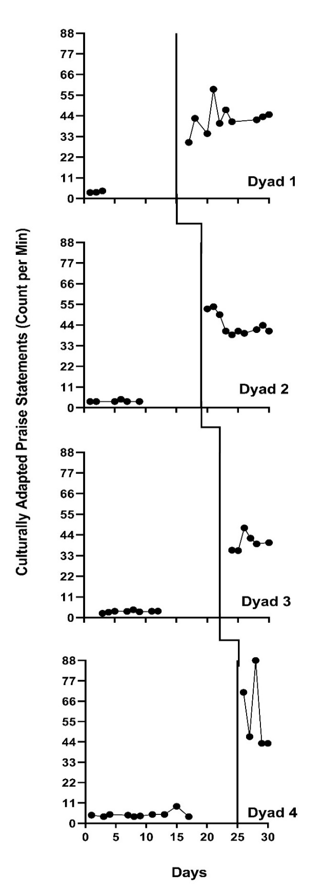
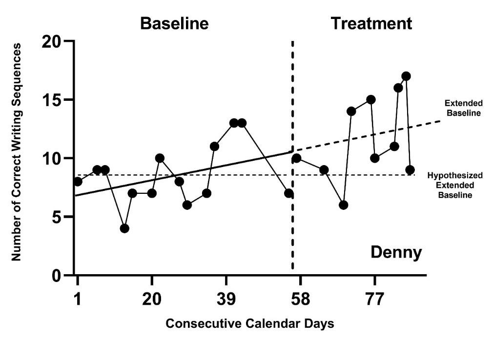
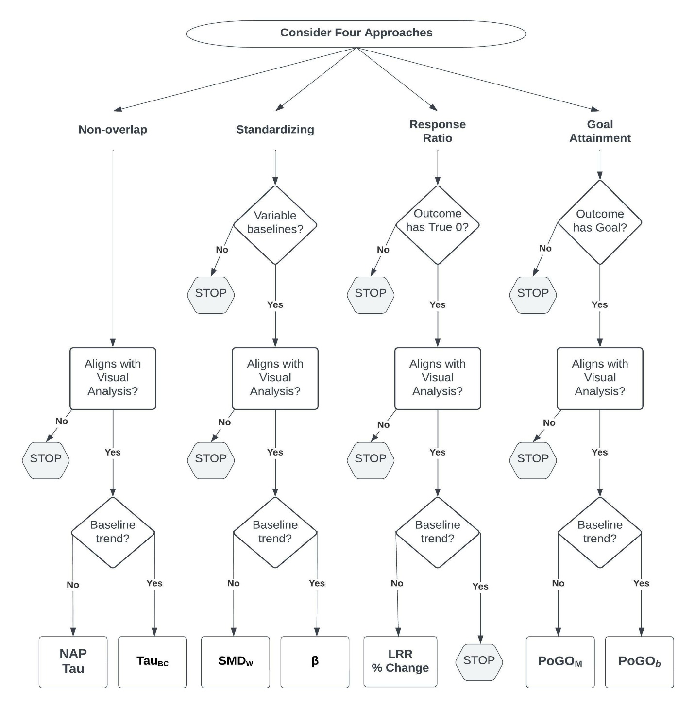

# Introduction to Case-Specific Effect Sizes {#intro-case-specific-es}

This chapter provides background on case-specific effect sizes and describes when this approach is useful in the synthesis of single-case research. We discuss different case-specific effect size metrics, their underlying assumptions, and when it is appropriate to use them. We conclude this chapter by providing a set of decision rules for meta-analysts to use when selecting among the various available case-specific effect sizes.

## Background

Case-specific effect sizes in single-case design (SCD) research provide an effect estimate for each participant on a common metric. In the context of a research synthesis that includes multiple studies, case-specific effect sizes are useful for summarizing the overall average effectiveness of an intervention, investigating the degree of heterogeneity of effects across participants, and identifying for whom and under what conditions the intervention is most effective. In meta-analyses of SCD studies, researchers can use several different metrics to summarize the intervention effect for a given case. One approach quantifies the effect based on the degree of nonoverlap between observations in the treatment phase and baseline phase [@Brossart_Vannest_Davis_Patience_2014; @Parker_Vannest_Davis_Sauber_2011; @parker2014Nonoverlap; @Parker_Vannest_2009; @Scruggs_Mastropieri_Casto_1987; @Tarlow_2017]. A second approach standardizes a summary of the change between baseline and treatment phases using standardized mean differences [@Busk_Serlin_1992; @Gingerich1984meta] or standardized regression coefficients [@maggin2011Quantitative; @van2003hierarchical]. A third approach compares the baseline and treatment levels through response ratios or percentage change indices [@pustejovsky2018Using]. Finally, a fourth approach indexes the effect relative to goal attainment by finding the percent of zero data [@Scotti_Evans_Meyer_Walker_1991] or the percentage of goal obtained [@Ferron_Goldstein_Olszewski_Rohrer_2020]. Researchers can choose among these metrics to meet the needs of their single-case synthesis context, understanding that no single approach is universally appropriate for all SCDs.

Each of the case-specific effect size estimation methods have limitations that can hinder their utility and, if not purposefully selected, lead to effect estimates misaligned with visual analysis. Consequently, researchers have developed methods for choosing among the different effect quantifications based on study purpose(s) and characteristics of the data [@Manolov_Moeyaert_Fingerhut_2022]. Further, researchers can conduct sensitivity analyses and report results from multiple indices to allow examination of the similarity in conclusions across indices [@Kratochwill2010single]. 

In this chapter, we detail the available case-specific effect size options and their underlying assumptions. We provide guidance on selecting one or more metric types for a synthesis, as well as recommendations for selecting among the specific effect indices within a metric type.

## When to Use Case-Specific Effect Sizes

When choosing an effect size for SCD study data, researchers should consider their aims or reason for using one or multiple effect sizes. There are two common motivations for using case-specific effect sizes to synthesize SCD effects. First, in some contexts, researchers want to quantify the treatment effect for each individual participant to summarize the average effect and examine variation in treatment effectiveness across participants, along with predictive factors that may help to identify for whom the intervention is most effective. When one purpose of a synthesis is to examine individual-level effects, case-specific effect sizes are more aligned with such a goal than are study-level effect sizes (i.e., design-comparable effect sizes that average the effect across participants). Second, in contexts where a variety of different approaches are used to measure outcomes across the cases and studies to be synthesized, researchers need to find a common metric with which to index the effects. If the same outcome is available for all cases for all studies, researchers could consider a multilevel model. However, multilevel modeling is not viable when outcomes are so disparate across cases that transformation of the raw data to a common scale is not feasible. Consider, for example, a situation where researchers are interested in examining individual-level effects of an intervention targeting the reduction of disruptive behavior during home routines. One included study measures the dependent variable as elapsed time from the beginning of a routine until the first disruptive behavior (i.e., latency). Another included study reports the effects of the intervention on reducing the number of disruptive behavior events during the routine (count per observation). In circumstances such as these, where researchers are interested in studying the variation in effects across individuals and the outcomes differ substantially across these individuals, case-specific effect sizes are preferable because they provide multiple options for indexing effects using a common metric.

## Assumptions and Limitations of Case-Specific Effect Sizes

When computing case-specific effect sizes, assumptions and limitations encountered depend on both metric type used (nonoverlap, standardized, response-ratios, or goal attainment) and the specific index used within that type (e.g., NAP versus Tau-U). Thus, we divide this chapter into subsections for each metric type and detail the assumptions and limitations associated with selected indices of each type. We conclude with a discussion of approaches for synthesizing the effect size estimates. Researchers can calculate most of the illustrated effect size metrics using a web application called the Single-Case Effect Size Calculator [https://jepusto.shinyapps.io/SCD-effect-sizes/\; @pustejovsky2023singlecasees] or using the SingleCaseES R package [@pustejovsky2023SingleCaseES]. We provide a detailed demonstration of these tools in Chapter 10.

## Assumptions and Limitations of Nonoverlap Indices

One of the first nonoverlap indices developed, percent of nonoverlapping data [PND\; @Scruggs_Mastropieri_Casto_1987], computes the percentage of treatment phase observations that do not overlap with baseline phase observations. Unfortunately, the index has several technical drawbacks: (a) it is sensitive to outliers, (b) it has no known SE, and (c) its expected value depends on the number of observations in the baseline phase [@Allison_Gorman_1994; @Pustejovsky2019Procedural; @White1987some]. Two newer nonoverlap indices largely address these technical problems and are more widely recommended for use: nonoverlap of all pairs [NAP\; @Parker_Vannest_2009] and Tau [@Parker_Vannest_Davis_Sauber_2011].

To compute NAP, each baseline observation is compared to each treatment phase observation. For each of these comparisons, researchers must determine whether the treatment observation is more favorable (indicating a positive result), less favorable (indicating a negative result), or identical to the baseline phase observation (indicating a null result). After obtaining a rating for each paired baseline and treatment phase observation, comparisons are summed by their category to give the total number of positive comparisons (P), negative comparisons (N), and tied comparisons (T). With these totals, NAP is the percentage of the comparisons that are positive, $NAP = \frac{P + .5\ T}{P + N + T} \times 100$. The maximum value of NAP is 100, a value that indicates all comparisons had a positive result, suggesting a positive treatment effect. If half the comparisons were positive and half were negative, the value of NAP would be 50, suggesting a null treatment effect. The minimum value of NAP is 0, when all comparisons are negative, indicating a detrimental or iatrogenic intervention effect. However, NAP is not restricted to this scale, and outcomes can be reported as a proportion using a scale of 0-1[^SingleCaseESNAP]. 

[^SingleCaseESNAP]: The Single Case Effect Size Calculator [@pustejovsky2023singlecasees] app used in Chapter 10 to model case-specific effect size estimation methods reports NAP on a 0-1 scale.

Tau is closely related to NAP and is also based on the comparison of each baseline observation to each treatment observation. However, unlike the NAP scale of 0-100 usually reported in studies, the Tau scale is -1 to 1, where 1 indicates a maximal positive effect, 0 indicates no effect, and -1 indicates a maximal negative effect. Tau can be computed from the sum of the positive, negative, and tied comparisons or can be computed directly from NAP; $Tau = \frac{P-N}{P+N+T} = \big(2\times \frac{NAP}{100} \big)-1.$ Because of the similarities between NAP and Tau, neither is statistically superior over the other. Where one can use NAP, they one could also use Tau, and vice versa. Thus, choice of NAP or Tau is a matter of the researcher’s preferred scale (i.e., an index that runs from 0 to 100, or an index that runs from -1 to 1). 
NAP and Tau are preferable to PND for several reasons. Outliers have less influence on NAP and Tau estimates, resulting in more stable sampling distributions [@Parker_Vannest_2009]. Unlike PND, the expected values of NAP and Tau are not dependent on the baseline length [@Pustejovsky2019Procedural]. Furthermore, one can compute SEs for both NAP and Tau given the assumptions that the observations are mutually independent and homogeneously distributed within each condition. However, it is reasonable to believe that these assumptions may be violated, at least to some extent. Single-case data can be autocorrelated [@matyas1997Serial; @Shadish_Sullivan_2011], violating the assumption of mutual independence. Single-case data series can also involve time trends, leading to heterogeneous distributions within each phase. Yet, having SEs under relatively restrictive assumptions is preferable to not having SEs at all. Moreover, techniques such as robust variance estimation can be deployed in the synthesis of the effect sizes that can tolerate inaccuracies in estimation of the SEs for individual effect size estimates [@Chen_Pustejovsky_2022]. 

A limitation of both NAP and Tau, as well as for the other nonoverlap indices, is the presence of a maximum value that restricts the sensitivity of this index to large effects. Consider the multiple baseline study by @knochel2021culturally shown in Figure \@ref(fig:Knochel-2021). In this study, the researchers tested a culturally focused training to increase staff use of behavior-specific praise with students. Visual analysis suggests that the treatment effect varies across dyads, with Dyad 4’s effect being the largest and the remaining dyads having variations in variability, level, and overall magnitude of effect (i.e., differences in level across phases). However, the value of NAP for all three cases is 100 and the value of Tau is 1, because treatment phase observations do not overlap with any baseline phase observation. The ceiling effect for the nonoverlap indices leads to less variation in the effect size estimates than there would be in an examination of true effects.

When choosing to use NAP or Tau, one implicitly assumes that these metrics will reflect meaningful variation in the magnitude of the effects. If the synthesis purpose is simply to confirm or rule out the presence of an effect, it may not be critical to distinguish between large and very large effects. However, if the research goal is to estimate the degree to which the size of the effect varies with some participant characteristic, NAP and Tau insensitivities to effect size at the high end of the scale can be problematic. Ceiling effects like those in the @knochel2021culturally example can limit meta-analytic efforts to examine the degree to which participant characteristics explain intervention effectiveness.

(\#fig:Knochel-2021)Multiple Baseline Design Across Three Participants (Knochel et al., 2021)

Another limitation of interpreting both NAP and Tau results as effect sizes is that one must assume there is no baseline trend and that the difference between the baseline and treatment observations results from a functional relation between the intervention and outcome, rather than some extraneous variable. Figure \@ref(fig:Rodgers-2020-Denny) shows the data from Denny, one of the participants in the @rodgers2021Effects writing intervention study. Denny's graph portrays a trend in baseline observations that suggests that some other factor has an influence on the behavior (e.g., maturation). While the value of NAP for this illustration is 80 ($\text{SE} = 10$; $\text{CI}_{95} = 56,\ 92$) and the value of Tau is 0.60 ($\text{SE} = 0.19$; $\text{CI}_{95} = 0.13,\ 0.84$), these positive values cannot be attributed to the treatment alone. In some synthesis contexts, studies with unstable baselines may not meet the quality inclusion criteria; however, ultimately it is up to the researchers to determine the inclusion criterion based on their specific research questions. If included, researchers should consider alternative effect sizes that have baseline trend adjustments. 

(\#fig:Rodgers-2020-Denny)Effect for Denny (Rodgers et al., 2020)

Researchers' desire for a metric that can adjust for baseline trends led to the development of Tau-U [@Parker_Vannest_Davis_Sauber_2011]. Tau-U adds a correction for monotonic trend to the numerator of the Tau computation. Unfortunately, this correction introduces multiple problems that make it challenging to recommend Tau-U for use in a research synthesis. As described in detail by @Tarlow_2017, problems with Tau-U include: (a) estimates are not bounded between -1 and 1, (b) adjustments cannot be meaningfully represented on a graph, (c) the size of the trend adjustment depends on the number of baseline observations and thus the expected value of Tau-U depends on phase lengths, and (c) the trend adjustment changes the sampling distribution of the statistic so that the Tau SEs are not appropriate for Tau-U. Furthermore, separate SEs for Tau-U have not yet been derived.

To correct some of the technical problems with Tau-U, @Tarlow_2017 developed the baseline-corrected Tau [@Tarlow_2017] that attempts to resolve the first three of the aforementioned problems. While baseline-corrected Tau ($\text{Tau}_{\text{BC}}$) is preferred over Tau-U, appropriate SEs for this index have not been derived, which leads to some challenges in using it in research syntheses. The implementation of $\text{Tau}_{\text{BC}}$ proposed by @Tarlow_2017 also has two further problems. First, @Tarlow_2017 proposed correcting baseline trends only when a pretest of the trend using a nonparametric rank correlation test is statistically significant. The power of this pretest depends on the number of observations in the baseline phase, and as a result, the size of the trend adjustment depends to an extent on the number of baseline observations. This issue can be avoided by applying the trend correction uniformly, regardless of the statistical significance of the pretest. Second, @Tarlow_2017 proposed to calculate $\text{Tau}_{\text{BC}}$ using Kendall's tau-b statistic, measuring the rank correlation between the trend-corrected dependent variable (y) and a binary indicator for the treatment phase (x). Because tau-b makes an adjustment for ties, which occur necessarily because x is binary, the tau-b statistic will not generally correspond to the proportion of comparisons that represent improvement after adjusting for baseline trend, and the differences can be quite large in practice. This issue can be avoided by calculating $\text{Tau}_{\text{BC}}$ directly from the formula, rather than via the tau-b statistic[^SingleCaseESTauBC].

[^SingleCaseESTauBC]: The Single Case Effect Size Calculator [@pustejovsky2023singlecasees] allows the user to choose whether to use a pre-test for significant trend. By default, it will implement the trend adjustment regardless of the statistical significance of the baseline trend.

## Assumptions and Limitations of Standardized Mean Differences

The within-case standardized mean difference [$\text{SMD}_{\text{W}}$; @Busk_Serlin_1992; @Gingerich1984meta] index describes the magnitude of an intervention effect in terms of the mean difference between treatment and baseline observations, standardized by dividing the mean difference by an estimate of the within-case standard deviation (SD). Researchers can further incorporate a small-sample correction to reduce the bias of the $\text{SMD}_{\text{W}}$ estimate. For a given amount of variation in the dependent variable, the $\text{SMD}_{\text{W}}$ is larger when the raw score mean difference is larger; for a given raw score mean difference, the $\text{SMD}_{\text{W}}$ is larger when the within-phase variation in the dependent variable is smaller. The within-case SD can be calculated assuming homogenous or heterogeneous between-phase variance in observations. If researchers assume that the variance in observations differs across phases, only the baseline SD is used in the estimation of the effect size; if researchers assume that the variance in the observations is homogeneous across phases, the within-case SD is calculated by pooling the variance across the baseline and treatment phases. 

The set of assumptions underlying the SMDW SE calculations, including those in the Single-Case Effect Size Calculator, are that observations in any given SCD study are mutually independent and homogeneously distributed (at least throughout the baseline phase). SCD study data may also violate the homogeneity of variance assumption, particularly when outcomes are reported as frequencies or percentages [@Shadish_Sullivan_2011] where the degree of variation tends to be related to the mean level. Single-case data can be autocorrelated as opposed to independent [@matyas1997Serial; @Shadish_Sullivan_2011]. In theory, an autocorrelation parameter could be added to the statistical model to loosen the assumption of independence. However, adjusting the $\text{SMD}_{\text{W}}$ estimator and the SEs for autocorrelation is challenging; autocorrelation parameters are difficult to estimate in short series, and the bias in these estimates leads to biases both in the effect size estimator and in its SE. Yet, to date, there is no consensus among researchers about the tolerability of independence and homogeneity assumption violations in calculating effects and SEs using standardized mean differences. If researchers need an approach that can tolerate some inaccuracies in the SE estimates in the synthesis of effect sizes, robust variance estimation may be preferable [@Chen_Pustejovsky_2022], as we illustrate in Chapter 10. 

An additional limitation of the SMDW is that there are circumstances in which it cannot be calculated. Consider the case of Stephen (Gevarter & Horan, 2019) in Figure \@ref(fig:GevarterHoran-2019) below. Stephen's baseline values are all equal to zero. In situations where baseline values for a case are consistently the same value (e.g., all 0s or all 2s), the baseline SD is equal to 0 and it is not possible to divide the raw score mean difference by a baseline SD of 0. Furthermore, effect size estimates using this method can conflict with visual analysis when the baseline SD is very small because the resulting $\text{SMD}_{\text{W}}$ may be very large, although the SCD graphs do not portray such. When this occurs, these very large values may show up in a synthesis as outlying effect sizes, creating challenges for summarizing the effects using meta-analysis.

(\#fig:GevarterHoran-2019)Effects of a Speech-Generating Device Intervention on Child Vocalizations (Gevarter & Horan, 2019)

Another limitation of $\text{SMD}_{\text{W}}$ is that to interpret it as an effect size, one must assume that there is no baseline trend and that the difference between baseline and treatment observations is due to the intervention and not some other factor. In Figure \@ref(fig:Rodgers-2020-Denny) for the case of Denny, observations in baseline increase with time, suggesting an improvement in absence of the intervention. Where there is a baseline trend like this, the lack of experimental control suggests that some other factor (e.g., maturation) may have an influence on the behavior observed. It would be reasonable to assume that the upward trend in Denny’s graph is due to some extraneous factor. 
Although the value of $\text{SMD}_{\text{W}}$ for this graph is 1.23 with a SE of 0.54 and $95\%$ CI [0.18, 2.28], this standardized mean difference cannot be attributed to the treatment alone. To interpret SMDW as the effect of treatment, baseline stability is also assumed (i.e., no baseline trend). In some synthesis contexts, studies with unstable baselines may not meet the quality inclusion criteria; however, in other contexts, researchers may decide and have justification for the inclusion of such studies. If included, there is a need to consider alternative effect sizes that have baseline trend adjustments. 

Researchers have developed adjustments to the $\text{SMD}_{\text{W}}$ for baseline trend by estimating regression models where a coefficient in the model indexes the difference between the treatment and baseline phase trend lines at a specific focal time. Then, the raw score regression coefficient is standardized using an estimate of the within-case variability [@Maggin2017meta-analysis; @van2003hierarchical]. Adjusting for trends, though, requires additional assumptions. One must assume a functional form for the trend (e.g., linear), and then assume that in the absence of intervention, the baseline trend would continue throughout the treatment phase. 
It can be challenging to argue that the unknown and unmeasured factor(s) leading to baseline instability will continue in a way that leads to the same trend. @Manolov_Solanas_Sierra_2019 provide an excellent discussion of the problems that can arise when trying to extrapolate baselines in SCD studies, as well as some potential solutions. In addition to the problems associated with trend extrapolation, the problems of trying to estimate and adjust for autocorrelation are exacerbated in models with trends [@Ferron_2002; @NatesanBatley_Hedges_2021]. Further research is needed to provide better guidance on how to standardize mean differences when there may be both trends and autocorrelation.

## Assumptions and Limitations of Percentage Change Indices and Log Response Ratios

The percentage change index, response ratios, and log response ratios are closely related case-specific effect sizes. Of these, the percentage change index [@hershberger1999meta] is considered the easiest to interpret. To obtain a percentage change effect size, one divides the raw score mean difference between treatment and baseline phases by the baseline mean and then multiplies the result by 100$\%$. 
For example, if the baseline mean level of problem behavior is 20 and the mean treatment phase level is 5, one divides the raw score mean difference (15) by the baseline mean (20), and then multiplies the result by 100$\%$ to obtain a percentage reduction of problem behavior (i.e., percentage change) of 75$\%$. Although easy to interpret, the sampling distribution of the percentage change index makes it challenging to use in a meta-analysis. Alternatively, the log response ratio (LRR) uses the same information (i.e., baseline and treatment phase means), but combines them into an index with improved distributional properties that is easier to work with meta-analytically. To compute the LRR index, one calculates the ratio of the intervention mean to the baseline mean, takes the natural log of this ratio, and then makes a correction for small sample bias [@pustejovsky2018Using]. While the LRR values can be challenging to interpret directly, one can overcome this limitation by converting raw effect size estimates or meta-analytic results from the LRR scale to a percentage change, using the formula: 
\begin{equation}
(\#eq:LRRtoPctC)
\% \ change= (e^{LRR}-1) \times 100 \%
\end{equation}
Converting the LRR scale to a percentage change allows researchers to take advantage of the desirable statistical properties of the LRR for meta-analytic modeling and the transparency of the percentage change scale for interpretation.

Approximate SEs for the LRR have been derived under the assumption that the observations within each phase are mutually independent and homogeneously distributed [@pustejovsky2018Using]. However, as common in SCD research, observations can be autocorrelated [@matyas1997Serial; @Shadish_Sullivan_2011]. Positive autocorrelation will lead to downward bias in the SEs and overly narrow confidence intervals, giving the perception of greater certainty than is warranted. Although the potential for bias in the SEs is not ideal, it is still feasible to use the SEs in a meta-analysis. In situations where the accuracy of the SEs is a concern, we recommend that researchers use robust variance estimation (RVE) methods in the synthesis of the effect sizes because RVE is an approach to synthesis that can tolerate inaccuracies in the estimated SEs of individual effect sizes [@Chen_Pustejovsky_2022].

A limitation of LRRs, response ratios, and percentage change indices is that they are only appropriate for outcome measures that have a ratio scale. A ratio outcome is measured on a scale where zero corresponds to the true absence of the quantity being measured (true zero) and each unit on the scale is equal in size. Consider the variable "time spent reading." It can be measured as the number of seconds one spends reading prior to being distracted (and not reading). The ratio scale for this outcome would include 0 seconds, interpreted as zero seconds elapsed (true zero) or absolutely no time. Since a second is a consistent unit of measurement (the duration of each second on the scale is equivalent), and there can be a true zero on the scale, the outcome "time spent reading" can be measured using a ratio scale. Other examples of ratio scales include count-based variables recorded as frequencies (e.g., number of disruptive behaviors, number of pro-social behaviors) or percentages (e.g., percentage of intervals with on-task behavior). However, variables without a true zero are not ratio variables. For example, consider the measurement of a student’s disruptive behavior using a behavior rating scale with the following four options: _rarely_, _sometimes_, _often_, and _almost always_. The variable _rarely_ might be coded as 0, _sometimes_ as 1, _often_ as 2, and _almost always_ as 3. However, the coded value 0 cannot be interpreted as an absolute zero (rarely $\ne$ never) and the newly coded units are not equal in size (e.g., 2 $\ne$ twice as much disruptive behavior as a 1). Thus, it is not appropriate to compute LRRs, response ratios, or percentage change for such a behavior rating scale or, more generally, for outcomes not measured on a ratio scale. However, these indices can also be difficult to interpret for ratio-based outcomes in reversal designs because the index is not symmetric with respect to the phase labels. Thus, a percentage change comparing treatment versus baseline is not necessarily the same magnitude as percentage change comparing baseline versus treatment. 

Another limitation of LRRs arises in situations where the baseline has a constant value of zero because it is not possible to divide by zero or take the natural log of zero. Here it is important to consider whether we believe that the true mean level we are trying to estimate is actually zero or some value close to zero. For example, if our outcome is continuous, the true values may be close to zero but recorded as zero by our measurement instrument. As another example, consider a low-incidence behavior that happened to not be present in any of our baseline observations, but where we anticipate that we would occasionally get a non-zero value if we were to extend the baseline phase further. When the true mean is not zero, there is a method to adjust the sample mean estimate [@Pustejovsky2015Measurement] and proceed to compute the LRR. However, when the baseline mean of zero reflects the true mean, such as when the behavior being measured is not yet in the child's behavioral repertoire, then the percentage change, response ratio, and LRR metrics are not appropriate. 

In addition, for the LRR to be interpreted as an effect size, it must be assumed that there is no baseline trend and that the difference between the baseline and treatment observations arises from the treatment as opposed to some other factor. Returning to the graphed data for Denny (Figure \@ref(fig:Rodgers-2020-Denny) where there is a baseline trend suggesting that some other factor (e.g., maturation) is impacting the observations, LRR as an effect size is somewhat problematic. The estimated value of LRR representing a treatment effect for Denny is 0.34 ($\text{SE} = 0.12$, $\text{CI}_{95} = 0.09, \ 0.58$), with a corresponding percentage change index of 40$\%$ ($\text{CI}_{95} = 9, \ 79$), but these values cannot be attributed to the treatment. Put another way, to interpret LRRs or percentage changes as the effects of treatment, one must assume stability in baseline observations (i.e., there is no trend). In some synthesis contexts, studies with unstable baselines may not meet the quality inclusion criteria; however, in other contexts, such studies may be included. If included, there is a need to consider alternative effect sizes that have baseline trend adjustments. At present, we are not aware of methods in the literature that provide baseline trend corrections for LRR.

## Assumptions and Limitations of Percent of Goal Obtained

Percent of goal obtained [PoGO\; @Ferron_Goldstein_Olszewski_Rohrer_2020] is a case-specific effect size that puts raw score effects onto a common scale by comparing the distance the intervention moved the outcome to the distance the intervention would have ideally moved the outcome. PoGO can only be computed if there is a goal. Goals can be set to the minimum of the outcome scale (e.g., the goal is to reduce problem behavior to 0), the maximum of the outcome scale (e.g., the goal is to increase on-task behavior to 100$\%$), or the level of typically developing peers (e.g., the goal is to increase the number of socially appropriate interactions to the number that is typical).

The simplest and most readily available approach to estimating PoGO relies on the phase means ($\text{PoGO}_\text{M}$). For example, consider the study of an intervention intended to reduce problem behavior to zero occurrences ($\text{goal} = 0$). If the baseline mean was 40 and the treatment mean was 20 or half the level of baseline, the intervention would have moved the behavior halfway to the goal. Thus, $PoGO_M = \frac{40-20}{40-0} \times \ 100 = 50$. A PoGO estimate of 0 indicates no movement toward the goal, whereas a PoGO estimate of 100 indicates that the goal was achieved. However, PoGO is not bounded by 0 and 100. Values less than zero can occur if the intervention is harmful and results in observations moving the opposite direction of the goal. PoGO values can also exceed 100 if one or more of the observations exceed the specified goal. For example, if the researchers set a reading fluency intervention goal of 90 words read correctly per minute and treatment phase observations consistently exceeded 90, the PoGO estimate would be more than 100.

The assumptions underlying the calculations of approximate SEs for $\text{PoGO}_\text{M}$ are that observations are independent and homogeneously distributed and that the sample means are approximately normally distributed [@Patrona2022]. Single-case data can be autocorrelated as opposed to independent [@matyas1997Serial; @Shadish_Sullivan_2011]. While in theory one could add an autocorrelation parameter to the statistical model to loosen the assumption of independence, adjusting for autocorrelation is challenging. Autocorrelation parameters are difficult to estimate in short series, and the bias in these estimates would be expected to lead to biases in the SEs. The normality assumption and homogeneity assumptions may also be violated by single-case data, which are often based on frequencies or percentages [@Shadish_Sullivan_2011], which can be non-normal and heterogeneous across phases, particularly if a phase mean is near the boundary of the variable scale (e.g., the mean baseline percent is near 0 or 100). Hopefully, future research will clarify the degree to which the commonly made assumptions of independence, normality, and homogeneity can be violated before the violations lead to substantial biases in the SEs.

An obvious limitation of PoGO is that it can only be used as an index of effects for studies that specify a goal or target criterion for the outcome under study. However, in some studies, there is no goal stated or implied. Without a goal, PoGO cannot be used as a measure of effect. In addition, to interpret $\text{PoGO}_\text{M}$ as an effect size, it must be assumed that there is no baseline trend and that the difference between baseline and treatment observations arises from the treatment as opposed to some other factor. Returning to Figure \@ref(fig:Rodgers-2020-Denny), if @rodgers2021Effects specified a target goal of 20 correct writing sequences, then the $\text{PoGO}_\text{M}$ value for Denny is 30.1. However, Denny’s estimated $\text{PoGO}_\text{M}$ cannot be attributed to the treatment because the trend in baseline suggests some other factor, like maturation. To interpret $\text{PoGO}_\text{M}$ as the effect of treatment, baseline stability must be assumed (i.e., no trend). In some synthesis contexts, studies with unstable baselines may not meet the quality inclusion criteria; however, in other contexts researchers who decide to include such studies may need to consider alternative methods that have baseline trend adjustments. 

To adjust PoGO for baseline trend, researchers can estimate regression models where a coefficient in the model indexes the difference between the projected baseline and actual treatment phase trend lines at a specific focal time. Next, the raw score regression coefficient is divided by the distance between the extended baseline trend line at the focal time and the outcome goal to obtain $\text{PoGO}_\text{b}$. The SEs for $\text{PoGO}_\text{b}$ are then computed using the SEs from the regression coefficients [@Patrona2022]. Adjusting for trends also requires additional assumptions, like a functional form for the trend (e.g., linear), and that the baseline trend would continue throughout the treatment phase in the absence of intervention. It can be challenging to argue that the unknown and unmeasured factor(s) leading to baseline instability would continue to have the same effect on the dependent variable over time (i.e., across subsequent phases) resulting in the same trend[^Extrapolate]. In addition to problems associated with trend extrapolation, problems of estimating and adjusting for autocorrelation can exacerbate in models with trends [@Ferron_2002; @NatesanBatley_Hedges_2021]. Hopefully, in dealing with SCD study data having both trends and autocorrelation, future research will provide better guidance on how to estimate PoGO.

[^Extrapolate]: See for an excellent discussion of the problems associated with trying to extrapolate baselines in SCD studies, as well as some potential solutions.

## Case-Specific Effect Size Options for Synthesizing Single-Case Research

Let us suppose that a meta-analyst has chosen case-specific effect sizes based on the decision rules in Figure \@ref(fig:synthesis-flow-chart). We suggest that the meta-analyst should then entertain four different case-specific effect size metrics: (a) nonoverlap, (b) standardizing, (c) response ratios, and (d) goal attainment. Using knowledge of the limitations of each case-specific effect size metric and the decision tree in Figure \@ref(fig:CaseSpecificES-flowchart), the meta-analyst can eliminate metrics clearly not appropriate for their synthesis context. For example, when the participant of an SCD study has a baseline of constant values of zero, one can rule out the use of standardizing. In addition to baselines values of zero, if the meta-analyst suspects that the true baseline mean is zero, they can also eliminate the response ratio approach from consideration. Likewise, one would eliminate the use of response ratios if the outcome scale was not a ratio scale (does not have a true zero). Finally, when the outcome does not have a goal, one would eliminate goal attainment from consideration. After this initial screening, there may be at least one approach (nonoverlap) and potentially several approaches left for further consideration.

For the approaches still under consideration, the meta-analyst should evaluate the degree to which each approach has the potential to produce effect size estimates that align with visual analysis. To do this, it may be necessary to begin estimating effect sizes. In choosing a specific effect size to estimate within an approach, researchers need to decide whether adjustments for baseline trends are necessary. When trend adjustments are unnecessary, we recommend the use of NAP/Tau for nonoverlap, $\text{SMD}_\text{W}$ for standardizing, LRR transformed into percentage change for response ratios, and $\text{PoGO}_\text{M}$ for goal attainment. If a linear trend adjustment appears most appropriate, we recommend $\text{Tau}_\text{BC}$ for nonoverlap, $\beta$ for standardizing, and $\text{PoGO}_\text{b}$ for goal attainment. Response ratio options are currently not available if baseline trend adjustments are needed.

If any of these effect size approaches result in estimates conflicting with visual analysis, we suggest that the approach and its results be ruled out for consideration in the overall synthesis. However, it would be beneficial for future researchers to have access to such computations and results. Thus, we encourage researchers to be transparent and make the effect sizes available in supplemental materials (or in an archive of replication materials) so that readers can assess for themselves the lack of alignment and decision to drop the index. At this point, a meta-analyst is left with only the effect size estimation approaches that align reasonably well to visual analysis. Figure \@ref(fig:CaseSpecificES-flowchart) depicts a set of decision rules that correspond with these recommendations.

(\#fig:CaseSpecificES-flowchart)Flow Chart for the Selection of Case-Specific Effect Size(s)

After working through the decision rules, situations may arise in which multiple approaches are under consideration. At this point, a researcher must determine whether one or more indices will be selected for the meta-analysis. For example, the researcher could decide to estimate effect sizes and conduct meta-analyses using each of the viable effect size indices. The argument for including more than one index is that each has its own strengths and limitations, and using multiple indices allows us to check the sensitivity of our conclusions to the choice of effect metric [@Kratochwill2010single]. For those who prefer to select a single metric, we suggest selecting the index that best aligns with the visual analysis, or if no index aligns much better than the others, selecting the index that tends to function the best within a meta-analytic model. For example, a study by @Chen_Pustejovsky_2022 synthesizing NAP, $\text{SMD}_\text{W}$, and LRR found the LRR case-specific effect size functioned best (e.g., showed little to no bias and relatively accurate confidence intervals) across a variety of conditions for frequency count outcomes, followed by NAP. The $\text{SMD}_\text{W}$ metric led to the most substantial problems. Thus, if viable, the LRR effect size is preferred over NAP, and NAP is preferred over $\text{SMD}_\text{W}$.

After selecting one or multiple indices for the meta-analysis, the researcher then turns to synthesizing the effects. Although multiple approaches are possible, the synthesis approach that works best depends on the effect size being synthesized. With LRRs, we recommend multilevel meta-analysis coupled with robust variance estimation [@Chen_Pustejovsky_2022]. However, with NAPs and SMDs, the correlations between the effect sizes and their SEs create problems for using multilevel meta-analysis, so it is better to use simple averages with robust variance estimation [@Chen_Pustejovsky_2022]. Robust variance estimation is generally helpful in synthesizing any of these case-specific effect sizes because some inaccuracies in the SEs are likely due to violations to the independence assumption that is made when estimating the SEs for NAP, Tau, $\text{SMD}_\text{W}$, LRR, and $\text{PoGO}_\text{M}$. 

In the following chapter of this guide, we illustrate the application of case-specific effect sizes for the synthesis of single-case studies when researchers are interested in understanding the heterogeneity of effects across individuals in studies where measures and outcomes are not homogeneous. Using the flowchart in Figure \@ref(fig:CaseSpecificES-flowchart) as a reference point, we provide step-by-step instructions for selecting one or more of the case-specific effect sizes, then demonstrate use of the _Single-Case Effect Size Calculator_ [@pustejovsky2023singlecasees] to obtain these effects and comparing them to what is found through visual inspection of participant graphs within each included study. Finally, we conclude Chapter 10 with a hypothetical synthesis using meta-analytic models. 
