# Application of Case-Specific Effect Sizes {#app-case-specific-es}

_This chapter illustrates the application of case-specific effect sizes in the synthesis of single-case studies. We provide step-by-step instructions to demonstrate the selection of the case-specific effect sizes that initially appear appropriate for the synthesis context. We then illustrate the computation of each of those effect sizes using the Single-Case Effect Size Calculator and compare the resulting effect sizes to our visual analysis. Finally, for the effect sizes that align with our visual analysis, we provide a demonstration of synthesis using meta-analytic models._

In this chapter, we illustrate the calculation and use of case-specific effect sizes in the synthesis of single-case studies. Case-specific effect sizes provide a measure of effect for each participant from each study on a common scale. Thus, these methods are particularly useful when researchers are interested in understanding variation (heterogeneity) of treatment effects across individual participants and where the outcome measurement procedures vary substantially across the included participants and studies. We present an example scenario where we want to synthesize evidence from several single-case design (SCD) studies that examine the effects of augmentative communication interventions (AAC; e.g., sign language, picture exchange communication systems, speech-generating devices) on increasing the independent requests (mands) of individuals with developmental and intellectual disabilities. For purposes of illustration, we selected three studies from the meta-analysis by [@Ganz_et_al_2023].

The first study, @Byiers2014, used a reversal design to investigate the effects of an AAC intervention on increasing three adult participants' use of a switch device to communicate their desire for preferred items or activities while decreasing incidents of inappropriate behavior hypothesized to function as a request. For simplicity, we created a single outcome by combining both outcomes using this formula: 
$$
\% \ switch \ activated \ responses = \frac{appropriate \ responses \ per \ minute}{inappropriate \ + \ appropriate \ responses \ per \ minute}\times 100
$$
Participants received between 4 and 10 five-minute intervention sessions per day, with Jen and Tammy participating in sessions across three days and Rose completing all sessions in two days. The intervention sessions focused on switch training, which was "considered complete when the participant produced the response independently within 1 min on five consecutive opportunities," [@Byiers2014, p. 344]. Therefore, we defined the outcome goal as use of the communication switch device on 100$\%$ of opportunities per session. 

The second study by @Casey1978 included four student participants and used a multiple baseline design to examine AAC intervention effects on increasing the mean proportion of signed target requests in a classroom setting while simultaneously reducing the proportion of intervals engaged in problem behavior. The manual signing intervention was implemented by all classroom staff (one teacher, three aides) across the school day. The research team conducted observations of the participants during the first 30 minutes each morning at school across five weeks. Each participant's targeted behaviors were measured across a five-minute period using partial interval recording methods, in which observers checked a box next to any or all of the target behaviors that they observed at any point within a 10-second interval. The study goal was to reduce the proportion of intervals that each student engaged in problem behavior to zero (0) and increase positive communication skills to 1.0. We combined these outcomes to create a new outcome measure representing the proportion of communicative opportunities with signed requests. 

The third study, by @StrasbergerFerreri2014, also used a multiple baseline design. The researchers examined the impact of a peer-mediated intervention along with an iPod-based speech-generating device to teach communication skills to four autistic students aged 5-12 years old who had limited or no vocal or verbal behavior and no existing successful use of an alternative or augmentative communication system. The primary outcomes were the number of independent mands (e.g., "I want juice.") as well as independent responses to a direct question (e.g., "I want juice." In response to "What do you want?"). Intervention consisted of peer assisted communication application (PACA), in which five typically developing children between 7-13 years old delivered communication training sessions with the participants that mirrored the six Picture Exchange Communication System (PECS) phases. Researchers collected frequency data on independent and prompted mands and responses to questions by each participant for as many as three sessions daily, with each session consisting of 10 trials to request known preferred items and answer the questions. 

These three example studies used a range of different procedures for measuring outcomes and measured behaviors over sessions of different length. For example, @Byiers2014 used frequency or count measures of the dependent variable during five-minute sessions (between four and 10 sessions per day) per participant, whereas @StrasbergerFerreri2014 collected data on no more than three 10-trial sessions per day (session duration was not specified). The outcomes from these studies are on a variety of different scales, and responses to these AAC interventions could vary across individual participants. Thus, it is advantageous to use case-specific effect sizes to synthesize results from these studies.

## Selecting Case-Specific Effect Sizes for the Single-Case Studies

Using the decision rules in Figure \@ref(fig:CaseSpecificES-flowchart), we first select which of the types of case-specific effect sizes are viable for further consideration. Non-overlap indices can be computed with any type of outcome, so they are deemed initially viable. For the within-case standardized mean difference (SMD~W~), we need a non-zero within-case standard deviation. The graphs of the data from the studies are provided in Figures \@ref(fig:Byiers-2014) to \@ref(fig:Strasberger-2014). Inspection of Figure \@ref(fig:Byiers-2014) shows that each of the participants in @Byiers2014 has baseline variability, and as seen in Figure \@ref(fig:Casey-1978), the same is true for each participant reported in @Casey1978. However, examination of Figure \@ref(fig:Strasberger-2014) (data from @StrasbergerFerreri2014) shows that the first case (Parker) has only three baseline values and that those values are all the same, such that the estimated baseline standard deviation is 0. To compute a standardized mean difference for this case, we would have to consider estimating the within-case standard deviation by pooling the deviations across the baseline and treatment phases, something we will discuss in more detail later. For all other cases, the baselines show variation, and the typical approach of standardizing using the baseline standard deviation is feasible.

(\#fig:Byiers-2014)Effect of Intervention on Percent of Appropriate Responses (Byiers et al., 2014)

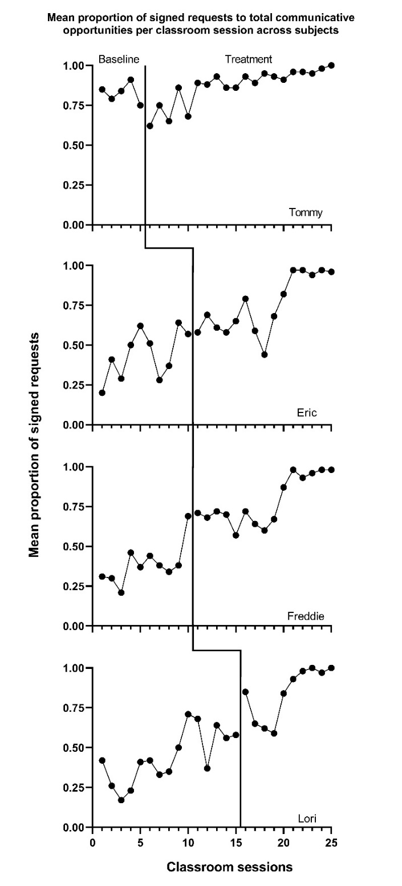

(\#fig:Casey-1978)Effect of Intervention on Classroom Behavior (Casey, 1978)

(\#fig:Strasberger-2014)Effect of Intervention on Mands (Strasberger & Ferreri, 2014)

Next, to determine if log response ratios (LRRs) are viable, we consider whether the outcomes are ratio-scale variables, which have a true zero and equal intervals (i.e., a unit at the lower end of the scale represents the same amount as a unit at the upper end of the scale). In @Byiers2014, the outcome is the percentage of switch-activated responses per session, in which zero would indicate absolutely no switch-activated responses and the intervals can be assumed equal. In @Casey1978, we used both the signed request and problem behavior outcomes reported in the study to create a new dependent variable: the mean proportion of communicative opportunities with a signed request (taught behavior) per observation interval, which has a true zero. Finally, the outcome in the @StrasbergerFerreri2014 study was the count of independent mands and responses per session, in which each session provided 10 opportunities. This count outcome has a true zero and is thus a ratio-scale variable. Because all outcomes are on a ratio scale, and none of the baselines are consistently zero, we determine that computing LRRs is feasible.

To determine if computing percentage of goal obtained (PoGO) is a viable option, we consider whether the outcomes have a goal, a scale value that would correspond to the outcome of an optimally effective or ideal intervention. For the percentage of switch-activated behaviors in @Byiers2014, we determined the goal level to be 100 percent. For the @Casey1978 study, the proportion of communicative opportunities with a signed request had a goal level of 1.0. Finally, for the count of mands and responses per session in @StrasbergerFerreri2014, the goal was specified as 10, a positive response to each of the 10 total opportunities presented per session. Thus, PoGO could be computed for each case in each study because the ideal value for each outcome was known.

Based on our initial consideration of the studies, each case-specific effect size category is potentially viable. The next decision we must make is whether to adjust for baseline trend. Based on our understanding of these outcomes, participants, and settings, we would expect stable baselines. When we visually analyze the plots in Figures \@ref(fig:Byiers-2014)-\@ref(fig:Strasberger-2014), the baselines appear stable for most cases, with the possible exceptions of Freddie and Lori in Figure \@ref(fig:Casey-1978). Because we did not see trends for most cases and have uncertainty as to whether Freddie and Lori have trends that would continue, we decide to not make baseline trend adjustments, and to interpret Freddie and Lori’s effect size estimates with caution and less confidence. Using \@ref(fig:multistudy-example-data) in Chapter 9 as our guide, we will estimate NAP for non-overlap, the SMD for standardizing, the LRR for response ratios (which we will transform to percentage change for interpretation), and PoGO~M~ for goal attainment. We illustrate the computation of each in the next section using the _Single-Case Effect Size Calculator_ [@pustejovsky2023singlecasees]. After computing each of the effect sizes, we will then consider whether the estimates align well with our visual analysis of participant graphs in Figures \@ref(fig:Byiers-2014)-\@ref(fig:Strasberger-2014). Indices that align poorly with our visual analysis will be given less focus in our synthesis, whereas indices that align well with our visual analysis will be used to illustrate the averaging of case-specific effect sizes and will figure more heavily into our interpretation. 

## Estimating the Case-Specific Effect Sizes for the Included AAC Intervention Studies

We demonstrate calculation of the case-specific effect size estimates using the web application, Single-Case Effect Size Calculator [@pustejovsky2023singlecasees], which is a graphical user interface to the SingleCase R package. All calculation methods implemented in the app are documented at https://jepusto.github.io/SingleCaseES/.

Prior to using the app to estimate case-specific effect sizes, we show how the data from the three augmentative communication intervention studies are entered into an Excel data file. We then illustrate the process of accessing the app, uploading the Excel data file for analysis, defining the variables, examining graphs provided within the app, and estimating the case-specific effect sizes.

### Entering the Data into Excel

Figure \@ref(fig:multistudy-example-data) is a screenshot of the Excel data file we use in this tutorial. These data are from three different studies examining the effects of AAC interventions on improving the requesting behavior of individuals with disabilities. There are four different spreadsheets within the file, three representing data extracted from each of the included studies [@Byiers2014; @Casey1978; @StrasbergerFerreri2014]. We also have a spreadsheet containing all participant data across the three studies, with the tab labeled ALL, as shown in Figure \@ref(fig:multistudy-example-data). 

The data in our spreadsheet are arranged using a long data format, which means that each row includes data for one observation of a participant in a given study. For example, the first row contains the first observation from the first case from the first study (e.g., Jan Session 1 in Figure \@ref(fig:multistudy-example-data)), and the second row contains the second observation from that case (Jan Session 2 in Figure \@ref(fig:multistudy-example-data)). After entering each of the observations from the first case of the first study, we enter each successive observation from the second case (e.g., Tammy in Figure \@ref(fig:multistudy-example-data)) of the first study, and continue until all observations for all cases in the first study have been entered. Then, beneath the data from the first study, we enter all values for the second study, again starting with the first observation from the first case and continuing through the last observation of the last case. All remaining studies are entered directly below the previous studies, with one row for each observation.

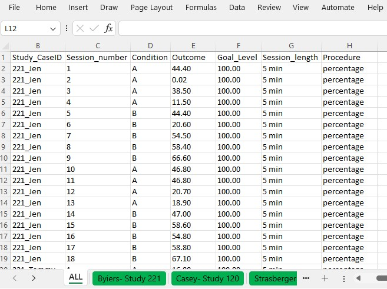

(\#fig:multistudy-example-data)Example Data Spreadsheet (.xlsx) Formatting

The columns of the spreadsheet correspond to the variables the app will need to compute the case-specific effect sizes. Our study indicator variable appears in the first column, labeled StudyID. The values in this column can be either numeric or alphanumeric, but the variables should consistently represent the study from which the outcome observations were extracted. For example, all study data from @Byiers2014 are assigned a study identifier of 221, @Casey1978 data have study identifier 120, and @StrasbergerFerreri2014 have study identifier 158. The case indicator variable appears in our second column, labeled _Study_CaseID_. The values in this column can also be numeric or alphanumeric. All within-case observations should have the same case indicator variable, with a unique code for each case in each study. To make it easier to track which case came from which study, we use values for each case indicator that are a concatenation of the study identifier and the case name used by the study authors. The third column, labeled _Session_number_, represents the session number for each recorded outcome value. It should only contain numerical values, with no values repeated across rows for a given case. The _Condition_ column represents the phase indicator variable. It can be numeric or alphanumeric. Here we use _A_ to indicate a baseline observation and _B_ to indicate a treatment phase observation. The next column, _Outcome_, represents the value of our primary dependent variable in the synthesis-requests or mands. We have also included a goal level for each study, _Goal level_, which is needed to compute the PoGO~M~ effect sizes. Both outcome and goal-level values must be numeric. Finally, the last two columns, _Session_length_ and _Procedure_ allow us to include additional information regarding the measurement of the outcome, which can be useful in the estimation of some case-specific effect sizes. As seen in Figures \@ref(fig:Byiers-2014) and \@ref(fig:multistudy-example-data), the outcome for the first case from the first study (i.e., Jen) is based on a five-minute observation period, and the outcome is reported as a percentage of switch-activated responses per session. 

### Accessing the App

We can estimate each of the case-specific effect sizes for each participant, as well as the associated standard errors (SEs) and confidence intervals (CIs), using the web-based Single-Case Effect Size Calculator [@pustejovsky2023singlecasees]. The app, shown in Figure \@ref(fig:SCDES), can be accessed at https://jepusto.shinyapps.io/SCD-effect-sizes/. For researchers comfortable using the R statistical computing environment, the app can also be accessed through the SingleCaseES R package (https://jepusto.github.io/SingleCaseES/). By running the app through R, one has the advantage of carrying out the calculations on their local computer, rather than on a cloud-based web server. As a result, the app will be faster and more responsive when run locally than when accessed via the website. Regardless of how it is accessed, the user interface and functioning of the app are the same.

At the top of the screen are headers for two distinct parts of the app. The _Single-Series Calculator_ allows users to calculate effect sizes for individual cases (i.e., entering the data for one participant at a time)[^SSCalcDemo]. The _Multiple-Series Calculator_ allows users to calculate effect sizes for several cases from one or more studies, all at once. The _Multiple-Series Calculator_ is also useful for calculating more than one effect size measure for the same set of data. Meta-analytic contexts include data from multiple cases and multiple studies. Therefore, we focus on the _Multiple-Series Calculator_ in this chapter[^MSCalcDemo]. Select the _Multiple-Series Calculator_ tab (as indicated with the arrow in Figure \@ref(fig:SCDES)) to enter this part of the app.

[^SSCalcDemo]: A video demonstration of the Single-Series Calculator is available at https://www.youtube.com/watch?v=V_r9MEX9LwY.

[^MSCalcDemo]: A video demonstration of the Multiple-Series Calculator is available at https://www.youtube.com/watch?v=DSW7wuFG7og.

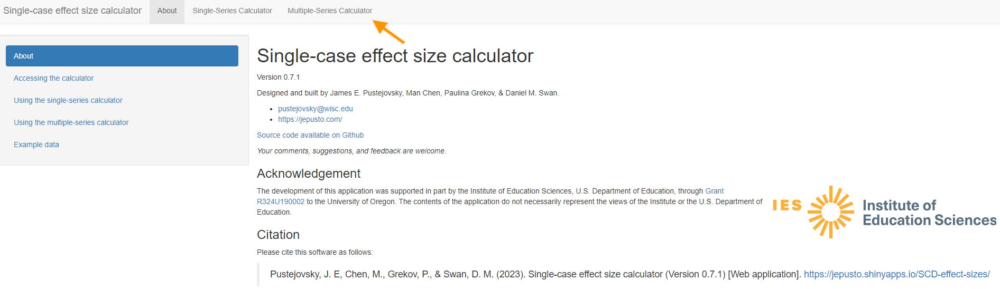

(\#fig:SCDES)Single-case effect size calculator web application (Pustejovsky et al., 2023)

### Loading the Data into the App

After clicking on _Multiple-Series Calculator_, we get the screen shown in Figure \@ref(fig:initial-multipleseries). Towards the top are tabs for _Data, Variables, Plot, Estimate, and Syntax for R_. The first tab is _Data_, which appears black to indicate that it is the active tab, whereas the other, inactive tab labels are blue. The _Data_ section allows us to select a dataset to use for effect size calculations. To upload our dataset, it must be saved as a .txt, .csv, or .xlsx file.

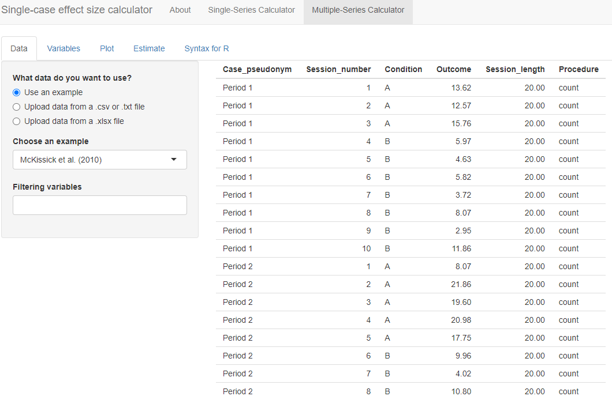

(\#fig:initial-multipleseries)Initial Multiple-Series Calculator screen

To load our Excel data file (.xlsx) into the _Data_ section of the app, we first select the choice "Upload data from a xlsx file" and then click the _Browse_ option in the app (see Figure \@ref(fig:multipleseries-data)) to locate and select the file as saved on our computer. The app will default to a checked box next to _File has a header?_. We leave this box checked because the top row of our Excel file contains our variable names. Because our file contains multiple spreadsheets, we must select a single sheet for analysis. Using the drop-down box, we select the sheet ALL that has the data from all three of the studies, as shown in Figure \@ref(fig:multipleseries-data). 

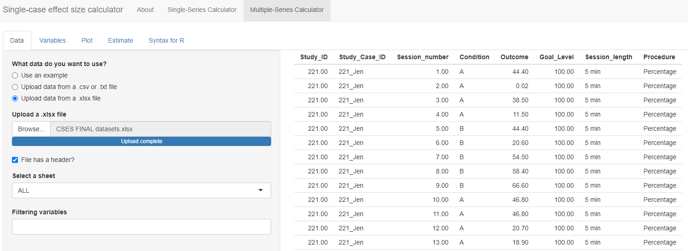

(\#fig:multipleseries-data)Initial Multiple-Series Calculator screen

Under the _Select a sheet_ field, there is a field titled _Filtering variables_. If we click the cursor in the empty field, a menu appears from which we can select one or more variable names to use in defining a subset of the dataset. This option can be helpful for researchers who want to analyze only specific studies, cases, or phases from a larger dataset. For example, if we only wanted to compute the effect sizes for the first study, @Byiers2014, we could select _Study_ID_ under filtering variables. Doing this would lead to an additional menu with the request _Please select the values for each filtering variable_. If we chose the value 120, the larger data set would be reduced to include only the data from study 120, and we could proceed to examine the graph for that specific study and to estimate the effect sizes for that specific study. As another example, some datasets might include studies with maintenance phases or multi-phase designs such as an ABCABC design. To calculate effect sizes for the comparison between phases A and B only, we could use the _Filtering variables_ field to exclude data from the maintenance phases or C phases.

For present purposes, we leave the _Filtering variables_ field empty because we want to estimate the effect sizes for all the cases in all three of our studies. Once the data are loaded, it automatically populates on our screen, so that we can quickly verify that the data presented correspond to the dataset we uploaded. In Figure \@ref(fig:multipleseries-data), we observe that the ID assigned to each study is listed under the _Study_ID_ column (e.g., 221 for all participants in @Byiers2014), so that the measured dependent variable values (_Outcome_) for participant Jen (_Study_Case_ID_) for all sessions (_Session_number_) across phases (_Condition_; A = baseline, B = treatment) and specified goal level are accurately presented. 

### Defining the Variable within the App

After uploading our data, the next step is to move to the _Variables_ tab. The menu, shown in Figure \@ref(fig:multipleseries-var-empty), guides us through the process of indicating which of the variables in the dataset correspond to the variables needed for analysis. 

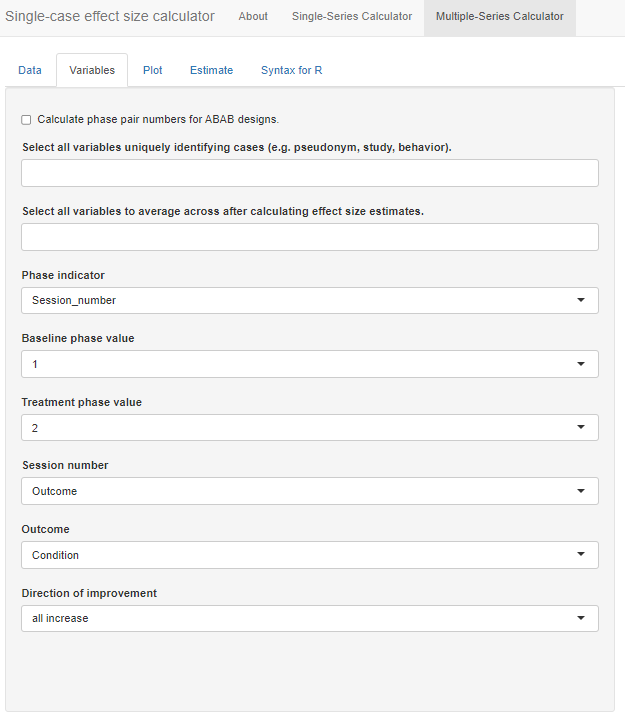

(\#fig:multipleseries-var-empty)Variables Section Menu

At the top of the menu, there is a checkbox allowing us to _Calculate phase pair numbers for ABAB designs_. We check this option because one of our studies [i.e., @Byiers2014] is an ABAB design replicated across several cases. After checking the box, a new identified variable _phase_pair_calculated_ is added to the dataset containing a label for each unique pair of sequential phases. Initially, the results in this variable will not make sense but they will be recalculated after we select unique identifier variables in the next step. 

Below the optional checkbox, we are asked to _Select all variables uniquely identifying cases (e.g., pseudonym, study, behavior)_. This drop-down box allows us to specify the variable names that uniquely identify our included study cases. Because we have a unique name for each case (i.e., we don’t use the same name for a case in two different studies), we can select our case identifier variable, _Study_Case_ID_. However, if the case labels were repeated across studies (e.g., "Case 1", "Case 2", etc. for each study), we would need to select both the _Study_ID_ and _Study_Case_ID_ to uniquely identify cases. In general, it is a good practice to select variables here for each relevant level of analysis. For our dataset, we select both _Study_ID_ and _Study_Case_ID_ so that we retain a variable with a unique ID for each study. Note that we must click outside the drop-down window or hit the Tab key to exit out of the options list. 

After selecting these unique identifying variables, the app will automatically recalculate the _phase_pair_calculated_ variable. The variable should now include a unique identifier for each unique pair of sequential phases within a data series. For instance, in @Byiers2014, each case will now have a label "1" for the first A phase and first B phase and a label "2" for the second A phase and second B phase. We recommend that users verify accurate calculation of _phase_pair_calculated_ before continuing with variable selection.

Next, from the drop-down box _Select all variables to average across after calculating effect size estimates_, we select _phase_pair_calculated_. Particularly important for the @Byiers2014 ABAB design, this option allows us to obtain an average effect size estimate across phase pairs for each case. While this variable was not in the original uploaded data file, it is added to the list because we checked the box, _Calculate phase pair numbers for ABAB designs_. 

We specify our _Phase indicator_ next, which is the variable we labeled _Condition_ in our data file. Once selected, the app automatically populates what it believes are the baseline and treatment phase values. With this dataset, it is correct that _A_ indicates a baseline observation and _B_ indicates a treatment observation. However, researchers should verify the accuracy of this field. Then, from the _Session_number_ menu, we select our variable named _Session_number_ and we select our variable _Outcome_ from the Outcome drop-down menu. 

The last item in the Variables section asks us to specify the expected direction of the data paths for the included cases anticipated given our outcome of interest, and whether the measured outcome is expected to increase or decrease in the treatment phase. Because our included studies examine participants’ acquisition of communicative skills, specifically requesting behavior, we select _all increase_ from the _Direction of improvement_ field. If the studies in the dataset include outcomes measured in different ways and with different valence, then the dataset will need to include a variable indicating the direction of improvement for each case, labeled as "increase" or "decrease." If the dataset includes such a variable, we could select the "by series" option from the _Direction of improvement_ field, resulting in a new field appearing, _Select variable identifying improvement direction_. We would use this field to indicate the name of the variable containing the labels for direction of improvement.

At this point, we have completed all sections on the _Variables_ tab. As shown in Figure \@ref(fig:multipleseries-var-filled), we have specified which of the variables in the data set correspond to the study indicator variable, case indicator, phase indicator variable, outcome, etc. We are now ready to click on the _Plot_ tab in the left panel of the screen, so that we can visually inspect the data for each of the cases. 

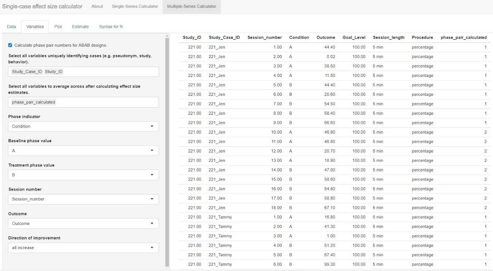

(\#fig:multipleseries-var-filled)Multi-Series Calculator Variables tab

### Examining the Graphs within the App

The _Plot_ tab of the Multiple-Series Calculator displays a graph of outcomes by session number, differentiating baseline phases from treatment phases using green and red data paths, respectively. The _Display plots for each value of this variable_ field allows us to specify variables with which to group the data plots. By default, the field defaults to _None_, which results in the app plotting only those data for the first pair of AB phases from the first case appearing alphanumerically in our dataset. However, we want to view more than one case at a time and select _Study_Case_ID_ from the drop-down options under _Display plots for each value of this variable_. Then we can select a variable from the drop-down box under _Select a value for each grouping variable_ to plot certain values for the grouping variables (e.g., study 221; Figure \@ref(fig:multipleseries-graph)). The app plots all cases on the same scale, so if reviewing the plots for multiple studies at once or for a study in which cases have different outcomes, a case with a relatively small scale may appear to have near-zero levels of responding.

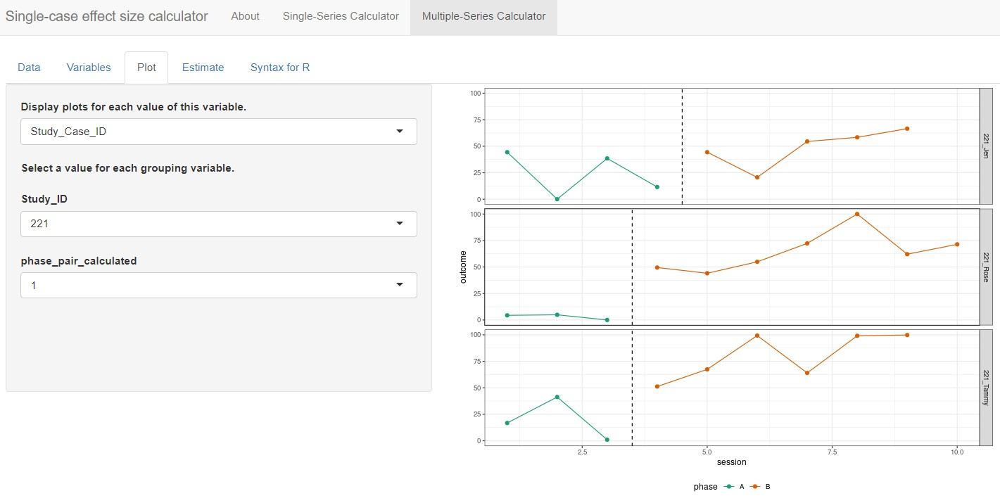

(\#fig:multipleseries-graph)Multiple-Series Calculator Plot Section

At this point, with _Study_Case_ID_ selected from the _Display plots for each value of this variable_ drop-down menu, the app automatically populates _phase_pair_calculated_ under the header _Select a value for each grouping variable_, with the default set to 1. Thus, the plot shown is for the first AB phase pair of the selected case. Since the @Byiers2014 study is a replicated ABAB design (i.e., multiple AB phase pairs), we must change this menu option from 1 to 2 so we can examine the plot for the second AB phase pair. Although researchers will likely have already reviewed the plots from their primary studies to determine which case-specific effect sizes would be appropriate to calculate, it is useful to review them again here. An additional review of these data plots ensures that the app has read the data as intended and can verify researchers' judgements about trends or other features of the data series. 

### Estimating the Effect Sizes within the App

After reviewing the plots, we move on to the estimation of case-specific effect size indices by selecting the _Estimate_ tab as shown in Figure \@ref(fig:multipleseries-est-empty). The effect sizes that can be computed are grouped into two categories: (a) Non-Overlap Effect Sizes, and (b) Parametric Effect Sizes. Researchers can select one or more of the effect size indices that they are interested in calculating. For the set of studies included in this illustrative example, we decided to estimate non-overlap of all pairs (NAP) as a non-parametric effect size. We also selected several parametric effect sizes to estimate, including the within-case standardized mean difference (SMD), log response ratio for increasing outcomes (LRRi), and percent of goal obtained (PoGOM). When we check the box next to each effect size index, the box turns blue (see Figure 10.12). For some effect size measures, additional estimation options also appear. For example, after checking the SMD box, the Standardize SMD field appears, asking us to select a quantity by which to standardize. Researchers should choose the option that is most appropriate for their synthesis, selecting either the first radio button to standardize the SMD using the standard deviation of baseline observations (baseline SD) or standardize the SMD using the standard deviation pooled across the baseline and treatment phases (pooled SD). We choose to leave the standardization to the default option, baseline SD, for this illustration. 

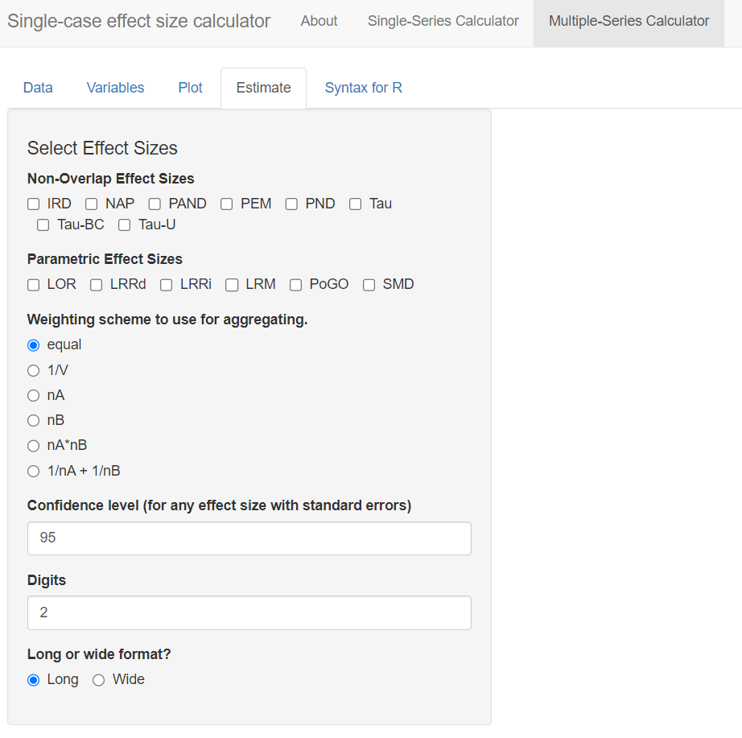

(\#fig:multipleseries-est-empty)Multiple-Series Calculator Estimate Section

Additional fields also appear when we opt to calculate LRRi. These fields allow us to provide more detail about the nature of our outcome and to select additional output to aid in the interpretation of results. The first field, _Outcome Scale_, allows us to indicate how the outcome measurements are scaled. The menu defaults to count (i.e., all variables are measured by counts). However, the outcome measures vary across our included studies---for @Byiers2014 the outcome is a percentage, for @Casey1978 the outcome is a proportion, and for @StrasbergerFerreri2014 the outcome is a count. Therefore, to specify different outcome scales for our different cases, we choose the option _by series_ under _Outcome Scale_. When we do so, another menu labeled _Select variable identifying outcome scale_ appears. Here, we select the _Procedure_ variable, which indicates the outcome scale used for each case in the dataset. 

In some contexts, researchers may need to specify variables in their dataset using one or all three remaining menus on the page. These variables allow the app to estimate LRRs for cases with zero or near-zero levels during a phase. Because all studies in our example dataset have non-zero baselines and treatment levels, selections in these fields will not affect the results of this illustration, but they may influence LRRi calculations in studies with outcomes at or near zero. For the menu, _Optionally, a variable identifying the number of intervals per session_, researchers can select the corresponding variable in their dataset that contains the number of intervals per observation. We leave this field at the default value of _NA_. Similarly, using the _Optionally, a variable identifying the length of each observation session_ menu, researchers can define the observation session length in minutes. However, if this value is unknown or not relevant to the calculations at hand, researchers can opt to choose _NA_, which is what we have chosen to do. Finally, the menu labeled _Optionally, provide a floor for the log-response or log-odds ratio? Must be greater than or equal to 0_ allows users to define the floor constant. This field provides the app with the information needed to estimate or specify a truncation constant. In either case, this makes it feasible to compute the LRR-increasing and LRR-decreasing values [see @Pustejovsky2015Measurement, @pustejovsky2018Using for further details]. We leave this section blank for the purposes of our illustration. However, other researchers analyzing data with near-zero baselines may find it helpful. 

Six more fields remain in the _Estimate_ section menu. Next, we move to specifications relevant to the PoGO~M~ case-specific effect size. Using the _Set the goal level for PoGO_ drop-down menu, we can opt to set the same goal for every series in the dataset (i.e., _common goal_) or to set a different goal for each series (i.e., _different goals across series_). Selecting _common goal_ triggers another field requesting us to select a single value that represents the goal level across all cases and studies. However, because we have three different studies, each with different goal levels, we select the alternative PoGO estimation option: _different goals across series_. Beneath this field, we then use the drop-down menu to specify the variable in our dataset that represents the goal level (e.g., _Goal_Level_; see Figure \@ref(fig:multipleseries-est-filled)). 

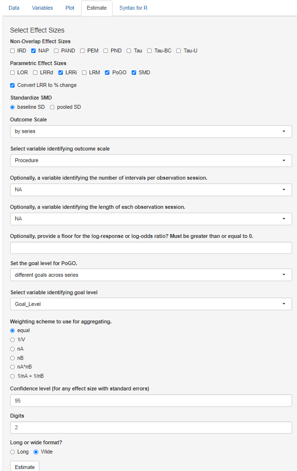

(\#fig:multipleseries-est-filled)Estimate Section of the Multiple-Series Calculator

After selecting the effect size indices and providing the app with additional information needed for computation where relevant, we have four additional options to consider, as shown in Figure \@ref(fig:multipleseries-es-res). The _Weighting scheme to use for aggregating_ section defaults to _equal_. For our illustration, we are aggregating the effect sizes across the AB pairs in the ABAB design [@Byiers2014]. With the calculator default as _equal_, the app will average the effect sizes from the two AB pairs by assigning them equal weights. This default is typically recommended for most syntheses and is appropriate here, so there is no need to change it. However, if there are substantial differences in the information used to compute one effect size versus another (e.g., one effect size is calculated with a larger set of observations or substantially less variable data), other options may be more appropriate. For example, the multiple-series calculator allows researchers to weight the effect sizes by the number of observations in the baseline phase (option $nA$), or the inverse of the error variance (option $1/V$).

The next menu, labeled _Confidence level (for any effect size with standard errors)_, lets us specify the preferred coverage level for the confidence intervals reported for effect size measures that have known sampling variances. We leave this field at the default and standard value, _95_. However, researchers can adjust the value to meet their needs. For the menu _Digits_, we choose the decimal places used in the reporting of our calculated effect size estimates (along with their SEs and confidence limits). We keep the value default of 2, which is consistent with APA reporting guidelines. 

Finally, the last menu _Long or wide format?_ in the Estimate section presents two options for how our output will be presented: long format or wide format. The app default is _Long_, which will arrange the output by cases, with each effect size appearing in a separate row. Since we opted to calculate four different effect size indices, there will be four rows per case. Alternatively, we can choose to view our output as _Wide_. Wide format organizes results with each case assigned to its own row, and each different effect size index represented by separate columns. In this scenario, we would view our cases in rows and scroll to the right to view each of the different effect sizes in a separate column. Although no format is better than the other, we present the wide format in Figure \@ref(fig:multipleseries-es-res). With a single line per data series, we can more easily complete across-case comparisons of specific effect size indices. With our data containing cases from multiple studies, the wide format will help us assess the degree to which one or more of the calculated effect size metrics provides estimates that align well with our visual analyses.

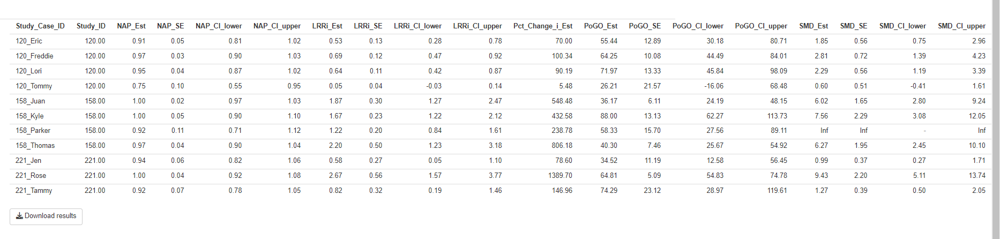

(\#fig:multipleseries-es-res)Estimate Section of the Multiple-Series Calculator

At this point, to view the results, we can click the _Estimate_ button at the bottom of the screen. By clicking this button, the multiple-series effect size calculator will display the results table with each effect size estimate and their corresponding SEs and confidence limits. Figure \@ref(fig:multipleseries-es-res) shows an example of the table that appears to the right of the _Select Effect Sizes_ options we selected in Figure \@ref(fig:multipleseries-est-filled). The table includes the NAP, SMD, LRRi, and PoGO~M~ estimates for each individual case across all three included studies, as well as associated 95$\%$ confidence intervals. Pressing the button labeled _Download results_ will download the output as a .csv file, which will be useful in the further processing of the effect sizes. 

## Syntex for R

The _Multiple-Case Effect Size Calculator_ also provides auto-generated R code, which can be useful for reproducing the effect size calculations carried out through the menu-driven interface. If we want to obtain R code, we click on the _Syntax for R_ tab, as shown in Figure \@ref(fig:multipleseries-syntax). After clicking on the Copy button at the top of the script field, we can paste the auto-generated code into an R script[^SyntaxNote]. We can then save the script to our computer for use in future analyses or for replicating the calculations carried out within the app.

[^SyntaxNote]: To do this using the popular RStudio program, click on the green plus button on the top left of the RStudio interface, select R script, and then paste the auto-generated code into the blank R script.

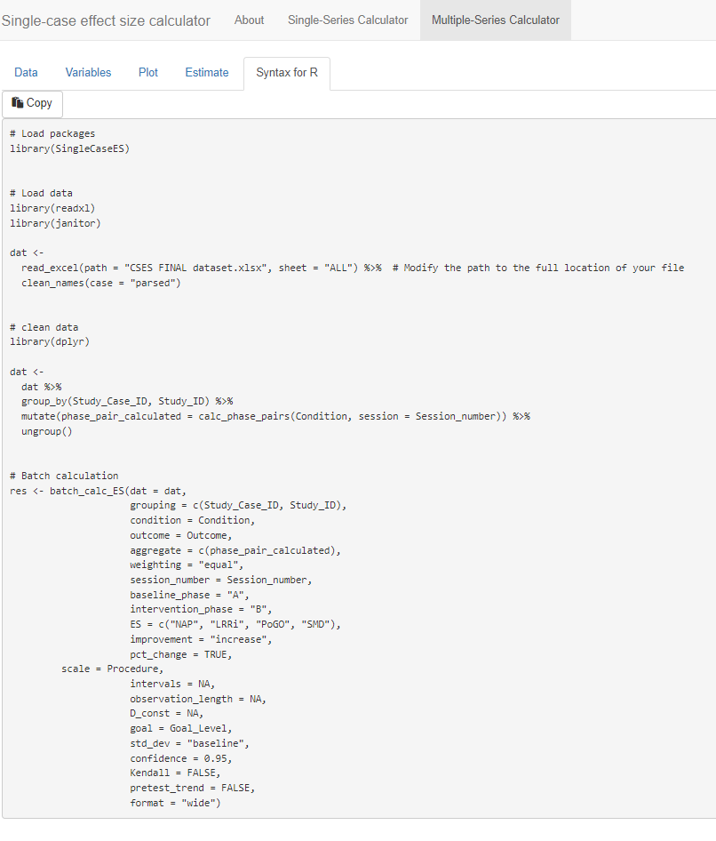

(\#fig:multipleseries-syntax)Generated Syntax for R Script

## Examining the Alignment of the Case-Specific Effect Sizes with our Visual Analysis

After computing the different effect sizes, it is useful and informative to compare the effect size estimates to the graphical displays in Figures \@ref(fig:Byiers-2014) through \@ref(fig:Strasberger-2014). Specifically, we want to examine the degree to which the variation in effects seen in the graphs corresponds to the variation in the values of the effect estimates obtained using the _Single-Case Effect Size Calculator_. Effect size estimates in a metric that correspond well with the results of visual analysis are conceptually easier to interpret. 

### NAP

NAP values of .50 or less suggest that at least half of the paired A and B phase data points are opposite in direction to what is expected if the treatment were helpful. Thus, if a treatment were harmful or ineffective at best, we would expect NAP values between 0 and .5. Alternatively, NAP values that are higher than .5 are indicative of positive treatment effects, with the largest possible effect being a NAP of 1. 

Each participant’s estimated NAP effect size per study is shown in Figure \@ref(fig:multipleseries-es-res) and listed in Table \@ref(tab:case-es-est). Starting with @Byiers2014 participants, Tammy had a NAP effect size estimate of .92, which tells us that there is a 92% probability that a randomly selected observation from Tammy’s treatment phase improved upon a randomly selected baseline phase observation. We also obtained an SE of .07 and 95% CI [ 0.78, 1.05][^TammyNote]. Jen had a slightly larger NAP effect size of .94, with an SE of .06. Finally, the NAP effect for Rose was estimated as 1.0, with an SE of .04. Rose's NAP effect size was the largest value possible, which can be interpreted as 100% of Rose’s treatment-baseline phase observational pairs having no overlap. 

[^TammyNote]: When NAP values are aggregated across multiple phases, the confidence interval for the aggregated NAP is based on a large-sample normal approximation and can therefore include values outside the logical range of 0 to 1. Specifically, the point estimate and standard error of the aggregated NAP are calculated using the user-selected weighting scheme. An $\omega$-level confidence interval is then calculated by adding and subtracting $z_\omega$ times the standard error from the point estimate, where $z_\omega$ is a standard normal critical value. Thus, if an aggregated NAP estimate is near the extreme of the range, the confidence interval can include values larger than 1 or less than 0.

Next, we compare these NAP estimates to what is visually depicted in the Figure \@ref(fig:Byiers-2014) graphs. Our visual analysis suggests positive effects for each participant. With Rose we see no overlap between phases and a large initial effect of the intervention. With Jen and Tammy's graphs, we see smaller initial effects, some overlap with the baseline phases, and increasing trends in the treatment phases. The NAP values of all participants being relatively high is consistent with the visual impression of positive effects for each participant, and Rose having a NAP of 1, which is the largest value is consistent with our visual inspection and conclusion that the intervention had the largest effect for Rose. Thus, for this study, there is a reasonable level of congruence between our visual analysis and the effect estimates.

Table \@ref(tab:case-es-est) also reports the NAP effect size estimates for our included @Casey1978 study with four participants. The obtained NAP values ranged from .75 (Tommy) to .97 (Freddie). Eric's estimated NAP effect size was .91, with an SE of .05. The second largest NAP value was .95 for Lori, with an SE of .04. Visual inspection of @Casey1978 participant graphs revealed the smallest effect and the largest amount of overlap between baseline and treatment phase data for Tommy, which is congruent with the obtained NAP effect size estimate of .75 and SE of .10. The lower baseline and higher average treatment levels noted in the graphs for Eric, Lori, and Freddie resulted in larger NAP effect sizes; overall, these NAP estimates are consistent with the results of our visual analysis of participant graphs.

Finally, we review the four NAP effect size estimates for the Strasberger and Ferreri (2014) participants shown in Table \@ref(tab:case-es-est). Parker had the lowest NAP effect size estimate of .92 with an SE of .11. The estimated NAP effect size for Thomas was .97, with a SE of .04, while both Juan and Kyle had NAP effect size estimates of 1, meaning that there was 0% overlap between baseline and treatment observation pairs. The NAP effect sizes obtained using the app, representing the degree of non-overlap of all baseline and treatment phase pairs, appear to be consistent with the overlap we observe in the @StrasbergerFerreri2014 graphs in Figure \@ref(fig:Strasberger-2014). However, Parker, who had the lowest NAP, reaches 10 independent mands in the last two treatment sessions, whereas Juan, who has a NAP of 1.0, never exceeds 5 independent mands. Thus, there is some inconsistency between the magnitude of effect seen in the visual analysis and the values of NAP for the graphs of @StrasbergerFerreri2014. 

### SMD Results

We also see the SMD outcomes in Table \@ref(tab:case-es-est) for all cases across all three included studies. Starting with the @Byiers2014 study, we examine the SMD results for Jen, Tammy, and Rose. Jen’s estimate of 0.99 indicates that the average percentage of switch-activated requesting behavior shifted between the treatment and baseline phases by 0.99 standard deviations. This estimated SMD effect size has an SE of 0.37. Tammy’s SMD effect size was 1.27, with an SE of 0.39. The third participant, Rose, had the largest estimated SMD effect size of 9.43, with an SE of 2.2. The smallest SMD value assigned to Jen (0.99) appears consistent with the results of visual analysis, which revealed a large amount of data overlap and a smaller degree of level change between phases. To a slightly lesser extent, the between-phase data overlap and smaller average level change seen in Tammy’s graph was in line with the estimated SMD effect size of 1.27. Rose’s largest SMD effect size was consistent with graphed data in Figure \@ref(fig:Byiers-2014) that showed no between-phase data overlap and the largest change in level between phases. 

Next, we examine the SMD estimates for the four @Casey1978 study participants. The SMD effect size estimates obtained using the app ranged between 0.60 (Tommy) and 2.81 (Freddie). Eric’s SMD effect size was estimated to be approximately 1.85 standard deviations from the _baseline SD_, with an SE of 0.56 and 95% CI [0.75, 2.96]. Freddie had an SMD effect size of 2.81, SE of 0.72, and 95% CI [1.39, 4.23]. The second largest SMD treatment effect estimate was 2.29 for Lori, with an SE of 0.56 and 95% CI [1.19, 3.39]. Finally, Tommy's SMD effect size was 0.60, with an SE of 0.51 and 95% CI [-0.41, 1.61]. Visual analysis of participants' graphs in Figure \@ref(fig:Casey-1978) is consistent with these results, as Tommy had the smallest degree of level change across phases, and Freddie had a larger mean level change. Also, if we compare the SMD estimates across the first two studies, we note the largest SMD estimate was from Rose, and this also aligns with our visual analysis.

We conclude our comparison of SMD results obtained using the app and visual analysis results with the four @StrasbergerFerreri2014 participants. In order from smallest SMD effect size to largest, Juan’s estimated SMD effect size was 6.02 with an SE of 1.6 and 95% CI [2.8, 9.24], Kyle’s SMD effect size was 7.56 with an SE of 2.29 and 95% CI [3.08, 12.05], and Thomas had an SMD effect size of 6.27, with an SE of 1.95 and 95% CI [2.45, 10.1]. However, as shown in Table \@ref(tab:case-es-est), only three out of the four participants have SMD effect estimates reported; the _Multiple-Case Effect Size Calculator_ reports the code "Inf" for Parker. This code means the effect size is infinite, which results from trying to divide the mean difference by zero. This problem will occur anytime the baseline is used for standardization and there is no variability in baseline, which is the case for Parker. To get an effect size for Parker, we reran the analysis choosing to standardize by the _pooled SD_ across phases. Parker's resulting SMD effect size was 1.60, with an SE of 0.73 and 95% CI [0.16, 3.03]. Although an effect size is computed, the value is notably smaller than the value for the other three participants. Another option would be to pool the SD across phases for all cases in this study, or to pool the SD across phases for all cases in all studies. Parker's smaller effect size value compared to Thomas or Juan is inconsistent with our visual inspection of the graphs in Figure \@ref(fig:Strasberger-2014), where Parker is observed to give 10 independent mands in his last two treatment sessions, whereas Thomas and Juan, who have similar baseline levels to Parker, never exceed 6 independent mands. This illustrates a problem that is encountered with the SMD when baselines have little to no variability for a case. Another option would be to pool the SD across phases for all cases in this study, or to pool the SD across phases for all cases in all studies. Although Parker’s SMD is somewhat problematic, the SMD effect sizes for the other cases (Thomas, Juan, and Kyle) are consistent with our visual analysis and reflect the improvement in level change seen from baseline to treatment across participants. Also, if we compare the SMDs across studies, we see that Rose has the largest SMD, followed by Thomas, Juan, and Kyle, which is generally consistent with our visual analysis. 

### LRRi Results

LRRi estimated effects for all cases across all three studies are reported in Table \@ref(tab:case-es-est). Starting with Jen [@Byiers2014], the LRRi effect size estimate of .58 represents the natural log of the average percentage of switch-activated requesting behaviors per session in the treatment phase divided by the average percentage of the requests during the baseline phase, giving us a relationship in terms of percentage change. Jen’s LRRi was 0.58 and the estimated percentage change was 79%. Tammy’s LRRi treatment effect was 0.82, with an estimated percentage change of improvement of 147%. Rose had the largest LRRi effect size with 2.67 and percentage change of 1390%. Visual analysis of the participants’ graphed observations across phases was aligned with the LRRi results obtained in the app. For example, the LRRi effect size and percentage change estimates arranged in order of smallest (Jen: 0.58, 78.6% respectively) to largest (Rose: 2.67, 1389.7%) reflect the same order in which we would rate the degree of level change noted between phases for all participants.

For the @Casey1978 study participants, the LRRi treatment effect estimates ranged from smallest to largest as follows: 0.05 (Tommy), 0.53 (Eric), 0.64 (Lori), and 0.71 (Freddie). Tommy's LRRi effect size SE was .04 with a 95% CI [-.03, .14] and an estimated percentage change of 5.5%. Eric's LRRi SE was .13 with a 95% CI [0.28, 0.78], and he had an estimated percentage change of improvement of 70%. Lori's LRRi SE was .11 with a 95% CI [.42, .87], and she had a percentage change increase of 90%. Finally, Freddie's LRRi SE was .12 with a 95% CI [.47, .92], and an estimated percentage change of 100%. In the treatment phase, all participant graphs showed an increasing trend, in the direction expected. For @Casey1978 estimated effects, we find the LRRi effect size results estimated using the app to be in line with what we see when we visually inspect the original graphs.

The LRRi treatment effect estimates for the four @StrasbergerFerreri2014 cases ranged from 1.22 (Parker) to 2.2 (Thomas). Juan had an LRRi effect estimate of 1.87, with an SE of .3 and 95% CI [1.27, 2.47], and percentage change estimated at 548%. Kyle's LRRi effect size was 1.67, with an SE of .23 and 95% CI [1.22, 2.12], and percentage change of 433%. Parker's estimated LRRi effect was 1.22, with an SE of .2 and 95% CI [.84, 1.61], and percentage change estimate of 239%. Finally, Thomas had the largest reported LRRi treatment effect among the study participants with an estimate of 2.20, SE of .5, and 95% CI [1.23, 3.18]. He also had the largest estimated percentage change of 806%. Although Thomas showed the largest percentage change, there was overlap in observations across phases, and his treatment observations did not move as far from baseline or reach as high of levels as either Parker or Kyle. Thus, we find that the LRRi effect sizes for this study are not as consistent with the results of our visual analyses as they were for the other two studies. The explanation is that the LRR makes a ratio of the treatment mean and the baseline mean. Because for Thomas and Juan the baseline means are notably lower than the mean for Kyle, the treatment phase means are divided by smaller values, leading to larger effect sizes. 

### PoGO~M$\uparrow$~

PoGO~M~ effect estimates for all cases across all three studies are reported in Table \@ref(tab:case-es-est). Starting with the @Byiers2014 study participants, the case-specific estimates in order from smallest to largest are as follows: Jen had a PoGO~M~ effect size of 34.5 with an SE of 11.2, Tammy had a PoGO~M~ effect size of 74.3 with an SE of 23.1, and Rose had a PoGO~M~ effect size estimate of 64.8 with an SE of 5.1. Visual inspection of the participants' graphs in Figure \@ref(fig:Byiers-2014) showed variability in effects across cases, with more of Tammy's treatment phase (B) observations at or approaching the goal level (100%) than other participants. This is consistent with the PoGO~M~ effect size results (74.3) obtained in the app. Similarly, the smallest PoGO~M~ effect size estimate for Jen (34.5) is also aligned with the data graphed in Figure \@ref(fig:Byiers-2014). However, for one participant, the PoGO~M~ results ranked from smallest effect (Jen) to largest (Tammy) are somewhat in conflict with what we see in Figure \@ref(fig:Byiers-2014); Rose's PoGO~M~ effect size was estimated smaller than Tammy’s, despite having graphs portraying the largest between-phase level change and no data overlap between phases. 

The @Casey1978 PoGO~M$\uparrow$~ effect estimates are also shown in Table \@ref(tab:case-es-est). Lori had the largest PoGO~M~ effect size of 72.0 with an SE of 13.3, followed by Freddie with a PoGO~M~ effect size of 65.3, SE of 10.1, and Eric with a PoGO~M~ effect size of 55.4 and SE of 12.9. Although Tommy had the largest treatment phase mean ($\beta = 0.87$), he also had the highest baseline phase mean ($\alpha = 0.83$). As a result, and consistent with the graphed observations in Figure \@ref(fig:Casey-1978), Tommy's change in level between baseline and treatment was much smaller in magnitude than any other participant, and the smaller effect was noted in the effect estimate of 26.2 with an SE of 21.6. When combined with the results of visual analysis indicating little data overlap between phases for Lori and Freddie, the larger difference in phase means aligned with their larger PoGO~M~ values.

<table class=" lightable-paper lightable-striped" style='font-family: "Arial Narrow", arial, helvetica, sans-serif; margin-left: auto; margin-right: auto;'>
<caption>(\#tab:case-es-est)Case-Specific Effect Size Estimation Results Across Studies</caption>
 <thead>
<tr>
<th style="empty-cells: hide;" colspan="2"></th>
<th style="padding-bottom:0; padding-left:3px;padding-right:3px;text-align: center; " colspan="2">
NAP
</th>
<th style="padding-bottom:0; padding-left:3px;padding-right:3px;text-align: center; " colspan="2">
SMD~W~
</th>
<th style="padding-bottom:0; padding-left:3px;padding-right:3px;text-align: center; " colspan="2">
LRRi
</th>
<th style="padding-bottom:0; padding-left:3px;padding-right:3px;text-align: center; " colspan="2">
PoGO~M~
</th>
</tr>
  <tr>
   <th style="text-align:left;"> Study </th>
   <th style="text-align:left;"> Case </th>
   <th style="text-align:center;"> Est. (SE) </th>
   <th style="text-align:center;"> 95% CI </th>
   <th style="text-align:center;"> Est. (SE) </th>
   <th style="text-align:center;"> 95% CI </th>
   <th style="text-align:center;"> Est. (SE) </th>
   <th style="text-align:center;"> 95% CI </th>
   <th style="text-align:center;"> Est. (SE) </th>
   <th style="text-align:center;"> 95% CI </th>
  </tr>
 </thead>
<tbody>
  <tr>
   <td style="text-align:left;"> Byiers et al., 2014 </td>
   <td style="text-align:left;"> Jen </td>
   <td style="text-align:center;"> .94 (.06) </td>
   <td style="text-align:center;"> [0.82, 1.06] </td>
   <td style="text-align:center;"> .99 (.37) </td>
   <td style="text-align:center;"> [0.27, 1.71] </td>
   <td style="text-align:center;"> .58 (.27) </td>
   <td style="text-align:center;"> [0.05, 1.10] </td>
   <td style="text-align:center;"> 34.52 (11.19) </td>
   <td style="text-align:center;"> [12.58, 56.43] </td>
  </tr>
  <tr>
   <td style="text-align:left;"> Byiers et al., 2014 </td>
   <td style="text-align:left;"> Tammy </td>
   <td style="text-align:center;"> .92 (.07) </td>
   <td style="text-align:center;"> [0.78, 1.05] </td>
   <td style="text-align:center;"> 1.27 (.39) </td>
   <td style="text-align:center;"> [0.50, 2.05] </td>
   <td style="text-align:center;"> .82 (.32) </td>
   <td style="text-align:center;"> [0.19, 1.46] </td>
   <td style="text-align:center;"> 74.29 (23.12) </td>
   <td style="text-align:center;"> [28.97, 119.61] </td>
  </tr>
  <tr>
   <td style="text-align:left;"> Byiers et al., 2014 </td>
   <td style="text-align:left;"> Rose </td>
   <td style="text-align:center;"> 1 (.04) </td>
   <td style="text-align:center;"> [0.92, 1.08] </td>
   <td style="text-align:center;"> 9.43 (2.2) </td>
   <td style="text-align:center;"> [5.11, 13.74] </td>
   <td style="text-align:center;"> 2.67 (.56) </td>
   <td style="text-align:center;"> [1.57, 3.77] </td>
   <td style="text-align:center;"> 64.81 (5.09) </td>
   <td style="text-align:center;"> [54.83, 74.78] </td>
  </tr>
  <tr>
   <td style="text-align:left;"> Casey, 1978 </td>
   <td style="text-align:left;"> Eric </td>
   <td style="text-align:center;"> .91 (.05) </td>
   <td style="text-align:center;"> [0.81, 1.02] </td>
   <td style="text-align:center;"> 1.85 (.56) </td>
   <td style="text-align:center;"> [0.75, 2.96] </td>
   <td style="text-align:center;"> .53 (.13) </td>
   <td style="text-align:center;"> [0.28, 0.78] </td>
   <td style="text-align:center;"> 55.44 (12.89) </td>
   <td style="text-align:center;"> [30.18, 80.71] </td>
  </tr>
  <tr>
   <td style="text-align:left;"> Casey, 1978 </td>
   <td style="text-align:left;"> Freddie </td>
   <td style="text-align:center;"> .97 (.03) </td>
   <td style="text-align:center;"> [0.90, 1.03] </td>
   <td style="text-align:center;"> 2.81 (.72) </td>
   <td style="text-align:center;"> [1.39, 4.23] </td>
   <td style="text-align:center;"> .69 (.12) </td>
   <td style="text-align:center;"> [0.47, 0.92] </td>
   <td style="text-align:center;"> 64.25 (10.08) </td>
   <td style="text-align:center;"> [44.49, 84.01] </td>
  </tr>
  <tr>
   <td style="text-align:left;"> Casey, 1978 </td>
   <td style="text-align:left;"> Lori </td>
   <td style="text-align:center;"> .95 (.04) </td>
   <td style="text-align:center;"> [0.87, 1.02] </td>
   <td style="text-align:center;"> 2.29 (.56) </td>
   <td style="text-align:center;"> [1.19, 3.39] </td>
   <td style="text-align:center;"> .64 (.11) </td>
   <td style="text-align:center;"> [0.42, 0.87] </td>
   <td style="text-align:center;"> 71.97 (13.33) </td>
   <td style="text-align:center;"> [45.84, 98.09] </td>
  </tr>
  <tr>
   <td style="text-align:left;"> Casey, 1978 </td>
   <td style="text-align:left;"> Tommy </td>
   <td style="text-align:center;"> .75 (.10) </td>
   <td style="text-align:center;"> [0.55, 0.95] </td>
   <td style="text-align:center;"> .60 (.51) </td>
   <td style="text-align:center;"> [-0.41, 1.61] </td>
   <td style="text-align:center;"> .05 (.04) </td>
   <td style="text-align:center;"> [-0.03, 0.14] </td>
   <td style="text-align:center;"> 26.21 (21.57) </td>
   <td style="text-align:center;"> [-16.06, 68.48] </td>
  </tr>
  <tr>
   <td style="text-align:left;"> Strasberger &amp; Ferreri, 2014 </td>
   <td style="text-align:left;"> Juan </td>
   <td style="text-align:center;"> 1 (.02) </td>
   <td style="text-align:center;"> [0.97, 1.03] </td>
   <td style="text-align:center;"> 6.02 (1.65) </td>
   <td style="text-align:center;"> [2.80, 9.24] </td>
   <td style="text-align:center;"> 1.87 (.30) </td>
   <td style="text-align:center;"> [1.27, 2.47] </td>
   <td style="text-align:center;"> 36.17 (6.11) </td>
   <td style="text-align:center;"> [24.19, 48.15] </td>
  </tr>
  <tr>
   <td style="text-align:left;"> Strasberger &amp; Ferreri, 2014 </td>
   <td style="text-align:left;"> Kyle </td>
   <td style="text-align:center;"> 1 (.05) </td>
   <td style="text-align:center;"> [0.90, 1.10] </td>
   <td style="text-align:center;"> 7.56 (2.29) </td>
   <td style="text-align:center;"> [3.08, 12.05] </td>
   <td style="text-align:center;"> 1.67 (.23) </td>
   <td style="text-align:center;"> [1.22, 2.12] </td>
   <td style="text-align:center;"> 88.0 (13.13) </td>
   <td style="text-align:center;"> [62.27, 113.73] </td>
  </tr>
  <tr>
   <td style="text-align:left;"> Strasberger &amp; Ferreri, 2014 </td>
   <td style="text-align:left;"> Parker </td>
   <td style="text-align:center;"> .92 (.11) </td>
   <td style="text-align:center;"> [0.71, 1.12] </td>
   <td style="text-align:center;"> Inf </td>
   <td style="text-align:center;">  </td>
   <td style="text-align:center;"> 1.22 (.20) </td>
   <td style="text-align:center;"> [0.84, 1.61] </td>
   <td style="text-align:center;"> 58.33 (15.70) </td>
   <td style="text-align:center;"> [27.56, 89.11] </td>
  </tr>
  <tr>
   <td style="text-align:left;"> Strasberger &amp; Ferreri, 2014 </td>
   <td style="text-align:left;"> Thomas </td>
   <td style="text-align:center;"> .97 (.04) </td>
   <td style="text-align:center;"> [0.90, 1.04] </td>
   <td style="text-align:center;"> 6.27 (1.95) </td>
   <td style="text-align:center;"> [2.45, 10.10] </td>
   <td style="text-align:center;"> 2.20 (.50) </td>
   <td style="text-align:center;"> [1.23, 3.18] </td>
   <td style="text-align:center;"> 40.30 (7.46) </td>
   <td style="text-align:center;"> [25.67, 54.92] </td>
  </tr>
</tbody>
</table>

## Averaging the Case-Specific Effect Sizes

Although there were a few instances where inconsistencies were noted between an effect size calculation and our visual analysis, each of the effect size metrics produced values that were reasonably well aligned with our visual analysis for the majority of the cases. Thus, we now illustrate the use of meta-analytic methods to summarize each of our case-specific effect sizes across participants and across studies. Two distinct approaches to meta-analysis may be useful in this situation, based respectively on fixed effects and random effects models. We present each of these approaches in turn. We carried out all calculations using the `metafor` package [@viechtbauer2010conducting] for the R environment for statistical computing [@RTeam].

### Fixed Effects Meta-Analysis

First, researchers might wish to simply summarize the effect sizes across the cases in each study, or across all 11 cases from the three studies. For this purpose, a fixed effects meta-analysis is a convenient approach. In fixed effects meta-analysis, we draw inferences only about the cases and studies included in the summary, without generalizing beyond the observed participants. Results are summarized by taking an average of the effect sizes across cases and calculating SEs and CIs to represent the uncertainty in the average effect _for these particular cases_---but not for any broader population of cases or studies. Conventional fixed effects meta-analysis uses a weighted average with weights inversely proportional to the squared SE of the effect size estimates (i.e., inverse-variance weighting or precision weighting). However, for some of the case-specific effect size indices we have calculated, the SEs can be correlated with the effect size estimators. Moreover, the effect size estimators and SEs are based on very few observations per phase, making inverse-variance weighting methods less appropriate. Instead, we use simple, equally-weighted averages to summarize the effect sizes for each of the studies.

Table \@ref(tab:FE-study-avg) reports the average effect size for each study and across all 11 cases included in the three studies. SEs and CIs are based on the fixed effects model. The average NAP effect size across all 11 cases is .94 with an SE of .02. The average NAP effect size appears similar across all three studies, ranging from .89 to .97. Both the study-level average and overall average suggest large intervention effect sizes, with relatively little overlap between treatment and baseline phases. The average SMD~W~ effect size across all 11 cases is 3.70 with an SE of 0.39. Study-level average effect sizes are more heterogeneous, ranging from 1.89 for @Casey1978 to 5.36 for @StrasbergerFerreri2014. The average LRR effect size across all 11 cases is 1.18 with an SE of 0.09, which corresponds to an average of a 225% increase from baseline to intervention, 95% CI [173%, 287%]. Study-level average LRR effect sizes appear heterogeneous, ranging from 0.48 (corresponding to a 62% increase) to 1.74 (corresponding to a 470% increase). Finally, the average PoGO~M~ across all 11 cases is 55.8 with an SE of 4.2, suggesting that, on average, intervention led to improvements that were about 56% of the way toward the goal levels. Average PoGO~M~ values appear quite consistent across studies, ranging from 54.5 for @Casey1978 to 57.9 for @Byiers2014. 

<table class=" lightable-paper lightable-striped" style='font-family: "Arial Narrow", arial, helvetica, sans-serif; margin-left: auto; margin-right: auto;'>
<caption>(\#tab:FE-study-avg)Study-Level Average and Overall Average Effect Sizes Across Studies Based on Fixed Effects Models with Equal Weights</caption>
 <thead>
<tr>
<th style="empty-cells: hide;" colspan="2"></th>
<th style="padding-bottom:0; padding-left:3px;padding-right:3px;text-align: center; " colspan="2">
NAP
</th>
<th style="padding-bottom:0; padding-left:3px;padding-right:3px;text-align: center; " colspan="2">
SMD~W~
</th>
<th style="padding-bottom:0; padding-left:3px;padding-right:3px;text-align: center; " colspan="2">
LRRi
</th>
<th style="padding-bottom:0; padding-left:3px;padding-right:3px;text-align: center; " colspan="2">
PoGO~M~
</th>
</tr>
  <tr>
   <th style="text-align:left;"> Study </th>
   <th style="text-align:left;"> N (Cases) </th>
   <th style="text-align:center;"> Est. (SE) </th>
   <th style="text-align:center;"> 95% CI </th>
   <th style="text-align:center;"> Est. (SE) </th>
   <th style="text-align:center;"> 95% CI </th>
   <th style="text-align:center;"> Est. (SE) </th>
   <th style="text-align:center;"> 95% CI </th>
   <th style="text-align:center;"> Est. (SE) </th>
   <th style="text-align:center;"> 95% CI </th>
  </tr>
 </thead>
<tbody>
  <tr>
   <td style="text-align:left;"> Byiers et al. (2014) </td>
   <td style="text-align:left;"> 3 </td>
   <td style="text-align:center;"> .95 (.03) </td>
   <td style="text-align:center;"> [.89, 1.02] </td>
   <td style="text-align:center;"> 3.90 (0.76) </td>
   <td style="text-align:center;"> [2.42, 5.38] </td>
   <td style="text-align:center;"> 1.36 (0.23) </td>
   <td style="text-align:center;"> [0.90, 1.82] </td>
   <td style="text-align:center;"> 57.9 (8.7) </td>
   <td style="text-align:center;"> [40.8, 75.0] </td>
  </tr>
  <tr>
   <td style="text-align:left;"> Casey (1978) </td>
   <td style="text-align:left;"> 4 </td>
   <td style="text-align:center;"> .89 (.03) </td>
   <td style="text-align:center;"> [.83, .96] </td>
   <td style="text-align:center;"> 1.89 (0.30) </td>
   <td style="text-align:center;"> [1.30, 2.47] </td>
   <td style="text-align:center;"> 0.48 (0.05) </td>
   <td style="text-align:center;"> [0.38, 0.58] </td>
   <td style="text-align:center;"> 54.5 (7.5) </td>
   <td style="text-align:center;"> [39.7, 69.3] </td>
  </tr>
  <tr>
   <td style="text-align:left;"> Strasberger &amp; Ferreri (2014) </td>
   <td style="text-align:left;"> 3 </td>
   <td style="text-align:center;"> .97 (.03) </td>
   <td style="text-align:center;"> [.91, 1.03] </td>
   <td style="text-align:center;"> 5.36 (0.88) </td>
   <td style="text-align:center;"> [3.65, 7.08] </td>
   <td style="text-align:center;"> 1.74 (0.16) </td>
   <td style="text-align:center;"> [1.41, 2.06] </td>
   <td style="text-align:center;"> 55.7 (5.7) </td>
   <td style="text-align:center;"> [44.6, 66.8] </td>
  </tr>
  <tr>
   <td style="text-align:left;"> Overall Average </td>
   <td style="text-align:left;"> 11 </td>
   <td style="text-align:center;"> .94 (.02) </td>
   <td style="text-align:center;"> [.90, .97] </td>
   <td style="text-align:center;"> 3.70 (0.39) </td>
   <td style="text-align:center;"> [2.93, 4.47] </td>
   <td style="text-align:center;"> 1.18 (0.09) </td>
   <td style="text-align:center;"> [1.00, 1.35] </td>
   <td style="text-align:center;"> 55.8 (4.2) </td>
   <td style="text-align:center;"> [55.8, 64.2] </td>
  </tr>
</tbody>
</table>

Examining the results across effect size metrics, the effect size indices paint somewhat different pictures regarding the strength of the average treatment effect and the degree of variation from study to study. Looking at the overall average across participants, the NAP effect size is near the upper boundary of the scale, and the SMD~W~ and LRRi effect size both suggest strong effects. In contrast, the average PoGO~M~ effect size of 55.8 suggests a more moderate effect of moving outcomes less than 60% of the way towards goal levels. Furthermore, the average NAP values are quite similar across studies, as are the study-level average PoGO~M~ effect sizes. In contrast, the study-level SWM SMD~W~ and LRRi values suggest that the effects might be more variable across the three studies.

### Random Effects Meta-Analysis

In summarizing the results across a very limited number of cases and studies, researchers might be wary of drawing any inferences beyond the included participants, and so will use fixed effects meta-analysis. However, in larger-scale research synthesis projects, researchers might have an explicit goal of drawing broader generalizations about the effects of a class of interventions or practices for a specific population of participants. Furthermore, researchers may be interested in understanding not only the average effects of intervention, but also the extent of variation in those effects across different participants and study contexts and whether such variation can be explained by features of the participants, intervention, setting, or other aspects of the study context. For such purposes, a random effects model provides a useful analytic approach. 

Random effects models start from the premise that the studies included in a meta-analysis represent a broader population of potential studies or potential contexts in which an intervention might be used, where the goal is to draw inferences about this population. Consequently, the SEs and CIs from random effects models represent the uncertainty in average effect sizes due to having only a limited sample from the population of potential studies. Compared to fixed effects models, SEs based on random effects models will typically be larger, and CIs will be wider, because they account for further sources of uncertainty. 

For synthesizing case-specific effect size indices such as NAP, SMD~W~, LRRi, and PoGO~M~, it is natural to use a hierarchical random effects model that describes an overall average effect, the degree of variation in average effect sizes across studies, and the degree of variation in effect sizes across participants nested within studies [@VandenNoortgate2008multilevel; @Moeyaert_Ferron_Beretvas_VandenNoortgate_2014]. The study-level variation in effect size is described by the standard deviation of average effects across the hypothetical population of studies. We will denote this standard deviation as $\tau$. The participant-level variation in effect size is described by the standard deviation of the effects across the participants within each study. We will denote this standard deviation as $\omega$. Typically, the degree of within-study variation is assumed to be homogeneous from study to study, so that $\omega$ represents the typical, or pooled, standard deviation in the hypothetical population of studies. The overall degree of variation in effect size across participants and across studies can then be described by the total heterogeneity, $\sqrt{\tau^2 + \omega^2}$. Using the metafor package [@viechtbauer2010conducting], we can estimate these heterogeneity values using restricted maximum likelihood methods.

For estimating an overall average effect size using the hierarchical random effects model, the conventional approach is to take an inverse-variance weighted average. However, inverse-variance weighting is less appropriate when effect size estimates are based on very limited numbers of observations and when the SE of the effect size is a function of the magnitude of effect size. @Chen_Pustejovsky_2022 evaluated different approaches to meta-analyzing several case-specific effect size indices, including NAP, SMD~W~, and LRRi, in an extensive simulation study. They found that using an inverse-variance weighted average was appropriate for LRRi (and LRRd) effect size indices, but not for NAP or for SMD~W~. For the latter two indices, the strong connection between the SE and the magnitude of effect size led to bias when inverse-variance weighting was used for estimation of overall average effects. @Chen_Pustejovsky_2022 also found that using simple weighted averages led to less biased estimates, and although they did not evaluate meta-analyses of PoGO~M~, the fact that its SE is related to the magnitude of effect size suggests that a similar pattern may hold. We therefore use simple weighted averages for summarizing NAP, SMD~W~, and PoGO~M~ based on the hierarchical random effects model. As a result, the summary effect sizes here are identical to those based on the fixed effects model-only the SEs and confidence intervals differ. For LRRi, we follow the recommendations from @Chen_Pustejovsky_2022 and use inverse-variance weighting. 

A further complication involved in synthesizing case-specific effect sizes is that the SEs of the effect size estimates assume that each observation is independent. If there is autocorrelation in the data series, where observations that are more closely spaced in time tend to be more predictive of future observations, this assumption will be violated, and the calculated SEs will tend to understate the true degree of uncertainty. However, @Chen_Pustejovsky_2022 found that this problem can be mitigated by using robust variance estimation methods for calculating SEs and CIs. Robust SEs and CIs provide accurate quantifications of uncertainty in overall average effect size estimates even for autocorrelated data series. When summarizing results for each of the four effect size metrics, we therefore report robust SEs and robust 95% CIs for overall average effect sizes. The robust SEs and robust CIs incorporate small-sample corrections [@Tipton_2015; @Tipton_Pustejovsky_2015] so that they perform well even when based on a very limited number of studies. 

Finally, we also report prediction intervals as a further method of describing the degree of heterogeneity in effect sizes. A prediction interval is an estimate of the range of effect sizes observed across a specified part of the hypothetical population of studies and participants. Another way to think about this is that the prediction interval is a range in which we would expect to observe the effect size for a new study with a new participant drawn from the population[^PInote]. If a prediction interval is quite wide, it means that we expect the population distribution of effect sizes to be heterogeneous. Such prediction intervals are an especially helpful approach to describing heterogeneity because they can be transformed into different scales, such as by transforming from the LRR scale to percentage change.  For each effect size metric, we calculated 80% prediction intervals to describe the range of effect sizes that we would expect to observe in the middle 80% of the population.

[^PInote]: Note that prediction intervals and confidence intervals pertain to different inferences. Confidence intervals are interval estimates that will tend to cover the true average effect size in a population, whereas prediction intervals are interval estimates that will tend to cover the effect size for a new individual participant drawn from the population. Prediction intervals will therefore tend to be wider than confidence intervals with the same specified coverage level. 

<table class=" lightable-paper lightable-striped" style='font-family: "Arial Narrow", arial, helvetica, sans-serif; margin-left: auto; margin-right: auto;'>
<caption>(\#tab:RE-study-RVE)Overall Average Effect Sizes and Heterogeneity Estimates Based on Hierarchical Random Effects Models with Robust Variance Estimation</caption>
 <thead>
<tr>
<th style="empty-cells: hide;" colspan="1"></th>
<th style="padding-bottom:0; padding-left:3px;padding-right:3px;text-align: center; " colspan="2">
NAP (equal weighting)
</th>
<th style="padding-bottom:0; padding-left:3px;padding-right:3px;text-align: center; " colspan="2">
SMD~W~ (equal weighting)
</th>
<th style="padding-bottom:0; padding-left:3px;padding-right:3px;text-align: center; " colspan="2">
LRRi (inverse-variance weighting)
</th>
<th style="padding-bottom:0; padding-left:3px;padding-right:3px;text-align: center; " colspan="2">
PoGO~M~ (equal weighting)
</th>
</tr>
  <tr>
   <th style="text-align:left;"> Parameter </th>
   <th style="text-align:left;"> Est. (SE) </th>
   <th style="text-align:center;"> 95% CI </th>
   <th style="text-align:center;"> Est. (SE) </th>
   <th style="text-align:center;"> 95% CI </th>
   <th style="text-align:center;"> Est. (SE) </th>
   <th style="text-align:center;"> 95% CI </th>
   <th style="text-align:center;"> Est. (SE) </th>
   <th style="text-align:center;"> 95% CI </th>
  </tr>
 </thead>
<tbody>
  <tr>
   <td style="text-align:left;"> Overall average effect size </td>
   <td style="text-align:left;"> .94 (.03) </td>
   <td style="text-align:center;"> [.82, 1.05] </td>
   <td style="text-align:center;"> 3.70 (1.14) </td>
   <td style="text-align:center;"> [-1.44, 8.83] </td>
   <td style="text-align:center;"> 1.06 (0.36) </td>
   <td style="text-align:center;"> [-.50, 2.61] </td>
   <td style="text-align:center;"> 55.8 (1.1) </td>
   <td style="text-align:center;"> [51.1, 60.6] </td>
  </tr>
  <tr>
   <td style="text-align:left;"> Between-study SD ($\tau$) </td>
   <td style="text-align:left;"> .02 </td>
   <td style="text-align:center;">  </td>
   <td style="text-align:center;"> .88 </td>
   <td style="text-align:center;">  </td>
   <td style="text-align:center;"> 0.56 </td>
   <td style="text-align:center;">  </td>
   <td style="text-align:center;"> .00 </td>
   <td style="text-align:center;">  </td>
  </tr>
  <tr>
   <td style="text-align:left;"> Within-study SD ($\omega$) </td>
   <td style="text-align:left;"> .00 </td>
   <td style="text-align:center;">  </td>
   <td style="text-align:center;"> 2.01 </td>
   <td style="text-align:center;">  </td>
   <td style="text-align:center;"> 0.36 </td>
   <td style="text-align:center;">  </td>
   <td style="text-align:center;"> 14.1 </td>
   <td style="text-align:center;">  </td>
  </tr>
  <tr>
   <td style="text-align:left;"> Total heterogeneity $\Big(\sqrt{\tau^2 + \omega^2}\Big)$ </td>
   <td style="text-align:left;"> .02 </td>
   <td style="text-align:center;">  </td>
   <td style="text-align:center;"> 2.19 </td>
   <td style="text-align:center;">  </td>
   <td style="text-align:center;"> 0.67 </td>
   <td style="text-align:center;">  </td>
   <td style="text-align:center;"> 14.1 </td>
   <td style="text-align:center;">  </td>
  </tr>
  <tr>
   <td style="text-align:left;"> 80% Prediction Interval </td>
   <td style="text-align:left;"> [.88, 1.00] </td>
   <td style="text-align:center;">  </td>
   <td style="text-align:center;"> [-.62, 8.02] </td>
   <td style="text-align:center;">  </td>
   <td style="text-align:center;"> [-.38, 2.50 </td>
   <td style="text-align:center;">  </td>
   <td style="text-align:center;"> [30.6, 81.1 </td>
   <td style="text-align:center;">  </td>
  </tr>
</tbody>
</table>

Applying the hierarchical random effects model to data from a small number of studies will tend to produce estimates of average effects and heterogeneity SDs that are imprecisely estimated and, therefore, must be interpreted cautiously. Although our example dataset includes just three studies and 11 cases, we will report and interpret the model estimates to illustrate the unique insights to be gleaned from the random effects approach. However, we caution readers not to draw any substantive conclusions about the effects of AAC interventions from this small illustration.

Table \@ref(tab:RE-study-RVE) reports the average effect size, between-study heterogeneity, within-study heterogeneity, and total heterogeneity estimates, along with 80% prediction intervals, for each of the four effect size metrics. SEs and CIs are based on robust variance estimation methods. The average NAP effect size across all eleven cases is .94 with an SE of .03, a small degree of between-study heterogeneity ($\tau \  \text{estimate} = .02$), and no within-study heterogeneity. Because there is little estimated heterogeneity, the 80% prediction interval is narrow, ranging from .88 to 1.00. This suggests that a large majority of participants in the population would have strong NAP effect sizes. 

The average SMD~W~ effect size across all 11 cases is 3.70, identical to the fixed effects meta-analysis, but the SE is 1.14, much larger than in the fixed effects meta-analysis. The larger SE arises because there is substantial heterogeneity estimated both between and within studies. The high degree of heterogeneity is also apparent in the 80% prediction interval, which ranges from less than 0 to over 8 standard deviations. 

The average LRR effect size across all 11 cases is 1.06 with an SE of 0.36, which corresponds to an average 188% increase from baseline to intervention, 95% CI [-39%, 1266%]. The LRR effect size appears to be heterogeneous both between studies and across participants within studies. The 80% prediction interval of [-0.38, 2.50] corresponds to percentages changes ranging from -32% (i.e., an iatrogenic effect) to 1113%. Based on this distribution of LRR effect sizes, the intervention appears to be moderately effective, on average, but also quite variable in terms of the degree of improvement for individual participants.

Finally, the average PoGO~M~ across all 11 cases is 55.8, identical to the fixed effects meta-analysis, with an SE of 1.14. Unusually, the robust SE based on the random effects meta-analysis is smaller than the SE from the fixed effects meta-analysis[^RobustSEnote]. Although the average PoGO~M~ values appear quite consistent across studies, the estimated within-study SD of $\omega = 14.1$ and 80% prediction interval of [30.6, 81.1] indicate that there is some variation in PoGO~M~ values across the participants in each study. 

[^RobustSEnote]: We suspect that this is because the robust standard error is based on only a few studies. When applied to results from a larger collection of studies, robust standard errors will tend to be larger than fixed effects standard errors when the population distribution is heterogeneous.

### Further Directions for Synthesizing Case-Specific Effect Sizes

The examples of fixed effects and random effects meta-analysis of case-specific effect sizes that we have presented here are only a starting point. In addition to summarizing findings across multiple participants and studies and providing quantitative estimates of the degree of heterogeneity in findings, meta-analysis techniques are available for investigating many further questions. One important further direction is to explore how features of a study’s design, intervention characteristics, or participant profiles explain variation in effect size magnitude. Such questions can be investigated using tools such as subgroup analysis, meta-analytic analysis of variance, and meta-regression analysis [@borenstein2021introduction, Chapters 19-21; @konstantopoulos2019statistically; @Moeyaert_Yang_Xue_2023], which is the meta-analytic analogue of multiple regression analysis for primary study data. 

Another further direction is to explore whether selective reporting of primary study findings could create biases in meta-analytic summary estimates. Selective reporting and publication biases are critical concerns in synthesis of group design studies [@rothstein2005publication] and there is good reason to anticipate that similar biases may also affect syntheses of case-specific effect sizes in single-case research [@Dowdy2020; @Gage2017; @Sham_Smith_2014; @Shadish2016]. Although many methods are available for detecting and correcting the biases created by selective reporting, nearly all available tools have been developed in the context of group design studies, where primary analyses are based on inferential statistical approaches. These tools have been applied in syntheses of single-case research as well, but they may not be as informative in this context because of reliance on visual analysis (rather than statistical inference). There remains an outstanding need to develop methods adapted to the context of single-case research [@Dowdy2022; @pustejovsky2017Research].

More broadly, tools for synthesis of single-case designs remains an active area of methodological development, with many recent statistical innovations that are beyond the scope of the present guide. In light of the rapid pace of methodological developments, we especially encourage researchers conducting syntheses of single-case designs to seek collaborations with methodologists working in the area. Such collaborations can not only improve the methodological rigor of single-case syntheses, but also spur further methodological developments to improve existing methods, making them more relevant and better suited for empirical application. In turn, researchers will be able to better apply the tools of synthesis to inform theory, policy, and practice on topics where single-case research is prevalent.
