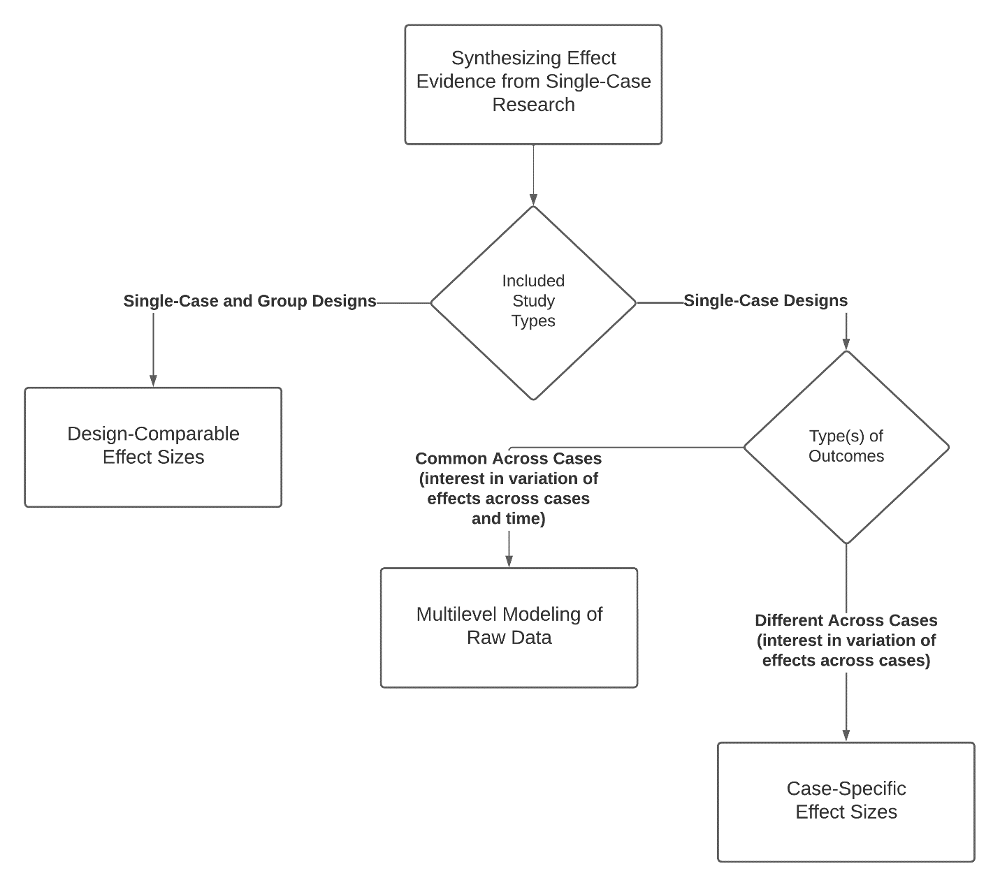

--- 
title: "Methods Guide for Effect Estimation and Synthesis of Single-Case Studies"
date: "November 18, 2023"
site: bookdown::bookdown_site
output: bookdown::gitbook
documentclass: book
bibliography: [SCD-Methods-Guide.bib, packages.bib]
biblio-style: apa
csl: apa.csl
link-citations: yes
github-repo: jepusto/SCD-Methods-Guide
description: "This is a minimal example of using the bookdown package to write a book. The output format for this example is bookdown::gitbook."
---

# Authors {-}

John M. Ferron, Megan Kirby, and Lodi Lipien 
 
_University of South Florida_

James Pustejovsky, Man Chen, and Paulina Grekov
 
_University of Wisconsin - Madison_

Wendy Machalicek
 
_University of Oregon_

## Disclaimer {-}

_This report was supported by the Institute of Education Sciences, U.S. Department of Education, through Grant R324U190002 to the University of Oregon. The opinions expressed are those of the authors and do not represent views of the Institute or the U.S. Department of Education._

## Citation {-}

This report is in the public domain. While permission to reprint this publication is not necessary, it should be cited as:

> Ferron, J. M., Kirby, M., Lippen, L., Pustejovsky, J. E., Chen, M., Grekov, P., & Machalicek, W. (2023). Effect Size Estimation and Synthesis of Single-Case Designs: A Methods Guide. Institute of Education Sciences. U.S. Department of Education. Washington, DC. Retrieved from https://jepusto.github.io/SCD-Methods-Guide/

## Preface {-}

We developed the _Methods Guide_ to support educational researchers interested in estimating effect size measures and synthesizing findings from single-case design studies. 
To do so, we aim to do two things: (a) provide guidance and decision rules to simplify the process of selecting effect size estimation and synthesis methods and (b) illustrate the step-by-step application of appropriate methods using readily available tools. 
The guide is not meant to cover all effect size methods that have been proposed for single-case design studies, nor is it meant to summarize all of the research on effect size estimation and synthesis of single-case research. 
Rather, it is meant to provide easy-to-follow decision rules, along with step-by-step instructions and illustrations of user-friendly tools, so that researchers aiming to conduct a synthesis involving single-case studies are more readily able to do so.

The guide is organized so that researchers can go immediately to the sections and chapters that are relevant to their immediate task, rather than having to read the guide sequentially from start to finish. 
The first chapter provides background and a flow chart (also shown below) to help researchers select among three broad approaches to synthesizing results from single-case research. 

(\#fig:unnamed-chunk-2)Approaches to synthesizing findings from single-case research

Those interested in synthesizing both single-case and group design studies should consider the design-comparable effect size approach and start by reading Chapter 2, which introduces this approach and its assumptions. 
They can then turn to one of the more detailed chapters providing step-by-step illustrations of how to estimate design comparable effect sizes with a user-friendly app (Chapter 3 if there are no trends, Chapter 4 if there are trends only in the treatment phases, or Chapter 5 if there are trends in both the baseline and treatment phases).

Those interested in synthesizing single-case design studies that share a common outcome, and particularly if they are interested in examining changes in the effect over time, should consider the multilevel modeling approach and read Chapter 6, which introduces this approach and its assumptions. 
They can then turn to one of the more detailed chapters providing step-by-step instructions along with illustrations of how to estimate multilevel models to synthesize single-case data with a user-friendly app (Chapter 7 if there are no trends, or Chapter 8 if there are trends).

Finally, those interested in synthesizing single-case design studies where the outcome measures vary across cases, and especially if they are interested in examining how the size of the effect varies from case to case, should consider the case-specific effect size approach. 
They can turn to Chapter 9, which introduces this approach and its assumptions, and Chapter 10, which provides step-by-step instructions along with illustration of how to estimate case-specific effect sizes with a user-friendly app. 

## Datasets {-}

## Acknowledgements {-}

We are grateful for the guidance from Katherine Taylor, who served as our project officer at the Institute of Education Sciences. We are also grateful for the suggestions and comments we received from the members of our external advisory panel: Jennifer Ledford, Joel Levin, Daniel Swan, Tai Collins, Katie Wolfe, and Kimberly Vannest.
